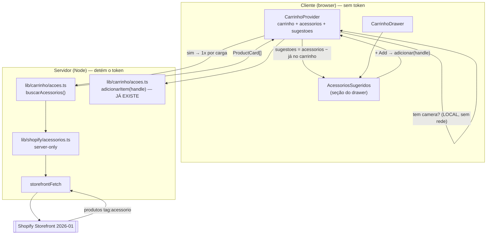

# Design Document — Acessórios Sugeridos (acessorios-sugeridos)

## Overview

Uma seção **"Você também vai precisar"** dentro do `CarrinhoDrawer` existente:
quando o carrinho tem uma câmera, ela lista os acessórios da loja com um botão
de adicionar em um clique.

A feature é **aditiva por natureza**. O carrinho funciona ponta a ponta hoje; o
risco desta spec não é construir, é **quebrar o que já vende**. Todo o design
gira em torno disso: reusar a escrita existente (`adicionarItem`), tocar o mínimo
possível do carrinho, e degradar para "sem seção" em qualquer falha.

### Fatos verificados (fundamentam este design)

Medidos contra a loja real e o schema 2026-01 via Dev MCP — não são suposições:

| # | Fato verificado | Consequência no design |
|---|---|---|
| 1 | `products(first: 250, query: "tag:acessorio")` — **válido no schema E devolvendo dados reais**: 2 produtos (`camera-seguranca-q8`, `camera-seguranca-s8`). `tag:camera` → 2 (`camera-seguranca-es-p9`, `camera-de-seguranca-q6`) | É a busca por tag. Sem coleção, sem `filters` |
| 2 | **`product.tags` CHEGA na linha do carrinho** — `cartCreate` real devolveu `{title, handle, tags: []}` | O gatilho pode ser avaliado **sem nenhuma chamada de rede** |
| 3 | `LinhaCarrinho` **não tem** `tags`; o fragmento traz só `product { title handle }` (`queriesCarrinho.ts:78`) | O fragmento **precisa** ganhar `tags` — e ele é compartilhado pela query e pelas 5 mutations |
| 4 | `RawProductCard` = `{id, handle, title, featuredImage, priceRange}` e `normalizeProductCard` já existem | O card do acessório **não precisa de tipo novo**: `ProductCard` serve |
| 5 | **As tags EXISTEM agora** (medido antes das tarefas): 2 `camera`, 2 `acessorio`, 2 sugeríveis, 0 com as duas, 0 sem tag. *Quando este design foi escrito eram **0** — a premissa foi cadastrada pelo usuário no meio da spec* | A feature deixou de ser código morto e a busca é verificável contra dados reais. **O §Salvaguarda continua**: a premissa já provou ser mutável pelo admin sem aviso |
| 6 | `tag:X AND available_for_sale:true` — sintaxe **aceita**, mas quando testada havia 0 produtos: "aceita" e "filtra certo" eram indistinguíveis | **Não uso o filtro na query.** Filtro `availableForSale` em JS, legível e verificável. *Com 2 produtos disponíveis hoje seria possível testar — mas um teste com 2 disponíveis e 0 esgotados também não distingue nada. Mantida a decisão* |
| 7 | Os produtos `acessorio` são **câmeras disfarçadas** (dados de teste) | A UI vai sugerir câmeras durante a validação. **Esperado, não bug** — o mecanismo é que está sob teste |

## Steering Document Alignment

### Technical Standards (tech.md)

- **Modelo de build:** runtime SSR/ISR já vigente; esta spec só consome. A busca
  roda em Server Action, no contexto do carrinho.
- **Home estática:** a busca **nunca** acontece no render da Home. O gatilho é
  avaliado no cliente, a partir de dados que o carrinho já traz. `app/layout.tsx`
  não muda — nada aqui lê `cookies()`/`headers()` no servidor de uma página.
- **Token server-only:** `lib/shopify/acessorios.ts` leva `import "server-only"`;
  o cliente importa só **tipos** e a action.
- **Cache:** o `tech.md` proíbe `fetchCache = "default-cache"` e `force-cache` no
  projeto. Esta spec **não** os usa — nem para dado de catálogo. Ver §Cache sem
  cachear.
- **Definition of Done:** `npm run build` limpo (com e sem `.env.local`) +
  `tsc --noEmit` limpo + verificação manual. **Sem suíte de testes formal.**

### Project Structure (structure.md)

- **pt-BR** em domínio e comentários (`acessorios`, `sugestoes`, `gatilho`).
- **Dados** em `lib/shopify/` (`acessorios.ts`, query em `queries.ts`).
- **Constantes de tag** em `lib/shopify/tags.ts` — sem `server-only`, porque
  servidor e cliente precisam delas.
- **Componente** em `components/loja/` (um arquivo por componente).
- **Action** em `lib/carrinho/acoes.ts` — a superfície do cliente já existente.

## Code Reuse Analysis

### Existing Components to Leverage

- **`adicionarItem(handle)`** (`lib/carrinho/acoes.ts`): o botão "+ Add" chama
  **a mesma action** do botão da página de produto. Herda de graça: resolução de
  variante no servidor, criação do carrinho, cookie `httpOnly`, tratamento de
  `warnings`, fila serial e tratamento de erro. **Nenhum segundo caminho de
  escrita** (Req 5.2).
- **`CarrinhoProvider`** (`components/loja/`): já tem o carrinho, a fila e o
  estado. Ganha o estado dos acessórios — ver §Onde mora o estado.
- **`storefrontFetch`** (`lib/shopify/client.ts`): único ponto de saída HTTP.
  Usado **sem** modificação.
- **`normalizeProductCard` + `ProductCard`** (`normalize.ts` / `types.ts`):
  servem ao card do acessório **sem mudança** (fato 4).
- **`formatMoney`**: preço em pt-BR. O cliente nunca formata dinheiro.
- **`CarrinhoDrawer`**: ganha **uma linha** — `<AcessoriosSugeridos />`.
- **`tokens`, `--cor-*`**: estilo e paleta herdados do wrapper do drawer.

### Integration Points

- **`lib/shopify/queriesCarrinho.ts:78`** → o fragmento ganha `tags` no
  `product`. **É o único ponto de risco real desta spec** — ver §Risco do
  fragmento.
- **`lib/shopify/types.ts`** → `LinhaCarrinho` ganha `tags: string[]`.
- **`lib/shopify/normalizeCarrinho.ts`** → **duas** edições que faltavam nesta
  lista (achado da auditoria; o `tsc` pegaria, mas a lista de arquivos é o
  entregável central deste design):
  - `RawVariante.product` (**linha 36**) — hoje `{ title: string; handle: string }`
    — ganha `tags: string[]`.
  - `normalizeLinha` (~**linha 138**) — mapeia `tags: v.product?.tags ?? []`,
    seguindo o padrão defensivo já usado nas linhas vizinhas
    (`titulo: v.product?.title ?? "Produto"`).
- **`lib/shopify/queries.ts`** → ganha `ACESSORIOS_QUERY`.
- **`lib/carrinho/acoes.ts`** → ganha `buscarAcessorios()`.
- **`components/loja/CarrinhoDrawer.tsx`** → renderiza a seção no fim do corpo.

## Architecture

**Padrão: o gatilho é local, a busca é remota e acontece uma vez.**

O cliente já sabe o que tem no carrinho. Com `tags` na linha, ele sabe também
**se há uma câmera** — sem perguntar nada a ninguém. Só quando a resposta é sim
ele pede a lista de acessórios ao servidor, e só uma vez por carga de página.



### Decisão: `tags` na linha do carrinho (e não buscar as câmeras)

Como saber se há câmera no carrinho? Duas opções reais:

| | **`tags` no fragmento ✅** | Buscar `tag:camera` e comparar |
|---|---|---|
| Custo do gatilho | **Zero rede** — o dado já vem no carrinho | 1 fetch **só para saber se precisa buscar** |
| NFR "não buscar sem gatilho" | Satisfeita naturalmente | **Impossível** — é preciso buscar para saber |
| Escala | Indiferente | Baixa todas as câmeras para testar pertencimento |
| Risco | **Toca o fragmento compartilhado** | Não toca o carrinho |

**Escolha: `tags` no fragmento.** O ganho decisivo é a NFR: "carrinho sem câmera
não deve gerar chamada à Shopify". A alternativa tem um problema de galinha-e-ovo
— precisaria da rede para decidir se usa a rede.

### Risco do fragmento (o ponto que exige cuidado)

`CAMPOS_DO_CARRINHO` é interpolado na `CARRINHO_QUERY` **e nas 5 mutations**.
Mexer nele mexe em **todas as 6 operações** do carrinho que hoje funciona.

**Mitigação, na ordem:**
1. A mudança é **um campo escalar** (`tags`) dentro de um `product` já
   selecionado — sem novo argumento, sem novo tipo, sem nova conexão.
2. **Revalidar as 6 operações** via Dev MCP após a mudança (Req 9.5) — o mesmo
   procedimento da tarefa 28 da `carrinho-loja`.

   > ⚠️ *Correção da auditoria: uma versão anterior dizia que aquela tarefa "já
   > tem um extrator pronto". **Não tem** — `scripts/` só contém
   > `verificar-variantes.mjs`. O extrator usado lá viveu num scratchpad
   > temporário e nunca entrou no repo. A frase escondia horas de trabalho manual
   > (resolver **duas** interpolações em 6 documentos) atrás de um reuso fictício,
   > dentro da tarefa que protege o carrinho em produção. Por isso o plano agora
   > tem a **tarefa 4a**, que cria `scripts/extrair-graphql.mjs` de verdade.*
3. **Reverificar o fluxo do carrinho** no portão humano (Req 9.1).
4. Verificado ao vivo (fato 2): `product { title handle tags }` responde
   `{"title":"Camera Segurança Q8","handle":"camera-seguranca-q8","tags":[]}`.

*Custo de payload: `tags` é um array de strings por linha. Com poucas tags por
produto, é ruído. Não justifica arquitetura alternativa.*

### Onde mora o estado (e por que não no componente)

A seção vive dentro do `AnimatePresence` do drawer: **ela desmonta quando o
drawer fecha**. Um `useState`/`useRef` no componente perderia a lista a cada
fechar/abrir, e a NFR "não refazer a busca a cada abertura" cairia — sem erro
nenhum, só rede desperdiçada.

**Solução:** o estado dos acessórios vive no **`CarrinhoProvider`**, que nunca
desmonta (está no root layout). O componente é burro: recebe `sugestoes` prontas.

### Cache sem cachear (Req 8.5 × NFR de performance)

Tensão real: os acessórios são **dado de catálogo** (cacheável em tese), mas o
Req 8.5 proíbe `force-cache`/`fetchCache` no projeto — e a proibição existe
porque a exceção "só aqui" é como ela morre.

**Solução: memo no cliente, não cache no fetch.** O provider busca **uma vez por
carga de página**, na primeira vez que o gatilho fica verdadeiro, e guarda em
estado. Abrir/fechar o drawer não refaz nada.

- **Satisfaz** "no máximo uma busca por carga" e "não buscar sem gatilho".
- **Limite honesto:** recarregar a página refaz a busca. É **uma** chamada por
  carga, só quando há câmera no carrinho — custo aceito, e mantém a proibição do
  cache intacta e **sem exceção**.

### O precedente contrário — e por que aqui a decisão é outra

⚠️ **A auditoria pegou este design contradizendo a `carrinho-loja` com a premissa
dela.** Uma versão anterior desta seção justificava o memo dizendo que acessórios
"são dado de catálogo" — exatamente o argumento que a spec anterior usou para
decidir o **oposto**:

> **Exceção declarada:** a resolução de variante do `adicionarItem` também não é
> cacheada. É dado de catálogo (seria cacheável), mas cachear traria
> `availableForSale` velho justamente no momento da compra — o custo de 1
> round-trip extra é preferível a vender item esgotado.

**A distinção correta não é catálogo × carrinho. É exibição × escrita:**

| | Resolução de variante (`adicionarItem`) | Lista de acessórios (aqui) |
|---|---|---|
| Onde o dado velho age | **Caminho de escrita** | **Caminho de exibição** |
| Preço do erro | **Vender item esgotado** | **Um clique perdido** |
| Quem corrige | Ninguém — a venda já foi | O próprio `adicionarItem`, que re-resolve a variante e é bloqueado pelo Req 1.6 da `carrinho-loja` ("Produto indisponível no momento.") |
| Decisão | **Nunca cachear** | **Memo por carga, aceito** |

O pior caso concreto: o cliente vê um acessório que esgotou há dois minutos,
clica "+ Add", e recebe "Produto indisponível no momento." — a mensagem que o
carrinho já sabe dar. Nenhuma venda ruim, nenhum dado divergente do cobrado. Por
isso o Req 2.4 é escopado **ao momento da busca**, e a defasagem é declarada em
vez de negada.

## Components and Interfaces

### `lib/shopify/tags.ts` (novo) — as tags como contrato

- **Purpose:** um único lugar para as strings `camera` e `acessorio`.
- **Interfaces:** `TAG_CAMERA = "camera"`, `TAG_ACESSORIO = "acessorio"`.
- **Dependências:** nenhuma.
- **Sem `server-only`:** o servidor usa na query, o cliente usa no gatilho.
  *Sem isso, a string viveria duplicada nos dois lados — e um typo em um deles
  faria a seção sumir sem erro.*

### `lib/shopify/queries.ts` — `ACESSORIOS_QUERY` (modificar)

```graphql
query Acessorios($query: String!, $first: Int!) {
  products(first: $first, query: $query) {
    nodes {
      id
      handle
      title
      availableForSale
      featuredImage { url altText width height }
      priceRange { minVariantPrice { amount currencyCode } }
    }
  }
}
```

- **`first: 250`** — o **máximo** da Storefront API, passado explicitamente.
- **Sem paginação, e isso é uma exceção declarada ao Req 2.6.** *A auditoria
  apontou, corretamente, que a query não tinha `pageInfo`/`$after` e portanto o
  "todos os produtos com a tag" (Req 2.2) era inimplementável. A resolução não é
  paginar: é **assumir o teto**. Uma tag `acessorio` com mais de **250** produtos
  não é um catálogo crescendo — é a tag virando categoria, e aí a feature inteira
  precisa ser repensada (nenhum cliente lê 250 sugestões num drawer). Paginar
  daria a impressão de suportar um cenário que a UI não suporta. Com 250 como
  teto explícito, o Req 2.2 vale até um limite dito em voz alta.*
- **`query` vem por variável**, montada no servidor a partir de `TAG_ACESSORIO` —
  o cliente **nunca** escolhe a busca (Req 8.3).
- Seleciona exatamente `RawProductCard` **+ `availableForSale`** — para
  `normalizeProductCard` funcionar sem adaptador (fato 4).
- **`availableForSale` NÃO entra na string de busca.** Poderia (`tag:x AND
  available_for_sale:true` é aceito), mas com 0 produtos não dá para provar que
  filtra — e um filtro que eu não consigo verificar é pior que um `.filter()` em
  JS, que qualquer um lê. Ver fato 6.
- ✅ **VALID** contra 2026-01 (Dev MCP), sem depreciação.

### `lib/shopify/acessorios.ts` (novo, `server-only`)

- **Purpose:** buscar os produtos com a tag de acessório.
- **Interfaces:** `buscarAcessoriosPorTag(): Promise<ProductCard[]>`.
- **Dependências:** `storefrontFetch`, `ACESSORIOS_QUERY`, `TAG_ACESSORIO`.
- **Reusa:** `normalizeProductCard`, `ProductCard`.
- Monta `query: "tag:acessorio"` a partir da constante; filtra
  `availableForSale === false` **antes** de normalizar (Req 2.4); devolve
  `ProductCard[]`.
- **Sem cache** (`{ semCache: true }`) — coerente com o Req 8.5 e com o fato de
  que o `next.revalidate` é inerte de qualquer forma (ver `tech.md`).

### `lib/carrinho/acoes.ts` — `buscarAcessorios()` (modificar)

```ts
"use server"
export async function buscarAcessorios(): Promise<ProductCard[]>
```

- **Sem argumentos** — o cliente não escolhe tag, query, endpoint nem versão
  (Req 8.3). A superfície é fechada em forma, como as 6 actions existentes.
- **NUNCA lança:** falha → `[]`. Um extra comercial não pode derrubar a compra
  (Req 6.2). Sem `console.error(e)`: a mensagem de `storefrontFetch` contém o
  endpoint.
- **Não lê o cookie** e não toca o carrinho — é leitura de catálogo. Mora aqui
  porque **esta é a fronteira do cliente**; criar um segundo módulo de actions
  para uma função dividiria a superfície sem ganho.

### `components/loja/CarrinhoProvider.tsx` (modificar)

Ganha, além do que já tem:

- `acessorios: ProductCard[]` — a lista crua, buscada **uma vez**.
- `sugestoes: ProductCard[]` — derivado (`useMemo`), **com o gatilho embutido**:

```ts
const linhas    = carrinho?.linhas ?? []          // `carrinho` é Carrinho | null
const temCamera = linhas.some((l) => l.tags.includes(TAG_CAMERA))

const sugestoes = useMemo(() => {
  // ⚠️ O GATILHO ENTRA AQUI, NÃO SÓ NO RENDER. Ver §A armadilha do memo.
  if (!temCamera) return []
  const noCarrinho = new Set(linhas.map((l) => l.handle))
  return acessorios.filter((a) => !noCarrinho.has(a.handle))
}, [temCamera, acessorios, linhas])
```

- Efeito de busca:
  ```ts
  if (temCamera && !buscou.current) {
    buscou.current = true      // ANTES do await — ver abaixo
    buscarAcessorios().then(setAcessorios)
  }
  ```
  - **`buscou.current = true` é setado SÍNCRONO, antes do `await`.** Se só virasse
    após sucesso, uma Shopify degradada + um carrinho conversador refariam a busca
    a **cada** mudança do carrinho — quebrando "no máximo uma por carga"
    exatamente quando a Shopify está mal. **Consequência honesta:** uma busca que
    falha não é repetida até a próxima carga. É o preço do Req 6.2 (o extra nunca
    atrapalha), e é preferível a martelar uma API que já está caindo.
- **Reatividade de graça (Req 3.3/3.4):** `sugestoes` deriva de `carrinho`, que já
  é atualizado por toda action. Adicionar um acessório o remove da lista; remover
  o traz de volta. **Sem código extra e sem rede.**

### ⚠️ A armadilha do memo (a auditoria pegou; era bug de runtime)

Uma versão anterior deste design afirmava que
`if (!ctx || ctx.sugestoes.length === 0) return null` cobria **todos** os casos de
"não aparecer", **inclusive sem gatilho**. **Era falso, e o build não pegaria.**

O memo é justamente estado que **sobrevive ao gatilho**. Sequência real:

1. Câmera no carrinho → gatilho dispara → `acessorios = [cabo, cartão]`.
2. Cliente **remove a câmera** (lixeira, ou `−` até 0 — Req 3.5 da `carrinho-loja`).
3. `sugestoes = [cabo, cartão] − [] = [cabo, cartão]` → **não vazio** → a guarda
   passa → **a seção renderiza sem nenhuma câmera no carrinho**. Req 1.2 violado.
4. Com o carrinho vazio, pior: a seção aparece embaixo de "Seu carrinho está
   vazio", sem rodapé. Req 1.3 violado.

Pior caminho ainda: **qualquer falha do `adicionarItem`** devolve `falha()` →
`{carrinho: null}` (verificado: `acoes.ts:48-49`) → `setCarrinho(null)` → um erro
transitório faz a lista inteira de sugestões brotar ao lado do banner de erro.

**Estado que sobrevive ao gatilho não pode ser validado por um `length`.** Por
isso o gatilho entra na **derivação**, não no render. Com `sugestoes` já gateada,
a guarda única passa a ser verdadeira de fato — e aí ela cobre os cinco casos.

*Nada disso aparece em `tsc` ou `build`: só na sequência exata
adicionar-câmera → remover-câmera. Daí o teste E2E novo.*

### `components/loja/AcessoriosSugeridos.tsx` (novo, client)

- **Purpose:** renderizar a seção. É burro de propósito.
- **Interfaces:** sem props — lê `useCarrinho()`.
- **Reusa:** `useCarrinho`, `ProductCard` (`import type`), `formatMoney` (já
  aplicado), `tokens`, `--cor-*`.
- **Guarda única (Req 6.1):** `if (!ctx || ctx.sugestoes.length === 0) return null`.
  Cobre **todos** os casos de "não aparecer" — sem gatilho, todos no carrinho,
  nenhum publicado, falha de busca — com uma linha. **Isso só é verdade porque o
  gatilho está na derivação de `sugestoes`** (§A armadilha do memo); sem aquilo,
  esta guarda seria uma mentira confortável.
- Título "Você também vai precisar" — **copy fixa no código, exceção declarada**
  ao "mudar conteúdo = editar JSON" do `product.md` (Req 4.7). O drawer não é
  seção de layout e não passa pelo `PreviewContent`. *Precedente idêntico:
  `carrinho-loja` Req 6.5, para a copy do selo de pagamento.*
- Por item: `` do CDN, nome, preço, botão "+ Add" com `aria-label` que
  **nomeia o acessório** (Req: Usability).
- Botão → `adicionar(handle)` do contexto. **Não chama `abrir()`** (o drawer já
  está aberto) e não fecha nada (Req 5.1).
- `disabled` enquanto `carregando` (Req 5.3) — o mesmo flag da fila serial.
  **Declarado:** `carregando` é **global do provider**, não por botão. Ele
  previne clique duplo ✅, mas também desabilita **todos** os "+ Add" durante
  **qualquer** operação do carrinho (cupom, quantidade), sem indicar qual item
  está carregando. É aceito — a fila é serial de qualquer forma, então um botão
  "ativo" durante outra operação seria só uma promessa falsa.

### Req 6.3 (os totais não podem pular) — satisfeito de graça, mas é frágil

O rodapé **não está dentro do container de scroll**: o painel é
`position: fixed; top:0; bottom:0` em coluna flex, o corpo é
`flex: 1; overflowY: "auto"` (`CarrinhoDrawer.tsx:138`) e o `<footer>` é
`flexShrink: 0` (`:187`) — **irmão** do corpo. Conteúdo crescendo dentro do corpo
**não consegue** mover subtotal/total.

**Está escrito porque é load-bearing e invisível:** quem colocar a seção *dentro*
do rodapé, ou trocar o `flex`, quebra o Req 6.3 sem que nada acuse.

### `components/loja/CarrinhoDrawer.tsx` (modificar)

Uma linha, no **fim do corpo rolável**, depois do `<ul>` das linhas e antes do
`</div>` que fecha o corpo — o `<footer>` (subtotal/desconto/total) vem depois,
o que satisfaz o Req 4.1 sem mexer no rodapé.

### `scripts/verificar-tags.mjs` (novo) — a salvaguarda (Req 7)

- Falha (**exit ≠ 0**) se não houver nenhum produto **sugerível** (`acessorio` **e**
  `availableForSale: true`) **ou** nenhum com `camera`.

  > **Contar sugerível, não etiquetado** — a auditoria achou o buraco: com os dois
  > acessórios etiquetados mas **esgotados**, um check que só olha a tag fica
  > **verde** enquanto o Req 2.4 os remove das sugestões e a seção nunca aparece.
  > Seria a salvaguarda aprovando exatamente o estado que existe para impedir.

- Distingue nos dois lados: **etiquetados** × **sugeríveis**. *"2 etiquetados, 0
  disponíveis" e "0 etiquetados" mandam o operador para telas diferentes do
  admin.*
- **Avisa, sem falhar**, se houver produto publicado **sem tag alguma**, nomeando
  os handles (Req 7.3).

  > *Correção: uma versão anterior desta linha dizia "avisa se a tag `camera`
  > estiver em algumas câmeras e não em todas" — **circular e inimplementável**:
  > o check só conhece tags, e sem a tag `camera` não há como saber que um produto
  > **é** câmera. Precisaria de uma verdade que só existe na cabeça do operador.
  > "Sem tag alguma" é verificável e captura o caso real: cadastro novo em que
  > alguém esqueceu de etiquetar.*
- **`process.exitCode`, nunca `process.exit()`** — verificado na spec anterior:
  `process.exit()` após `fetch` derruba handles do libuv no Windows e o exit code
  sai **127 em qualquer caso**, sucesso e falha indistinguíveis.
- **Fora do `npm run build`** (o build tem de passar sem `.env.local`).
- Duplica env/versão da API por rodar fora do Next — **exceção declarada do
  Req 10.3**, comentada no arquivo, igual ao `verificar-variantes.mjs`.
- `npm run verificar:tags`, documentado no README.

## Data Models

### `LinhaCarrinho` — um campo novo (`lib/shopify/types.ts`)

```ts
export interface LinhaCarrinho {
  // …campos existentes, inalterados…
  /**
   * Tags do produto (`merchandise.product.tags`).
   * É o que permite avaliar o gatilho da sugestão de acessórios SEM rede.
   * Verificado ao vivo: chega como array (vazio enquanto não houver tags).
   */
  tags: string[]
}
```

### `ProductCard` — **sem mudança**

O acessório sugerido é um `ProductCard` (`{id, handle, title, image, price}`).
`availableForSale` não entra: ele é **filtro do servidor**, não dado de exibição
— nunca se sugere indisponível, então o campo não teria leitor.

### Contexto do carrinho — dois campos novos

```ts
interface ContextoDoCarrinho {
  // …existentes…
  acessorios: ProductCard[]  // lista crua, buscada 1x
  sugestoes:  ProductCard[]  // acessorios − os já no carrinho (derivado)
}
```

## Error Handling

### Error Scenarios

1. **Busca de acessórios falha (rede/Shopify fora/env ausente)**
   - **Handling:** a action captura e devolve `[]`; `sugestoes` fica vazio.
   - **User Impact:** **nenhum.** A seção não aparece; o carrinho segue inteiro.
     Sem toast, sem erro. É o Req 6.2 — o extra não derruba a receita.

2. **Tags não cadastradas na Shopify (o estado de HOJE)**
   - **Handling:** `tag:acessorio` → 0 produtos → `sugestoes` vazio → sem seção.
     Indistinguível de "tudo já no carrinho" — e **é por isso** que existe o
     `npm run verificar:tags`: para o operador, não para o cliente.
   - **User Impact:** nenhum. Carrinho normal.

3. **Adicionar acessório falha**
   - **Handling:** `adicionarItem` já devolve `{erro}`; o drawer já o exibe.
   - **User Impact:** a mensagem de erro que ele já veria no carrinho. **Zero
     tratamento novo** (Req 5.4).

4. **Shopify limita a quantidade (`warnings`)**
   - **Handling:** nenhum — `adicionarItem` já traduz e o drawer já exibe.
   - **User Impact:** o aviso pt-BR de sempre (Req 5.5).

5. **Produto com as duas tags (`camera` e `acessorio`)**
   - **Handling:** conta como gatilho **e** entra na lista; se estiver no
     carrinho, some das sugestões (Req 3.1). Comportamento **definido**, não
     acidental (Req 2.3).
   - **User Impact:** coerente — o cliente não vê sugestão do que já tem.

6. **Acessório fica indisponível**
   - **Handling:** filtrado no servidor, antes de normalizar (Req 2.4).
   - **User Impact:** não é sugerido.

## Testing Strategy

> O `tech.md` fixa **"build + verificação manual"** e **sem suíte de testes
> formal**. Esta seção respeita isso. A rede de segurança é **estrutural**.

### Unit Testing

Sem runner no projeto. O equivalente é estrutural, e está no design de propósito:
- `import "server-only"` em `acessorios.ts` → o build **falha** se um componente
  de cliente importar a camada do token.
- `buscarAcessorios(): Promise<ProductCard[]>` **sem argumentos** → o cliente não
  tem como escolher tag/query, **no tipo**.
- `TAG_CAMERA`/`TAG_ACESSORIO` em um só lugar → um typo não pode divergir entre
  cliente e servidor.
- `npm run verificar:tags` → falha se a pré-condição de dados cair.

### Integration Testing

- `npx tsc --noEmit` limpo; `npm run build` limpo, **com e sem `.env.local`**.
- **Revalidar as 6 operações do carrinho** via Dev MCP após o `tags` no fragmento
  (Req 9.5) — aviso de depreciação conta como falha (Req 10.2).
- **Não-vazamento:** token, domínio e `SHOPIFY_STOREFRONT_TOKEN` em
  `.next/static` → **0 ocorrências**.
- Regime das rotas: `/` e `/sobre-nos` seguem `○ (Static)`; `/catalogo` e
  `/produtos/[handle]` seguem em ISR 5m.
- `grep` por `fetchCache`/`force-cache` → 0 (Req 8.5).

### End-to-End Testing (manual, `npm run dev`)

**Pré-requisito: o operador cadastrou os acessórios e aplicou as tags.** Sem
isso, só os itens 1 e 8 são executáveis — e é esse o ponto do `verificar:tags`.

1. **Sem as tags** (estado de hoje) → carrinho normal, **sem seção**, sem erro.
2. Adicionar uma câmera → seção "Você também vai precisar" com os acessórios.
3. **🔴 O TESTE QUE PEGA A ARMADILHA DO MEMO — adicionar câmera, ver a seção,
   depois REMOVER A CÂMERA → a seção SOME.** Repetir removendo pela lixeira e
   pelo `−` até 0. Depois, com um acessório no carrinho e a câmera removida → a
   seção continua sumida.
   *Este é o caminho que o design errou e que nem `tsc` nem `build` pegam. O
   teste antigo ("carrinho só com acessório → sem seção") passava **pelo motivo
   errado**: nunca tinha havido gatilho, então a lista estava vazia de qualquer
   forma — ele exercitava o caminho nunca-disparado, não o disparou-e-deixou-de-valer.*
4. Carrinho **só com acessório** (sem câmera, sem nunca ter tido) → **sem seção**.
4. "+ Add" num acessório → entra no carrinho e **some das sugestões**; o drawer
   **continua aberto**.
5. Adicionar **todos** os acessórios → a seção **desaparece** (Req 3.2).
6. Remover um acessório → ele **volta** a ser sugerido.
7. Fechar e reabrir o drawer → a seção aparece **sem nova chamada** à Shopify
   (conferir na aba Network) — prova o memo do provider.
8. `.env.local` renomeado → site sobe, carrinho degrada como já degradava, **sem
   seção e sem erro**.
9. **Regressão do carrinho:** adicionar/quantidade/cupom/remover/contador/
   checkout seguem funcionando (o fragmento foi tocado).
10. Teclado: a seção é navegável e o rótulo do botão **diz qual** acessório.

## Validação via Dev MCP (Req 10.1) — resultado

Ferramenta: **`mcp__shopify-dev-mcp__validate_graphql_codeblocks`**,
`api: storefront-graphql`, `version: 2026-01`.

| Artefato | Conteúdo | Resultado |
|---|---|---|
| `acessorios-por-tag` | `products(first:, query:)` + `availableForSale` + `featuredImage` + `priceRange` | ✅ VALID |
| `carrinho-com-tags` | fragmento + `cart(id:)` com `product { title handle tags }` | ✅ VALID |
| `tag-via-collection` | `collection(handle:){products}` — alternativa | ✅ VALID (não escolhida) |
| `tag-via-filters` | `collection.products(filters:[{tag:}])` — alternativa | ✅ VALID (não escolhida) |

**Por que `products(query:)` e não as coleções:** a coleção exigiria criar e
manter uma coleção `acessorios` no admin **além** das tags, e o gatilho seguiria
dependendo de tag na linha do carrinho — dois mecanismos para o mesmo conceito. A
tag é um mecanismo só, nos dois lados.

### Verificações contra a loja real (não só o schema)

| Afirmação | Como foi verificada | Resultado |
|---|---|---|
| A busca por tag funciona | `query: "title:Camera"` na loja | ✅ 4 produtos — o argumento `query` **opera** |
| `tag:camera` / `tag:acessorio` | na loja | ⚠️ **0** — por ausência de tags, não por sintaxe |
| `product.tags` chega no carrinho | `cartCreate` real + leitura da linha | ✅ `{"title":"Camera Segurança Q8","handle":"camera-seguranca-q8","tags":[]}` |
| `available_for_sale:true` na busca | na loja | ⚠️ **Aceita, mas inverificável** com 0 produtos → **não usado** |

*A última linha é o motivo de o filtro de disponibilidade estar em JS. "A sintaxe
não deu erro" não é a mesma coisa que "o filtro funciona", e a diferença só
aparece quando há dados — ou seja, em produção.*
