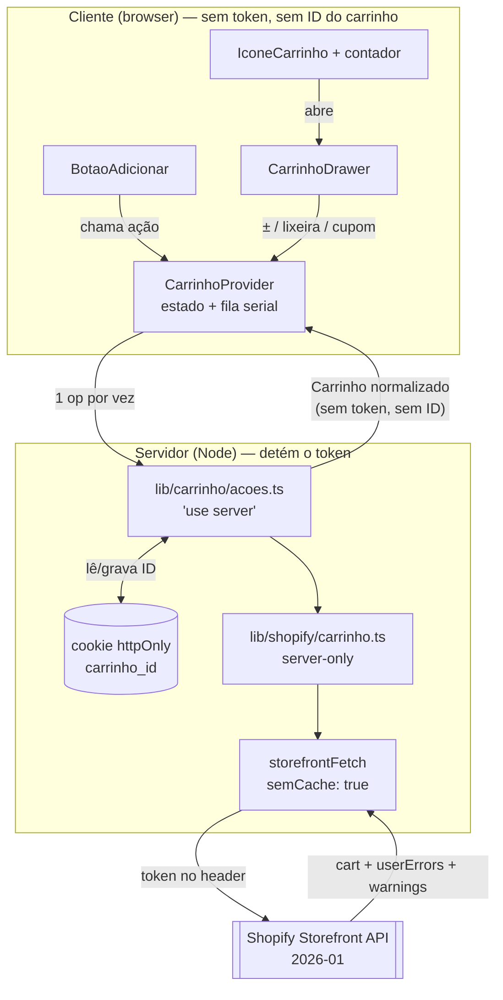

# Design Document — Carrinho da Loja (carrinho-loja)

## Overview

Transforma o `AddToCartPlaceholder` inerte em carrinho real, ligado à **Shopify
Cart API** (Storefront GraphQL **2026-01**). O cliente adiciona itens, revisa num
**drawer lateral**, aplica cupom e vai ao **checkout hospedado da Shopify**.

A tensão central é: **o drawer é interativo (cliente), o token é server-only**.
A resolução é uma fronteira estreita de **Server Actions** — o cliente chama
funções tipadas, o servidor executa GraphQL com o token e devolve dados já
normalizados. O cliente nunca vê token, endpoint, query ou o ID do carrinho.

### Fatos do schema/API verificados ao vivo (fundamentam este design)

Tudo abaixo foi apurado contra a loja real e o schema 2026-01 via Dev MCP — não
é suposição. **Três destes fatos mudariam o design se fossem ignorados:**

| # | Fato verificado | Consequência no design |
|---|---|---|
| 1 | `cartCreate/LinesAdd/LinesUpdate/LinesRemove/DiscountCodesUpdate` funcionam com o token atual | Sem mudança de scope/token |
| 2 | Re-adicionar o mesmo `merchandiseId` **mescla** (1 linha, qty 2) | Sem dedup no cliente; a Shopify resolve |
| 3 | **Limite de estoque é silencioso**: `userErrors: []`, sinal só em `warnings` (`MERCHANDISE_NOT_ENOUGH_STOCK`) | **Toda** mutation seleciona `warnings`; `ResultadoCarrinho.aviso` existe por isso |
| 4 | **Cupom inválido é silencioso**: `userErrors: []`, `warnings: DISCOUNT_NOT_FOUND`, e o código **fica no carrinho** com `applicable: false` | O drawer filtra por `applicable`; código inválido é purgado (ver §Cupom) |
| 5 | `cartDiscountCodesUpdate.discountCodes` é **`[String!]!` (não-nulo)** na 2026-01 | Remover cupom = enviar `[]`, nunca `null`. *Pego pelo `validate_graphql_codeblocks`.* |
| 6 | A mutation de cupom **substitui** a lista inteira | Sempre enviar a lista completa desejada |
| 7 | `Cart.discountAllocations` é depreciado, mas **`BaseCartLine.discountAllocations` NÃO é** | Desconto por linha vem da linha |
| 8 | Não existe flag de "carrinho finalizado" | Detecção só por `cart: null` |
| 9 | Catálogo hoje: **1 variante por produto**, mas a opção `Cor` (valor único) **existe** | A salvaguarda conta **variantes**, nunca `options` |
| 10 | **O `checkoutUrl` CONTÉM o cart id inteiro** (token + `key`) — `cartCreate` real: `id = gid://shopify/Cart/<tok>?key=<k>` e `checkoutUrl = …/cart/c/<MESMO tok>?key=<MESMA k>&…` | **Mata a garantia "`Carrinho` sem `id` ⇒ o ID nunca chega ao cliente"** — ver §Fronteira honesta |
| 11 | **`next: { revalidate }` no `storefrontFetch` é INERTE** — Next 15+ não cacheia `fetch` por default (`cache: "force-cache"` é opt-in, e cobre até POST/cookie) | O ISR do catálogo vem do `export const revalidate` das rotas; `semCache` é defesa declarada, não correção de um vazamento real |
| 12 | `productByHandle` **depreciado** na 2026-01 ("Use `product` instead") | Query de variante usa `product(handle:)` |

## Steering Document Alignment

### Technical Standards (tech.md)

- **Modelo de build:** o carrinho é exatamente o caso que o `tech.md` prevê como
  "exige RUNTIME". A migração já ocorreu em `catalogo-loja`; aqui apenas se
  consome (Server Actions). `output: "export"` continua ausente.
- **Token só em env, server-side:** mantém `import "server-only"` na camada de
  dados e `import type` nos componentes de cliente — o critério já **provado** em
  `catalogo-loja` (busca no `.next/static` → 0 ocorrências).
- **Tema por variáveis CSS:** o drawer consome `--cor-*`, nunca escreve no
  `:root`. **Mas ele precisa do próprio wrapper de paleta** — ver §Paleta do
  drawer, uma armadilha real desta arquitetura.
- **Acessibilidade:** ⚠️ **O `MotionConfig reducedMotion="user"` NÃO é global.**
  Ele existe em **um único lugar** (`components/preview/PreviewContent.tsx:112`),
  dentro do `PreviewContent`. O drawer é montado em `app/layout.tsx`, **acima**
  dele na árvore — e o `StoreShell` também não o tem. Portanto o drawer fica
  **fora** da cobertura e precisa de tratamento explícito: `MotionConfig
  reducedMotion="user"` próprio no drawer (ou `useReducedMotion()`). Sem isso, a
  animação ignora `prefers-reduced-motion` e viola a NFR de Usability.
- **Definition of Done:** `npm run build` limpo + `tsc --noEmit` limpo +
  verificação manual em `npm run dev`. **Sem suíte de testes formal** — o
  `tech.md` proíbe adicionar infra de testes sem pedido (ver §Testing Strategy).
- **`images.unoptimized` mantido:** as fotos do drawer usam `` puro com URL
  do CDN da Shopify, como o resto da loja.

### Project Structure (structure.md)

- **Idioma pt-BR** em nomes de domínio e comentários (`carrinho`, `linhas`,
  `cupom`, `aviso`); nomes de API React/Next em inglês.
- **Dados** em `lib/shopify/` (junto de `client.ts`/`products.ts`).
- **Server Actions** em `lib/carrinho/acoes.ts` (nova pasta de domínio em `lib/`).
- **Componentes** em `components/loja/` (um arquivo por componente, primitivos de
  `components/ui/` reutilizados, nunca recriados).

## Code Reuse Analysis

### Existing Components to Leverage

- **`storefrontFetch()`** (`lib/shopify/client.ts`): reusado como **único** ponto
  de saída HTTP para a Shopify. Estendido (não substituído) para expressar "sem
  cache" — ver §Lacuna do cache.
- **`formatMoney()`** (`lib/shopify/normalize.ts`): já converte `Money` →
  `FormattedPrice` em pt-BR respeitando `currencyCode`. Reusado para preço de
  linha, subtotal e total — o cliente **nunca** formata nem soma dinheiro.
- **`PriceTag`** (`components/ui/`): recebe `price`/`currency` — encaixa
  exatamente no `FormattedPrice`. Usado no total do drawer.
- **`CtaButton`**: aceita `href` — o botão "Finalizar compra" é um link direto
  para o `checkoutUrl` da Shopify (sem JS de redirect, sem montar URL).
- **`Input`**: `value`/`onChange`/`ariaLabel` — campo do cupom.
- **`HighlightBadge`**: selo do cupom aplicado (variante `suave`).
- **`ImageSlot`** / `` puro: foto da linha, padrão já usado na loja.
- **`StoreShell`** (`components/loja/`): chrome (Navbar/Footer + paleta). O drawer
  **não** entra aqui — ver §Onde mora o provider.
- **`lucide-react`**: `ShoppingCart`, `Trash2`, `Lock`, `X`, `Plus`, `Minus`.
- **`tokens`** (`lib/tokens.ts`): `radius.btn` etc., já usado pelo placeholder.

### Integration Points

- **`components/loja/AddToCartPlaceholder.tsx`** → substituído por
  `BotaoAdicionar.tsx`. O arquivo do placeholder é **removido** (o TODO dele
  aponta para esta spec).
- **`components/sections/Navbar/Navbar.tsx`** → ganha o ícone do carrinho. É
  **componente compartilhado com a Home** (dirigido por JSON via
  `PreviewContent`) — ver §Navbar para a estratégia de não-regressão.
- **`app/layout.tsx`** → hospeda o `CarrinhoProvider` (raiz), para que Home,
  Sobre Nós e loja compartilhem o mesmo estado.
- **`lib/shopify/queries.ts`** → ganha `variants(first: 2)` na query de produto
  (hoje **não traz variante alguma** — lacuna verificada).
- **`lib/shopify/types.ts`** → ganha os tipos do carrinho (sem `server-only`,
  pois o cliente os importa via `import type`).

## Architecture

**Padrão: Server Actions como fronteira fechada.**

O cliente não fala GraphQL. Ele chama funções tipadas (`adicionarItem`,
`atualizarQuantidade`, …) que rodam **só no servidor**, leem o cookie `httpOnly`,
executam a mutation com o token e devolvem um `Carrinho` normalizado.



### Decisão: Server Actions, não Route Handlers

| Critério | Server Actions ✅ | Route Handlers |
|---|---|---|
| Superfície pública | Nenhuma rota REST a proteger | Cria `/api/*` público a validar |
| Req 8 (NFR "operações fechadas, não proxy GraphQL genérico") | Natural: a assinatura **é** o contrato | Precisa validar payload manualmente |
| Tipagem | Ponta a ponta, sem JSON | `fetch` + parse + tipos duplicados |
| `cookies().set()` | Permitido | Permitido |
| Idiomático no App Router (Next 16) | Sim | Para APIs públicas/webhooks |

**Escolha: Server Actions.** O ganho decisivo é o Req 8: com Server Actions o
cliente **não pode** escolher query, endpoint ou versão — só pode chamar as 6
operações existentes. Um route handler equivalente exigiria reimplementar essa
restrição à mão.

**Ressalva honesta:** Server Actions **são** endpoints HTTP por baixo (POST com
action id). Não são "privadas" — são **fechadas em forma**. O que protege o
carrinho de terceiros não é a action, é o cookie `httpOnly` (§Persistência).

### Onde mora o provider (e por que não no StoreShell)

O contador precisa aparecer **em toda navbar** (Req 4.1) — inclusive na Home, que
usa `PreviewContent`, e não o `StoreShell`. Logo o provider vai em
**`app/layout.tsx`** (raiz), envolvendo tudo. `StoreShell` fica inalterado.

### Paleta do drawer — armadilha do provider no root (Req 6.3)

Consequência não-óbvia de montar o drawer em `app/layout.tsx`, **verificada no
código**:

`lib/paleta.ts` aplica a paleta como `--cor-*` num **wrapper**, "NUNCA no
`:root`". Só existem **dois** wrappers: `PreviewContent.tsx:120` (Home, Sobre
Nós) e `StoreShell.tsx:28` (rotas da loja). O `:root` (`app/globals.css`) é a
**paleta de fábrica**. Um drawer montado no root layout está **fora dos dois** →
herdaria fábrica:

| Variável | Paleta do site (`_home.json`) | `:root` de fábrica |
|---|---|---|
| `--cor-destaque` | `#ff8903` (laranja) | `#D4A017` (dourado) |
| `--cor-fundo` | `#000000` | `#0D0A08` |

**O drawer sairia dourado num site laranja** — atingindo `PriceTag`,
`HighlightBadge`, `Input`, `CtaButton` e o `SeloPagamento`.

**Solução:** o **drawer** (não o provider) aplica `paletaWrapperStyle(paleta)` no
container, com a **paleta carimbada de `_home.json`** — exatamente o que o
`StoreShell` já faz (`StoreShell.tsx:18-19`). O provider continua sem estilo (é
só estado).

**De onde vem a `paleta` (ajuste da auditoria):** o `app/layout.tsx` — que é
Server Component — resolve `globalSettings.paleta ?? getPaleta(estilo)` e passa
as 9 cores ao drawer **como prop serializável**. *Motivo: o caminho ingênuo é o
drawer (`"use client"`) importar `layouts/_home.json` direto — o que jogaria os
9 KB de conteúdo da Home no bundle de **toda** rota, inclusive `/catalogo`. A
paleta são 9 strings; o JSON inteiro não precisa atravessar a fronteira.*

*Nota de escopo:* isso fixa o drawer na paleta do site, que hoje é única
(`_home.json` e `sobre-nos.json` compartilham o chrome). Se o projeto passar a ter
paleta por rota, o drawer precisará recebê-la por contexto — fora desta spec.

### Como a Home continua estática (Req 4.5 × 9.2)

Este é o ponto que mais facilmente quebraria a spec:

> Ler cookie no servidor dentro de `app/page.tsx` **torna a rota dinâmica** e mata
> a pré-renderização estática da Home.

**Solução:** o `CarrinhoProvider` é `"use client"` e **não recebe dados via
props do servidor**. Ele chama a action `lerCarrinho()` num `useEffect` **após a
montagem**. O HTML pré-renderizado sai com a navbar **sem contador** (Req 4.5); o
contador aparece na hidratação.

Consequência que o Req 4.7 cobre: **toda** página com navbar passa a disparar uma
chamada de carrinho no mount — inclusive a Home. Por isso `lerCarrinho()`
**nunca lança**: sem cookie, sem env ou com Shopify fora, devolve
`{ carrinho: null }` e a navbar renderiza sem contador e **sem erro**.

## Components and Interfaces

### `lib/shopify/client.ts` — estender para expressar "sem cache" (Req 8.4)

> **⚠️ Correção da auditoria — a premissa desta seção estava errada.** A versão
> anterior dizia que `client.ts:54` aplicava "`revalidate: 300` como default
> sobrescrevível", tratando-o como o mecanismo de ISR do catálogo. **Não é.**
> Next 15+ (projeto: 16.2.9) **não cacheia `fetch` por default** — a doc é
> explícita: *"Caching is opt-in. Set `cache: 'force-cache'` to cache any
> request, including `POST`…"*. Como `storefrontFetch` faz POST e nunca passa
> `force-cache`, **o `next: { revalidate }` de hoje não faz nada**. O ISR do
> catálogo vem inteiro do `export const revalidate = 300` de
> `app/catalogo/page.tsx:8` e `app/produtos/[handle]/page.tsx:13`.
>
> **O que muda no design:** nada no código — a união continua certa. Mudam o
> *motivo* e o *risco*:
> - O risco "a tarefa 1 regride o catálogo" é quase nulo: o parâmetro é inerte
>   nos dois ramos. A tarefa 2 (`tsc`) provava tipos de algo que não estava em
>   risco.
> - O risco **real** é o inverso: alguém nota que `revalidate` não funciona e
>   "conserta" com `force-cache` ou `export const fetchCache = "default-cache"` —
>   aí o carrinho **passa a ser cacheado** (a doc diz que `force-cache` inclui
>   POST e requests com `cookie`). O `semCache → no-store` é a defesa que
>   sobrevive a esse cenário. Ver Req 8.4a.

**Problema real:** `StorefrontFetchOptions` só sabe dizer `revalidate`. O carrinho
não pode ser cacheado, e `cache: "no-store"` junto de `next: { revalidate }` é
**conflito** no Next — precisa ser mutuamente exclusivo.

**Solução — união discriminada que torna o erro impossível de compilar:**

```ts
export type StorefrontFetchOptions =
  | { semCache?: false; revalidate?: number }  // ISR (catálogo)
  | { semCache: true;  revalidate?: never }    // carrinho — nunca cacheia
```

```ts
const opcoesDeCache = opts?.semCache
  ? { cache: "no-store" as const }
  : { next: { revalidate: opts?.revalidate ?? 300 } }

res = await fetch(endpoint, { method: "POST", headers, body, ...opcoesDeCache })
```

- **Compatível:** as chamadas atuais (`{ revalidate: 300 }`) seguem idênticas.
- **O que a união entrega, honestamente:** ela torna a intenção "o carrinho nunca
  cacheia" explícita **no tipo** e imune a mudanças de default do framework — não
  conserta um vazamento existente (fato 11: hoje nada cacheia). É defesa
  declarada, e vale pelo cenário do `force-cache`.
- `revalidate?: never` impede `{ semCache: true, revalidate: 300 }` no compilador.
- **A tarefa 1 SHALL deixar isso num comentário no código** — que o ISR real mora
  no `export const revalidate` das rotas — para o próximo leitor não "consertar"
  o parâmetro inerte e cachear o carrinho sem querer.

### `lib/shopify/queriesCarrinho.ts` — documentos GraphQL (novo, `server-only`)

Contém o fragmento `CamposDoCarrinho` + `CARRINHO_QUERY` + as 5 mutations.
**Todas validadas contra o schema 2026-01 via Dev MCP** (ver §Validação).

Regras cravadas pelos fatos verificados:
- **Toda mutation seleciona `warnings { code message target }`** além de
  `userErrors { field message code }` — sem isso o sistema fica cego (fatos 3 e 4).
- `cost { subtotalAmount totalAmount }` — nunca os depreciados `totalDutyAmount`,
  `totalTaxAmount`, `*Estimated`.
- Nunca `Cart.estimatedCost`, `Cart.discountAllocations`, `BaseCartLine.estimatedCost`.
- `discountAllocations` **na linha** (é campo vivo — fato 7).
- `merchandise { ... on ProductVariant { … } }` (`Merchandise` é interface).
- `$discountCodes: [String!]!` — **não-nulo** (fato 5).

### `lib/shopify/carrinho.ts` — operações de dados (novo, `server-only`)

- **Purpose:** executar as operações GraphQL e devolver `Carrinho` normalizado.
- **Interfaces:** `lerCarrinhoPorId`, `criarCarrinhoCom`, `adicionarLinhas`,
  `atualizarLinhas`, `removerLinhas`, `definirCupons`.
- **Por onde trafega o `cartId` (lacuna fechada na auditoria):** a normalização
  descarta o `id` (não existe no tipo `Carrinho`), mas a action **precisa** do id
  que o `cartCreate` devolve para gravar o cookie. Por isso `criarCarrinhoCom`
  devolve `{ id, resultado }` **internamente** (é `server-only`); só o
  `ResultadoCarrinho` — sem `id` — cruza a fronteira para o cliente.
- **Dependências:** `storefrontFetch({ semCache: true })`, `queriesCarrinho`.
- **Reusa:** `formatMoney()`, `storefrontFetch()`.
- Toda operação retorna `ResultadoCarrinho` (carrinho + aviso derivado de
  `warnings`).

### `lib/shopify/normalizeCarrinho.ts` — normalização (novo)

- Converte a resposta crua → `Carrinho`/`LinhaCarrinho` (§Data Models).
- **Traduz `warnings` para mensagem pt-BR** (o cliente nunca vê código cru):
  - `MERCHANDISE_NOT_ENOUGH_STOCK` → "Ajustamos a quantidade ao estoque disponível."
  - `DISCOUNT_NOT_FOUND` → "Cupom inválido."
  - Código desconhecido → mensagem genérica (nunca a string crua da Shopify).
- **Filtra cupons por `applicable`** (fato 4): código não aplicável **não** é
  exibido como aplicado.
- Reusa `formatMoney()` — dinheiro nunca é somado no cliente.

### `lib/carrinho/acoes.ts` — Server Actions (novo, `"use server"`)

A **fronteira**. Cada action: lê cookie → chama `lib/shopify/carrinho.ts` →
grava cookie se necessário → devolve `ResultadoCarrinho`.

```ts
"use server"
export async function lerCarrinho(): Promise<ResultadoCarrinho>
export async function adicionarItem(handle: string): Promise<ResultadoCarrinho>
export async function atualizarQuantidade(lineId: string, quantidade: number): Promise<ResultadoCarrinho>
export async function removerLinha(lineId: string): Promise<ResultadoCarrinho>
export async function aplicarCupom(codigo: string): Promise<ResultadoCarrinho>
export async function removerCupom(codigo: string): Promise<ResultadoCarrinho>
```

**Versão da API (Req 10.4):** esta camada **não** conhece versão. Toda chamada
passa por `storefrontFetch`, que resolve
`SHOPIFY_STOREFRONT_API_VERSION || DEFAULT_API_VERSION` (`client.ts:34`). Nada de
`2026-01` hardcoded aqui — as menções a "2026-01" neste documento descrevem
**contra o que foi validado**, não um valor a escrever no código.

**`lerCarrinho()` curto-circuita sem cookie.** Se não há `carrinho_id`, retorna
`{ carrinho: null }` **sem tocar a Shopify**. Isso importa: como o cookie é
`httpOnly`, o cliente não sabe se existe carrinho, então **toda** visita à Home
chama esta action. Sem o curto-circuito, cada visitante novo geraria uma chamada
inútil à Shopify.

**O parâmetro é `handle`, não `merchandiseId`** — decisão de segurança: o cliente
não escolhe a variante, o servidor resolve. Assim o cliente não pode injetar um
`merchandiseId` arbitrário (de outro produto, ou despublicado).

**Custo de round-trip do `adicionarItem` (NFR corrigida):** ele faz **2** chamadas
à Shopify — resolver a variante pelo handle + a mutation. É consequência direta e
desejada da decisão de segurança acima. A NFR anterior exigia "um único
round-trip" para **toda** operação, o que era impossível; ela agora diz "no
máximo **uma mutation** por operação". `alterarQuantidade`/`remover` seguem com 1.

`adicionarItem(handle)` no servidor:
1. Busca o produto com **`product(handle:)`** — nunca `productByHandle`
   (depreciado na 2026-01, fato 12) — e `variants(first: 2)`: `first: 2` porque
   **é preciso 2 para detectar "mais de uma"** (Req 1.8).
2. Escolhe a **primeira variante disponível** (Req 1.7). Nenhuma disponível →
   erro amigável (Req 1.6).
3. Sem cookie → `cartCreate` **com `lines` no input** (1 round-trip: cria+adiciona,
   Req 1.2) → grava cookie. Com cookie → `cartLinesAdd`.
4. `cart: null` (expirado/finalizado) → descarta cookie e refaz como criação
   (Req 2.3/2.6) — **sem erro para o cliente**.

### `components/loja/CarrinhoProvider.tsx` (novo, client)

- **Purpose:** estado do carrinho + abertura do drawer + **fila serial**.
- **Interfaces:** `useCarrinho()` → `{ carrinho, aviso, erro, carregando, abrir,
  fechar, aberto, adicionar, alterarQuantidade, remover, aplicarCupom, removerCupom }`.
- **Fila serial (Req 3.10):** as ações são enfileiradas e executadas **uma por
  vez** (uma `Promise` encadeada).
  - **Correção de premissa (verificada no fonte do Next instalado):** o Next
    **JÁ serializa** o dispatch de Server Actions por cliente — existe uma fila
    (`actionQueue.pending`) em `next/dist/client/components/app-router-instance.js`.
    A doc oficial reforça: *"dispatches Server Actions one at a time per client"*,
    e desaconselha `Promise.all` para paralelizá-las. **Uma versão anterior deste
    design afirmava o contrário; estava errada.**
  - **Por que a fila do provider continua necessária:** naquele mesmo arquivo
    (linhas 91–98), `runRemainingActions()` é chamado **antes** de
    `action.resolve(...)` / `action.reject(err)`. Ou seja, a fila do Next avança
    **antes** de o `await` do nosso código retornar. Depender só dela para ordenar
    **a nossa reconciliação de estado** é frágil — sobretudo no caminho de erro. A
    fila do provider garante a ordem do **nosso** estado, que é o que o cliente vê.
  - **Limite honesto:** resolve corrida **da própria aba**. Entre abas continua
    possível (Req 4.4 declara fora de escopo).
- `useEffect` no mount → `lerCarrinho()` (§Home estática).
- **Reusa:** nada de UI; é só estado.

### `components/loja/CarrinhoDrawer.tsx` (novo, client)

- Painel deslizante da direita (Framer Motion) com **`MotionConfig
  reducedMotion="user"` próprio** — o do `PreviewContent` **não alcança** o root
  layout (ver §Technical Standards). Sem ele, a animação ignora
  `prefers-reduced-motion`.
- Aplica **`paletaWrapperStyle(paleta)` no container** (ver §Paleta do drawer) —
  sem isso sai na paleta de fábrica, não na do site.
- Overlay clicável, `Esc` fecha, foco preso enquanto aberto, `role="dialog"` +
  `aria-modal`.
- Vazio → "Seu carrinho está vazio", **sem** botão de checkout (Req 3.8).
- Rodapé: subtotal, total (`PriceTag`), `SeloPagamento`, `CtaButton` →
  `href={carrinho.checkoutUrl}` (Req 7.2/7.3 — link direto, nunca URL montada).
- Alerta se alguma linha estiver indisponível (Req 7.6) antes do checkout.

### `components/loja/CarrinhoLinha.tsx` (novo, client)

Foto, título, preço, `−`/`+`, lixeira (`Trash2`). `−` em 1 → remove (Req 3.5).
`+` desabilita ao atingir `estoqueMaximo` conhecido; o aviso da Shopify cobre o
resto (fato 3). Linha indisponível recebe marcação visual (Req 3.13).

### `components/loja/CupomForm.tsx` (novo, client)

`Input` + botão. Sucesso → `HighlightBadge` com o código **e um botão de remover
como elemento IRMÃO**. *Detalhe verificado: `HighlightBadge`
(`components/ui/HighlightBadge.tsx`) aceita `{ text, accentColor, variant,
showDot, dotColor, className }` e **não aceita `children`** — renderiza só `text`.
O botão de remover não pode ir dentro dele.*
Rejeição → mensagem "Cupom inválido" (do `aviso`), totais intactos (Req 5.4).

### `components/loja/SeloPagamento.tsx` (novo)

`Lock` + "Pagamento seguro via Mercado Pago", usando `--cor-*` do wrapper de
paleta do drawer (Req 6.3 — ver §Paleta do drawer). Copy fixa no código —
exceção consciente ao "conteúdo em JSON" (Req 6.5), pois o drawer não é seção de
layout. **Confirmado pelo operador:** Mercado Pago é o único gateway ativo
(Req 6.2). A copy é **informativa** e não afirma que o pagamento ocorre no site —
o pagamento acontece no checkout da Shopify (Req 6.4).

### `components/loja/BotaoAdicionar.tsx` (novo, client) — substitui o placeholder

`onClick` → **abre o drawer imediatamente (estado local) e SÓ ENTÃO** aguarda
`adicionar(handle)`. A ordem importa: a NFR exige drawer em **< 100ms**, sem
esperar a rede; o conteúdo reconcilia quando a resposta chega (o drawer mostra
carregando). Inverter isso — `await` antes de abrir — violaria a NFR.
Carregando desabilita o botão (Req 1.10). Recebe `handle` por prop.

### `components/loja/IconeCarrinho.tsx` (novo, client)

`ShoppingCart` + badge com `totalItens`. **Sem badge quando vazio** (Req 4.3) e
**sem badge quando `carrinho` é `null`** — que é também o estado de falha
(Req 4.7): mesmo visual, sem erro.

### `components/sections/Navbar/Navbar.tsx` — alteração (compartilhado!)

Risco: é seção dirigida por JSON usada pela Home. Estratégia de não-regressão:

- Renderiza `<IconeCarrinho />` no container de ações (`Navbar.tsx:183` — o
  `div` com `marginLeft: "auto"`), ao lado do CTA existente.
- **Nenhuma prop nova obrigatória**; o contrato `type/variation/content/accentColor`
  do `PreviewContent` fica intacto (Req 4.6/9.5) e os JSONs seguem válidos sem
  migração (Req 9.4). Verificado: `NavbarProps` é
  `{ type?, accentColor?, content?, [key: string]: unknown }` e os links vêm de
  `content.link1..6` + `linkCount` — nada disso é tocado.
- Os links vindos do JSON (incluindo "Catálogo" → `/catalogo`) são preservados.
- **⚠️ O ícone fica FORA do gate `!isMobile`** (achado da auditoria). No mobile a
  `Navbar` **esconde o CTA** e mostra só o hambúrguer (`Navbar.tsx:184–211`); se
  o ícone entrar junto do `CtaButton` dentro de `!isMobile && ctaVisible`, **o
  carrinho fica inacessível no celular** — Req 3.2 e 4.1 quebram **só no mobile**,
  e o build não pega. O ícone é sempre visível, em qualquer viewport.
- O ícone lê o contexto; **fora do provider** ele renderiza nada (guarda de
  segurança para o Navbar continuar montável isolado, como o `StoreShell` já
  depende). *Na prática o provider está no root layout, então ambos os
  renderizadores da Navbar — `PreviewContent` e `StoreShell` — estão cobertos.*

### `app/layout.tsx` — alteração

Envolve `{children}` com `CarrinhoProvider` + monta `CarrinhoDrawer` uma vez.
Como o provider é client e não lê cookie no servidor, **a Home segue estática**.

### Salvaguarda de variantes (Req 1.8) — `scripts/verificar-variantes.mjs`

Script dedicado: falha (exit ≠ 0) se **qualquer produto tiver > 1 variante**.
Conta **variantes**, nunca `options` — hoje os produtos têm 1 variante mas
mantêm a opção `Cor` com valor único; checar `options` daria **falso positivo
imediato** (fato 9).

**Decisão deliberada: NÃO acoplar ao `npm run build`.** O Req 8.6 exige que o
build passe **sem `.env.local`**; um check que precisa de token quebraria isso.
Fica em `npm run verificar:variantes`, documentado no README, para rodar antes de
publicar mudanças de catálogo. *Trade-off honesto: é menos automático que um build
gate, mas não sacrifica o Req 8.6. Se um dia houver CI com secrets, é lá que ele
entra.*

### Atualização do steering — `.claude/steering/product.md` (Req 11)

Não é código, mas é entregável da spec (precedente: `catalogo-loja` Req 4.7
atualizou README e `tech.md` quando o modelo de build mudou).

Duas seções do `product.md` ficam **factualmente falsas** quando esta spec entra:

| Seção | Texto atual | Por que quebra |
|---|---|---|
| "Problema que resolve" | *"canaliza tráfego para os canais de venda (Mercado Livre, TikTok Shop)"* | O site passa a **vender direto**, não só canalizar |
| "Usuários" | *"navegam produtos / vão para o checkout nos marketplaces"* | O checkout passa a ser **próprio** (Shopify + Mercado Pago) |

**Edição:** registrar que o site vende direto, **sem** afirmar que os
marketplaces deixaram de ser canal (Req 11.2) — eles continuam na Home, e o
Req 9.1 exige preservá-la. Os dois modelos coexistem; o conflito de CTAs é
decisão de produto declarada no Out of Scope dos requisitos.

#### Correções adicionais (auditoria) — escopo do Req 11 ampliado

A auditoria varreu os três arquivos do steering contra o código e achou **muito
mais** que as duas frases originais. Todas viraram AC do Req 11 (1–12):

| Arquivo | Afirmação | Realidade verificada |
|---|---|---|
| `tech.md:8, 38–41, 48–50` | *"Build (atual): **Static export** — `output: "export"` → gera `out/`"* | **Falso e auto-contraditório** — `next.config.ts` não tem `output: "export"`, e a nota 27 linhas abaixo, no mesmo arquivo, diz que foi removido |
| `tech.md:54–59` | *"Export estático: **sem código de servidor, sem Route Handlers** … Vale para Home/Sobre Nós **hoje**"* | **Falso — e era a frase mais perigosa do steering:** quem acreditasse nela concluiria que Server Actions estão proibidas, ou seja, que **esta spec é impossível** |
| `tech.md:87` | *"`MotionConfig reducedMotion="user"` **envolve todo o site**"* | Envolve só o `PreviewContent` (`PreviewContent.tsx:112`). Home e Sobre Nós sim; **root layout e `StoreShell` não** |
| `product.md:26–27, 36` | *"hospedável em qualquer lugar"*, *"publica o site **estático**"* | Falso desde `catalogo-loja`. Risco: induzir alguém a re-adicionar `output: "export"` e quebrar catálogo **e** carrinho |
| `product.md:39` | *"Páginas: Home e Sobre Nós"* | Faltam `/catalogo` e `/produtos/[handle]` |
| `product.md:20–21` | *"URLs dos marketplaces: **a registrar depois**"* | Já registradas (`sobre-nos.json` → `marketplace1Href`) |
| `product.md:61` | *"o site respeita `prefers-reduced-motion` (`MotionConfig …`)"* | Mesma imprecisão do `tech.md:87` |
| `structure.md` (árvore) | Só `app/{layout,globals,page,sobre-nos}` | Faltam `app/catalogo/`, `app/produtos/[handle]/`, `lib/shopify/`, `components/loja/` — **o `tasks.md` desta spec declarava conformidade com uma convenção que o `structure.md` não documentava** |
| `structure.md` §Rota | *"Server Component minimalista: importa o JSON do layout"* | Não vale para as rotas da loja (fetch Shopify, `revalidate`, try/catch) |

Isso não é academicismo: foi **exatamente** a frase do `MotionConfig` que me levou
a escrever "o `MotionConfig` global já cobre o drawer" — falsa, e teria entregue
um drawer sem `prefers-reduced-motion`. E o `tech.md:54–59` era uma bomba maior:
teria vetado a arquitetura inteira. Deixar o texto de pé faz a próxima spec
repetir o erro.

**Nuance registrada no `tech.md` (pedido do usuário):** a verificação "`/` é
`○ (Static)`" **não é invariante permanente** — é não-regressão **desta** spec.
A frente futura do `ProductGrid` da Home por tag moverá a Home para ISR **de
propósito**. Carrinho mexendo no regime da Home = bug; `ProductGrid` por tag
mexendo = a feature. Ver Req 9.2 e `tech.md` → "Home estática: o que é regra e o
que NÃO é".

## Data Models

Em `lib/shopify/types.ts` (**sem** `server-only` — o cliente importa via
`import type`; apagados na compilação).

```ts
/** Uma linha do carrinho, já formatada para exibição. */
export interface LinhaCarrinho {
  id:             string          // gid://shopify/CartLine/... (usado nas mutations)
  quantidade:     number
  disponivel:     boolean         // merchandise.availableForSale
  estoqueMaximo:  number | null   // merchandise.quantityAvailable
  titulo:         string          // product.title
  handle:         string          // link de volta ao produto
  imagem:         ProductImage | null
  precoUnitario:  FormattedPrice  // cost.amountPerQuantity — VEM da Shopify, nunca total/qtd
  precoTotal:     FormattedPrice  // cost.totalAmount da LINHA (não calculado aqui)
  descontos:      FormattedPrice[] // discountAllocations[].discountedAmount — LISTA, não somada
}

/** Cupom que a Shopify considerou aplicável. */
export interface CupomAplicado {
  codigo: string
}

/** Carrinho normalizado. NÃO contém o ID (fica no cookie httpOnly). */
export interface Carrinho {
  checkoutUrl: string
  totalItens:  number             // cart.totalQuantity
  subtotal:    FormattedPrice     // cost.subtotalAmount
  total:       FormattedPrice     // cost.totalAmount
  linhas:      LinhaCarrinho[]
  cupons:      CupomAplicado[]    // só os applicable: true
}

/** Retorno único de toda ação de carrinho. */
export interface ResultadoCarrinho {
  carrinho: Carrinho | null  // null = sem carrinho (vazio, expirado, indisponível)
  aviso:    string | null    // de `warnings` — pt-BR, ex.: quantidade limitada
  erro:     string | null    // falha amigável, nunca com token/endpoint
}
```

### Fronteira honesta: o que o `Carrinho` sem `id` garante (e o que NÃO garante)

> **⚠️ Correção da auditoria.** Esta seção afirmava: *"`Carrinho` não expõe o
> `id`. Isso não é decorativo: garante **no tipo** que o ID nunca chega ao
> cliente (Req 2.4). O cliente manipula `lineId`, que é inútil sem o `cartId`."*
> **As duas frases são falsas** e foram provadas falsas contra a loja real
> (fato 10): o `checkoutUrl` **contém** o token e a `key` do carrinho, e o
> `Carrinho` entrega o `checkoutUrl` ao cliente de propósito — renderizado como
> `<a href>` pelo `CtaButton` (`CtaButton.tsx:92` → `motion.a href={…}`). Um
> `document.querySelector('a[href*="/cart/c/"]').href` devolve a capability
> inteira. **É exatamente a classe de dívida que esta spec corrige no steering —
> agora contra a própria spec.**

**Manter `Carrinho` sem `id`? Sim** — mas pelo motivo certo, e sem anunciar o que
não entrega:

| | |
|---|---|
| ✅ **Garantido** | O ID **persistido** vive em cookie `httpOnly`: JS não lê, não forja e não apaga a sessão de carrinho — **o servidor decide qual carrinho é o da sessão**. O cliente nunca escolhe `merchandiseId`, endpoint, versão de API ou query (Server Actions fechadas). O ID nunca é logado. Não ter o campo evita que ele vaze em log/estado/props **por descuido**. |
| ❌ **NÃO garantido** | **Sigilo do valor do ID.** Ele chega ao navegador dentro do `checkoutUrl`, necessariamente (Req 7.2). Um XSS que leia o DOM tem o carrinho. O `httpOnly` compra bem menos do que esta spec afirmava. |

**Isso não é falha de segurança:** o carrinho é do próprio visitante e o checkout
hospedado da Shopify exige entregar essa URL. **O defeito era a frase**, não o
código.

### Decisão: link direto (DECIDIDA — não reabrir)

A auditoria levantou a alternativa de tirar o `checkoutUrl` do DOM com uma Server
Action `irParaCheckout()` fazendo `redirect(checkoutUrl)` no servidor.

**Decisão do usuário: NÃO. Fica o link direto** — `CtaButton href={checkoutUrl}`.
Motivos registrados:

- **O ID do carrinho visível não é risco real.** Ele é a capability do carrinho
  **do próprio visitante**, não uma credencial da loja. **O que importa proteger
  — o token da Storefront API — continua server-only** e provado por busca no
  `.next/static` (Req 8.1).
- **É o padrão do mercado headless** (inclusive o Hydrogen, da própria Shopify).
- **É mais simples**: um `<a href>` em vez de action + redirect, sem JS no
  caminho da compra.

O que a auditoria de fato corrigiu aqui **não foi a arquitetura, foi a frase**: a
spec anunciava uma garantia ("o ID nunca chega ao cliente") que não tinha. A
arquitetura estava certa desde o começo. A NFR de Security agora descreve a
fronteira real em vez de prometer a ideal.

*Se um dia o sigilo do valor virar requisito de verdade, o caminho está acima —
mas ele não existe hoje, e re-abrir isso sem um requisito novo é retrabalho.*

*Nota:* o `lineId` também não é a barreira que se supunha. O que impede um
`lineId` alheio de funcionar é a mutation usar o `cartId` **do cookie** — não a
obscuridade do id.

**Todo dinheiro vem da Shopify, nunca de aritmética local** — a UI não pode
divergir do valor cobrado (NFR Reliability). Em concreto:
- `precoUnitario` = `cost.amountPerQuantity` (campo **existe** e foi validado no
  schema 2026-01). **Não** é `totalAmount / quantidade`.
- `precoTotal` = `cost.totalAmount` da linha.
- `descontos` = **lista** de `discountAllocations[].discountedAmount`.
  `BaseCartLine.discountAllocations` é uma lista e **não é somada aqui**:
  colapsá-la num único valor seria aritmética local, justamente o que esta regra
  proíbe. A UI exibe as alocações; se no futuro for preciso um total de desconto,
  ele deve vir da Shopify, não de um `reduce`.

## Persistência — cookie `httpOnly` (Req 2)

| Atributo | Valor | Porquê |
|---|---|---|
| Nome | `carrinho_id` | domínio em pt-BR |
| `httpOnly` | `true` | **Req 2.4**: JS não lê, não forja e não apaga a **persistência**. *Não protege o sigilo do valor do ID — ver §Fronteira honesta.* |
| `secure` | `true` em produção | não trafega em claro |
| `sameSite` | `lax` | default prudente. *Ressalva honesta: **nesta** arquitetura `strict` também funcionaria — o cookie só é lido em Server Actions (POST) iniciadas pela própria página, contexto same-site; nunca no render do documento. `lax` é escolhido por ser o default sensato e à prova de futuro caso um dia haja leitura no SSR.* |
| `maxAge` | 7 dias | Req 2.1 (janela declarada) |
| `path` | `/` | contador em toda página |

**Revalidação no retorno do checkout (Req 2.5) — corrigido na auditoria.**

> A versão anterior dizia: *"não precisa de mecanismo novo — o `useEffect` de
> mount já roda em toda carga de página, inclusive na volta do checkout"*.
> **Falso para o caminho mais provável.** Voltar do checkout é tipicamente
> **Back**, e o **back/forward cache (bfcache)** restaura a página do jeito que
> estava, **sem re-executar efeitos**. Ou seja, exatamente no cenário que o
> Req 2.6 quer mitigar (carrinho fantasma), o `useEffect` de mount **não roda**.

**Mecanismo:** além do `useEffect` de mount, o provider escuta **`pageshow`** e
re-chama `lerCarrinho()` quando `event.persisted === true` (restauração de
bfcache). `cart: null` → cookie descartado, carrinho vazio (Req 2.6).

**Limitação declarada (já registrada nos requisitos):** se a Shopify continuar
devolvendo o carrinho após a compra, o cliente vê um carrinho fantasma. Não é
verificável sem concluir uma venda real — confirmar na verificação manual.

## Cupom — mecânica ditada pelos fatos 4/5/6

`cartDiscountCodesUpdate` **substitui** a lista e o argumento é **não-nulo**.
Logo:

- **Aplicar:** enviar `[...codigosAtuais, novo]`.
- **Remover:** enviar a lista sem ele (vazia → `[]`, **nunca `null`**).
- **Rejeição:** a Shopify aceita a mutation (`userErrors: []`), avisa
  `DISCOUNT_NOT_FOUND` e **deixa o código no carrinho** com `applicable: false`.
  O design **purga**: ao detectar não-aplicável, reenvia a lista sem ele, para o
  carrinho não ficar sujo. Ao cliente: "Cupom inválido", totais intactos (Req 5.4).

  > **⚠️ Armadilha da purga (achada na auditoria).** A purga faz **duas**
  > mutations, e a **segunda devolve `aviso: null`**. A implementação óbvia —
  > propagar o último `ResultadoCarrinho` — **apaga o "Cupom inválido" antes de
  > ele aparecer**, e o Req 5.4 quebra em silêncio (o portão humano reprova sem
  > diagnóstico óbvio). **Regra:** o `aviso` devolvido pela purga é o da
  > **primeira** resposta; a segunda contribui só com o `carrinho` limpo.

**Ciclo de vida do `aviso` (lacuna fechada):** `aviso` e `erro` são um campo cada,
e "exibir quando existir" não diz quando somem. **Regra:** eles são substituídos
**apenas quando o usuário inicia uma nova ação** (o `aviso` da resposta nova, ou
`null`). Nenhuma ação interna (como a segunda mutation da purga) limpa um aviso
que o cliente ainda não leu.

*Limite declarado:* `warnings.target` aponta a linha afetada, mas o `aviso`
normalizado é uma string global do carrinho. Com 2+ itens, o cliente vê "Ajustamos
a quantidade ao estoque disponível" sem saber **qual** linha — a quantidade
correta aparece na linha (Req 3.12), o que basta. Refinar por linha é escopo
futuro.
- Nenhuma regra de cupom no código (Req 5.6) — só repasse.

## Error Handling

### Error Scenarios

1. **Shopify fora / rede falha (Req 1.9, 3.11)**
   - **Handling:** `storefrontFetch` lança; a action captura e devolve
     `{ carrinho: null, erro: "..." }` — **nunca** com token/endpoint (Req 8.5).
   - **User Impact:** mensagem amigável no drawer; carrinho anterior intacto.

2. **Envs ausentes em runtime (Req 8.6)**
   - **Handling:** `storefrontFetch` já lança erro explícito de env. `lerCarrinho`
     devolve `{ carrinho: null }`.
   - **User Impact:** navbar sem contador, **sem erro** (Req 4.7); Home e Sobre
     Nós intactas. Build sem `.env.local` continua passando.

3. **`cart: null` — ID expirado/inválido/finalizado (Req 2.3/2.6)**
   - **Handling:** descarta o cookie; numa adição, recria o carrinho.
   - **User Impact:** carrinho vazio, **sem mensagem de erro**.

4. **Estoque limitado silenciosamente (fato 3 — Req 1.5/3.12)**
   - **Handling:** ler `warnings` (não `userErrors`, que vem vazio); traduzir
     `MERCHANDISE_NOT_ENOUGH_STOCK` → `aviso`.
   - **User Impact:** quantidade real + "Ajustamos a quantidade ao estoque
     disponível." Sem isso, o `+` travaria mudo.

5. **Cupom inválido (fato 4 — Req 5.4)**
   - **Handling:** `applicable: false` e/ou `DISCOUNT_NOT_FOUND`; purgar o código.
   - **User Impact:** "Cupom inválido", totais anteriores mantidos.

6. **Produto com > 1 variante (Req 1.7/1.8)**
   - **Handling:** runtime → primeira **disponível**; esteira → `npm run
     verificar:variantes` falha.
   - **User Impact:** nenhum (compra segue). O sinal é para o operador.

7. **Nenhuma variante disponível (Req 1.6)**
   - **Handling:** action devolve `erro`, não adiciona.
   - **User Impact:** "Produto indisponível no momento."

8. **`checkoutUrl` ausente (Req 7.5)**
   - **Handling:** não renderiza o link de checkout; mostra erro.
   - **User Impact:** não é levado a uma URL inventada.

9. **Cliques concorrentes (Req 3.10)**
   - **Handling:** fila serial no provider; UI de carregamento.
   - **User Impact:** quantidade final correta, sem "pulos".

## Testing Strategy

> O `tech.md` fixa **"Build + verificação manual"** e **"sem suíte de testes
> formal — não adicionar infraestrutura de testes a menos que seja pedido"**.
> Esta seção respeita isso: não introduz Jest/Vitest/Playwright.

### Unit Testing

Não há runner no projeto. A rede de segurança equivalente é **estrutural**, e
está no design de propósito:
- A **união discriminada** de `StorefrontFetchOptions` torna
  `{ semCache: true, revalidate: 300 }` um erro de **compilação**.
- `Carrinho` **sem** o campo `id` impede, **no tipo**, vazar o ID ao cliente.
- `import "server-only"` faz o build **falhar** se a camada de token for
  importada no cliente.
- `npm run verificar:variantes` falha se a premissa "sem variantes" cair.

### Integration Testing

- `npx tsc --noEmit` limpo e `npm run build` limpo (DoD do `tech.md`).
- `npm run build` **sem `.env.local`** deve continuar passando (Req 8.6) — o
  critério já usado e provado em `catalogo-loja`.
- **Prova de não-vazamento:** após o build, buscar o token, o domínio e
  `SHOPIFY_STOREFRONT_TOKEN` em `.next/static` → **0 ocorrências** (Req 8.1).
- Confirmar que `/`, `/sobre-nos` seguem `○ (Static)` e `/catalogo`,
  `/produtos/[handle]` seguem com ISR de 5 min na saída do build (Req 9.1/9.2).
  **Isto roda duas vezes:** na tarefa 22 (onde o risco nasce) e na 29 (DoD).
  *Escopo: prova que o **carrinho** não mudou o regime da Home — não é invariante
  permanente (Req 9.2).*
- **`npm run verificar:variantes` com exit 0** — sem isto o Req 1.8 fica
  insatisfeito: uma salvaguarda que ninguém roda não bloqueia nada, e vira "o log
  que ninguém lê" que o próprio requisito proíbe.

> **O que a `tsc` NÃO prova (achado da auditoria).** A tarefa 2 rodava só
> `tsc --noEmit` para "provar que o catálogo não regrediu". Um ramo **invertido**
> na união de cache (`semCache` → `next:{revalidate}` e vice-versa) **compila
> perfeitamente**. O que pegaria isso é a saída do build (regime das rotas) e o
> item 2 do teste manual — "adicionar o mesmo produto 2× → 1 linha, qty 2" —, que
> falharia se o carrinho estivesse sendo cacheado. A tarefa 2 foi ampliada para
> `tsc` **+ build + conferência do regime das rotas**.

### End-to-End Testing (manual, `npm run dev`)

1. Adicionar produto → drawer abre com o item; contador na navbar mostra 1.
2. Adicionar o **mesmo** produto → **1 linha, quantidade 2** (fato 2), não duas.
3. `+` até o teto → quantidade limitada **com aviso visível** (fato 3).
4. `−` até 0 → linha some; carrinho vazio, **sem** botão de checkout.
5. Cupom inválido → "Cupom inválido", totais intactos, cupom **não** listado.
6. Navegar para outra página → itens e contador persistem.
7. Fechar e reabrir o navegador → carrinho persiste (cookie 7 dias).
8. Home e Sobre Nós → sem erro, navbar com ícone e contador correto.
9. Sem `.env.local` → site sobe, navbar sem contador, **sem erro visível**.
10. "Finalizar compra" → vai ao checkout da Shopify (Mercado Pago). **Aqui se
    confirma a limitação do carrinho fantasma** (Req 2.6) — verificar a volta.
11. Aba anônima → carrinho vazio (prova o isolamento do cookie).
12. DevTools → `document.cookie` **não** mostra `carrinho_id` (prova `httpOnly`,
    Req 2.4).

## Validação via Dev MCP (Req 10.1) — resultado

Ferramenta: **`mcp__shopify-dev-mcp__validate_graphql_codeblocks`**, `api:
storefront-graphql`, `version: 2026-01`.

| Artefato | Conteúdo | Resultado |
|---|---|---|
| `cart-fragment-query` | fragmento `CamposDoCarrinho` + `cart(id:)`, com `... on ProductVariant`, `discountAllocations` de linha | ✅ VALID |
| `cart-mutations` rev.1 | as 5 mutations com `warnings` | ❌ **INVALID** — `$discountCodes: [String!]` usado onde se espera `[String!]!` |
| `cart-mutations` rev.2 | idem, com `$discountCodes: [String!]!` | ✅ VALID |
| `product-variants-query` | `variants(first: 2)` para a salvaguarda | ✅ VALID |
| `linha-preco-unitario` | `cost.amountPerQuantity` + `compareAtAmountPerQuantity` + `discountAllocations` | ✅ VALID |

**O erro da rev.1 é o valor concreto do Req 10.1:** o argumento virou não-nulo na
2026-01. Escrito "de memória", passaria na revisão humana e só quebraria em
produção, no fluxo de cupom.

### Outras verificações feitas contra o código real (não só o schema)

| Afirmação | Como foi verificada | Resultado |
|---|---|---|
| A união discriminada compila e é retrocompatível | `tsc --noEmit --strict` num arquivo de prova com os 5 casos | ✅ **1 erro só**, exatamente em `{ semCache: true, revalidate: 300 }`; `{ revalidate: 300 }` do catálogo segue compilando |
| `MotionConfig` é global | `grep` no projeto | ❌ **Falso** — só em `PreviewContent.tsx:112`; drawer no root fica fora |
| Paleta cobre o root layout | `grep paletaWrapperStyle` + comparação `_home.json` × `globals.css` | ❌ **Falso** — só em `PreviewContent:120` e `StoreShell:28`; drawer herdaria fábrica (dourado × laranja) |
| Next não serializa Server Actions | leitura de `next/dist/client/components/app-router-instance.js` | ❌ **Falso** — há fila (`actionQueue.pending`); mas `runRemainingActions` roda **antes** de `resolve/reject` (linhas 91–98) |

*As três últimas eram afirmações minhas, erradas. Ficam registradas porque cada
uma teria virado defeito: drawer sem reduced-motion, drawer dourado num site
laranja, e uma justificativa falsa para a fila.*
