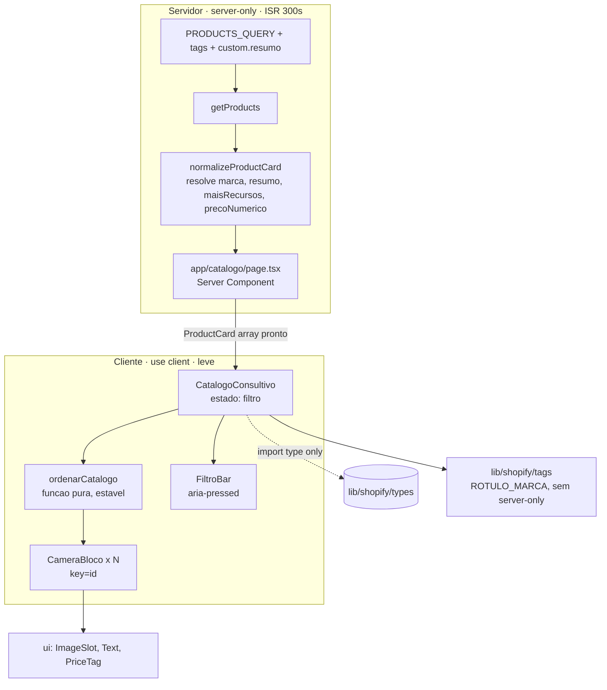

# Design Document — Catálogo Consultivo

## Overview

Reformula `/catalogo` de grade de cards para **blocos largos horizontais** com um **filtro que reordena** a lista (nunca esconde). O eixo do design é a **fronteira servidor/cliente**:

- **No servidor** (Server Component + camada `lib/shopify/*`, `server-only`): busca TODAS as câmeras numa única requisição, agora trazendo `tags` + metafield `custom.resumo`, e **resolve na normalização** os campos derivados (`marca`, `resumo`, `maisRecursos`, `precoNumerico`). O cliente recebe `ProductCard[]` pronto para exibir e ordenar — **decisão aprovada: marca no servidor (opção A)**.
- **No cliente** (`CatalogoConsultivo`, `"use client"` — primeiro componente de UI da loja além do carrinho): guarda **um** estado (`filtro`) e deriva a ordem por uma **função pura** sobre a lista já carregada. Sem `fetch`, sem token, sem esconder.

O ponto que faz o SEO funcionar sem truque: **componentes `"use client"` no App Router ainda são renderizados no servidor (SSR)**. O HTML inicial já contém TODAS as câmeras na ordem do servidor; a interatividade do filtro só entra após a hidratação. Não existe `display:none` nem desmontagem em lugar nenhum — o filtro apenas troca a ordem de um array.

## Steering Document Alignment

### Technical Standards (tech.md)
- **Regime preservado:** `/catalogo` mantém `export const revalidate = 300` (ISR). O componente de cliente **não** lê `cookies()`/`headers()`; a Home e `/sobre-nos` continuam `○ Static`. Nada aqui muda o regime de nenhuma rota.
- **Token server-only:** as extensões ficam em `lib/shopify/queries.ts`, `products.ts`, `normalize.ts` (já `server-only` ou puros). O cliente importa **apenas tipos**. Critério herdado de `catalogo-loja`: token/domínio **0 ocorrências** em `.next/static`.
- **Uma requisição:** os campos novos são **aditivos** à `PRODUCTS_QUERY` já existente — mesmo custo de rede (sem N+1). Validado contra **Storefront 2026-01** via Dev MCP (feito nesta fase; `metafield(namespace:"custom", key:"resumo")` + `tags` = ✅ VALID).
- **Money da Shopify, UI não faz aritmética:** o preço exibido continua vindo de `formatMoney` (pt-BR). `precoNumerico` é **apenas chave de ordenação** (não é preço exibido, não é conta sobre dinheiro cobrado) — decisão declarada nos comentários.
- **Acessibilidade fora do PreviewContent:** o `StoreShell` **não** é coberto pelo `MotionConfig reducedMotion` do `PreviewContent`. Por isso o design **evita animação de layout** na reordenação (troca de ordem seca); se um dia entrar animação, ela traz o próprio `useReducedMotion()`.

### Project Structure (structure.md)
- UI da loja em `components/loja/`; primitivos em `components/ui/`; camada de dados em `lib/shopify/`; CSS de layout da loja em `app/globals.css` (precedente `.produto-grid`, `.recomendados-*`). pt-BR em nomes de domínio e comentários.
- Grafia de marca vive **num lugar só** (`lib/shopify/tags.ts`); esta spec **adiciona** ali o rótulo de exibição e a tag `mais-recursos`, sem duplicar strings no cliente.
- Salvaguarda de dados no padrão `scripts/verificar-*.mjs` + `npm run verificar:*` (espelha `verificar:marcas`).

## Code Reuse Analysis

### Existing Components to Leverage
- **`lib/shopify/queries.ts` → `PRODUCTS_QUERY`**: estendida aditivamente com `tags` e o metafield `resumo`.
- **`lib/shopify/normalize.ts` → `normalizeProductCard` / `RawProductCard`**: passa a derivar `marca`, `resumo`, `maisRecursos`, `precoNumerico`. Os campos crus novos entram **opcionais** — assim `ACESSORIOS_QUERY`/`RECOMENDADOS_QUERY` (que não selecionam tags/metafield) continuam válidos, produzindo `marca=null`/`resumo=null`/`maisRecursos=false` (harmless; esses cards os ignoram).
- **`lib/shopify/tags.ts` → `marcaDoProduto`, `MARCAS`, `TAG_ESEECLOUD`, `TAG_ICSEE`**: reusados para resolver a marca; **acrescento** `TAG_MAIS_RECURSOS`, `ROTULO_MARCA` e o tipo `Marca`.
- **`components/ui/*`**: `ImageSlot`, `Text`, `PriceTag`, `Heading`, `SectionLabel` compõem o bloco — sem recriar primitivos.
- **`components/loja/StoreShell.tsx`** e **`app/catalogo/page.tsx`**: o Server Component da rota permanece (try/catch, revalidate, StoreShell, cabeçalho); só troca `<CatalogGrid>` por `<CatalogoConsultivo>`.
- **`app/globals.css`**: recebe as classes de layout do bloco/lista/filtros, no mesmo estilo das classes de produto já existentes.
- **`scripts/verificar-marcas.mjs`**: modelo literal para `verificar-resumo.mjs`.

### Integration Points
- **Shopify Storefront API 2026-01**: só a `PRODUCTS_QUERY` muda; `getProducts()` mantém assinatura (`Promise<ProductCard[]>`).
- **`ProductCard` (contrato compartilhado, `types.ts`)**: ganha campos **aditivos** — todos os consumidores (`ProductCardLink`, `AcessoriosSugeridos`, `RecomendadosRelacionados`) seguem compilando sem mudança obrigatória.

## Architecture



**Regra de ouro do SSR:** `CatalogoConsultivo` é `"use client"`, mas seu **primeiro render é no servidor**. O array chega na ordem do servidor, `filtro` inicia em `"todas"` (identidade), logo o HTML inicial = todas as câmeras em ordem original. Hidratou → clicar reordena o array em memória. Nenhuma câmera sai do DOM em nenhum momento.

## Components and Interfaces

### 1. `PRODUCTS_QUERY` estendida — `lib/shopify/queries.ts`
- **Propósito:** trazer, aditivamente, o que alimenta selo/resumo/filtro.
- **Forma (validada 2026-01):**
  ```graphql
  query Products($first: Int!) {
    products(first: $first) {
      nodes {
        id
        handle
        title
        tags
        featuredImage { url altText width height }
        priceRange { minVariantPrice { amount currencyCode } }
        resumo: metafield(namespace: "custom", key: "resumo") { value }
      }
    }
  }
  ```
- **Reuses:** estrutura existente; só acrescenta `tags` e o campo aliasado `resumo`.
- **Nota de chave:** a chave `custom.resumo` é **confirmada contra a loja real** antes de depender dela (script de salvaguarda, item 8) — lição do `eseecloud`.

### 2. Tipos crus + normalização — `lib/shopify/normalize.ts`
- **`RawProductCard`** ganha campos **opcionais** (para não quebrar os outros consumidores do normalizador):
  ```ts
  export interface RawProductCard {
    id: string; handle: string; title: string
    featuredImage: RawImage | null
    priceRange: RawPriceRange
    tags?: string[]                       // novo — só a PRODUCTS_QUERY seleciona
    resumo?: { value: string } | null     // novo — metafield aliasado
  }
  ```
- **`normalizeProductCard`** passa a derivar os campos de exibição/ordenação:
  ```ts
  const tags = raw.tags ?? []
  return {
    id, handle, title,
    image: normalizeImage(raw.featuredImage),
    price: formatMoney(raw.priceRange.minVariantPrice),
    precoNumerico: Number(raw.priceRange.minVariantPrice.amount), // só chave de ordem; assume amount numérico finito (Shopify sempre entrega string numérica — ao contrário de formatMoney, aqui não guardamos com Number.isFinite; se um dia isso mudar, NaN tornaria a ordem de "Melhor preço" indefinida)
    marca:        marcaDoProduto(tags),                            // Marca | null
    resumo:       raw.resumo?.value?.trim() || null,               // "" / ausente → null
    maisRecursos: tags.includes(TAG_MAIS_RECURSOS),                // boolean
  }
  ```
- **Reuses:** `marcaDoProduto`, `TAG_MAIS_RECURSOS`, `formatMoney`. `normalize.ts` já é importado só no servidor.
- **Dependência:** importa de `./tags` (sem `server-only`) — sem ciclo (`tags.ts` não importa `normalize.ts`).

### 3. Marca e constantes — `lib/shopify/tags.ts`
- **Adiciona (sem `server-only`, atravessa a fronteira como `types.ts`):**
  ```ts
  export const TAG_MAIS_RECURSOS = "mais-recursos"
  export type Marca = (typeof MARCAS)[number]           // "eseecloud" | "icsee"
  export const ROTULO_MARCA: Record<Marca, string> = {
    eseecloud: "EseeCloud",
    icsee:     "iCSee",
  }
  ```
- **Propósito:** rótulo de exibição **desacoplado** da grafia da tag (Req 2.2); a tag do filtro de recursos numa constante única (Req 3.4). O cliente usa `ROTULO_MARCA`/`Marca` — nunca reescreve as grafias.

### 4. Contrato `ProductCard` estendido — `lib/shopify/types.ts`
```ts
import type { Marca } from "./tags"   // type-only; sem ciclo

export interface ProductCard {
  id: string; handle: string; title: string
  image: ProductImage | null
  price: FormattedPrice
  // ── novos, derivados no servidor (aditivos; consumidores antigos os ignoram) ──
  marca:        Marca | null   // resolvido por marcaDoProduto (server)
  resumo:       string | null  // custom.resumo; null quando ausente/vazio
  maisRecursos: boolean        // tem a tag mais-recursos
  precoNumerico: number        // chave de ordenação (NÃO é preço exibido)
}
```
- **Compat:** `ProductCardLink`, acessórios e recomendados recebem os campos extras e os ignoram. Como recebem os cards de queries que **não** selecionam tags/metafield, chegam com `marca=null`, `resumo=null`, `maisRecursos=false` — inertes.
- **Por que campos OBRIGATÓRIOS (não opcionais) compilam em todo lugar:** `normalizeProductCard` é o **único construtor de `ProductCard` no codebase** — não há nenhum objeto `ProductCard` montado à mão. Todos os produtores (`products.ts`, `acessorios.ts`, `recomendados.ts`) passam por ele. Por isso adicionar 4 campos obrigatórios não quebra nada; e se um dia alguém montar um `ProductCard` literal, o compilador **corretamente** vai exigir os campos (falha desejada, não regressão).

### 5. Página (Server Component) — `app/catalogo/page.tsx`
- **Muda só a linha de corpo:** `corpo = <CatalogoConsultivo produtos={produtos} />` no lugar de `<CatalogGrid>`. Mantém `revalidate=300`, `try/catch` (erro amigável), `StoreShell`, `SectionLabel` + `<h1>` "Catálogo".
- **Reuses:** tudo o mais intacto. `CatalogGrid.tsx`/`ProductCardLink` **permanecem** no repo (ainda usados por recomendados/acessórios; `CatalogGrid` fica órfão do catálogo mas não é removido nesta spec — blast radius mínimo).

### 6. `CatalogoConsultivo` (client) — `components/loja/CatalogoConsultivo.tsx`
- **Propósito:** estado do filtro + reordenação da lista já pronta.
- **Interface:** `{ produtos: ProductCard[] }`.
- **Comportamento:**
  ```tsx
  "use client"
  const [filtro, setFiltro] = useState<FiltroCatalogo>("todas")
  const ordenados = useMemo(() => ordenarCatalogo(produtos, filtro), [produtos, filtro])
  if (produtos.length === 0) return <EstadoVazio />          // Req 8.1: sem barra de filtros
  return (
    <>
      <FiltroBar filtro={filtro} onSelect={setFiltro} />
      <div className="catalogo-lista">
        {ordenados.map((p) => <CameraBloco key={p.id} produto={p} />)}
      </div>
    </>
  )
  ```
- **Leveza:** um `useState`, um `useMemo`, zero efeitos, zero rede. `import type` para `ProductCard`; import de valor só de `./ordenarCatalogo` e `tags.ts`.
- **`key={p.id}`:** React **reordena** os nós existentes → imagens não recarregam (Req 3.9).

### 7. `ordenarCatalogo` (função pura) — `components/loja/ordenarCatalogo.ts`
- **Assinatura:** `ordenarCatalogo(produtos: ProductCard[], filtro: FiltroCatalogo): ProductCard[]`
- **Regras (todas estáveis — não mutam a entrada):**
  | Filtro | Ordem |
  |---|---|
  | `todas` | identidade (retorna a ordem do servidor) |
  | `melhor-preco` | `precoNumerico` crescente; empate → ordem do servidor |
  | `mais-recursos` | partição estável: `maisRecursos === true` primeiro, resto depois |
  | `eseecloud` | partição estável: `marca === "eseecloud"` primeiro |
  | `icsee` | partição estável: `marca === "icsee"` primeiro |
- **Implementação (estabilidade garantida por `Array.sort` estável do ES2019 sobre uma cópia):**
  ```ts
  const rank = (p, casa) => (casa(p) ? 0 : 1)
  // partição: [...produtos].sort((a,b) => rank(a) - rank(b))
  // preço:    [...produtos].sort((a,b) => a.precoNumerico - b.precoNumerico)
  ```
  `todas` retorna `produtos` sem cópia/sort (identidade real). Nenhum item é filtrado para fora — o comprimento do array é invariante (Req 3.2/4.3).
- **Testável isoladamente:** entrada/saída puras — o coração da auditoria do item (c).

### 8. `FiltroBar` (client, apresentacional) — dentro de `CatalogoConsultivo.tsx` (ou arquivo irmão)
- **Interface:** `{ filtro, onSelect }`. Renderiza 5 botões (sempre os 5 — Req 8.3), rótulos pt-BR: "Todas", "Melhor preço", "Mais recursos", "EseeCloud", "iCSee".
- **A11y (Req 3.10):** `<button aria-pressed={filtro === opção}>`, foco/ativação por Tab/Enter/Space nativos do `<button>`; estado ativo estilizado via `--cor-destaque`.

### 9. `CameraBloco` (apresentacional) — `components/loja/CameraBloco.tsx`
- **Interface:** `{ produto: ProductCard }`. Sem hooks, sem estado (bundlado no cliente por ser filho do client, mas inerte).
- **Composição (ordem de leitura — Req 1.1):**
  - `ImageSlot` (fallback nativo se `image` nulo — Req 1.6), `aspectRatio` fixo à esquerda (desktop).
  - Nome como `Link href="/produtos/{handle}"`.
  - **Selo de marca:** só quando `produto.marca` → `ROTULO_MARCA[produto.marca]` (Req 2.2/2.3), estilo `--cor-destaque`.
  - **Resumo:** só quando `produto.resumo` (Req 1.5) — `<Text>` secundário.
  - `PriceTag` (preço formatado — Req 1.7).
  - Botão "ver detalhes" → `Link` para `/produtos/{handle}` (Req 1.4).
- **Reuses:** `ImageSlot`, `Text`, `PriceTag`, `Link`; `ROTULO_MARCA` de `tags.ts`. Importa **só tipos** da camada Shopify.

### 10. CSS de layout — `app/globals.css` (aditivo)
- `.catalogo-filtros` (barra flex, `flex-wrap`, gap, alvos de toque ≥ 40px).
- `.catalogo-lista` (coluna, gap entre blocos).
- `.catalogo-bloco` (desktop: `display:flex; flex-direction:row`, imagem largura fixa ~40%, `background: var(--cor-card)`, borda `color-mix(--cor-destaque 14%)`, radius 20; **mobile `@media (max-width: 767px)`: `flex-direction:column`**). Sem scroll horizontal (Req 1.3).
- Mesma paleta que o usuário pediu, já disponível em `--cor-*` (`--cor-fundo #0D0A08`, `--cor-destaque #D4A017`, `--cor-card` gradiente `160deg,#1c1508,#110e06`), container 1200px herdado do wrapper da página.

## Data Models

### `FiltroCatalogo` (novo tipo — `ordenarCatalogo.ts`)
```
type FiltroCatalogo = "todas" | "melhor-preco" | "mais-recursos" | "eseecloud" | "icsee"
```

### `ProductCard` (estendido — ver Componente 4)
```
+ marca:         "eseecloud" | "icsee" | null   (derivado no servidor)
+ resumo:        string | null                  (custom.resumo; null se ausente/vazio)
+ maisRecursos:  boolean                         (tag mais-recursos)
+ precoNumerico: number                          (chave de ordenação; nunca exibido)
```

## Error Handling

### Error Scenarios
1. **Shopify offline / falha na busca (runtime):**
   - **Handling:** `try/catch` já existente em `app/catalogo/page.tsx` → estado de erro amigável. Nenhuma mensagem interpola token/endpoint.
   - **User Impact:** "Não foi possível carregar os produtos. Tente novamente em instantes." (inalterado).
2. **`custom.resumo` ausente/vazio para uma câmera:**
   - **Handling:** `raw.resumo?.value?.trim() || null` → `resumo = null`.
   - **User Impact:** bloco sem a linha de resumo (sem espaço órfão). Req 1.5.
3. **Câmera sem tag de marca conhecida:**
   - **Handling:** `marcaDoProduto` → `null`.
   - **User Impact:** bloco sem selo; filtros de marca simplesmente não a sobem. Req 2.3.
4. **Imagem ausente (`featuredImage` nulo):**
   - **Handling:** `ImageSlot` sem `src` (fallback nativo).
   - **User Impact:** placeholder padrão da loja; layout intacto. Req 1.6.
5. **Zero câmeras:**
   - **Handling:** `CatalogoConsultivo` retorna estado vazio, **sem** barra de filtros. Req 8.1.
5b. **Exatamente uma câmera (Req 8.2):**
   - **Handling:** renderiza o bloco normalmente; a barra de filtros aparece, mas `ordenarCatalogo` sobre lista de 1 é no-op (sort estável de 1 elemento).
   - **User Impact:** nenhum erro; clicar filtros não muda nada visível.
6. **Chave de metafield divergente (ex.: alguém renomeou para `custom.resumo_produto`):**
   - **Handling:** `verificar:resumo` (item 8) acusa contagem 0 **fora do build** — o resumo sumiria em silêncio; o script faz a premissa cair com barulho.
   - **User Impact:** nenhum em produção (blocos ficam sem resumo); o dev é avisado ao rodar o check.

## Testing Strategy

Alinhado ao **Definition of Done** do projeto (tech.md): **Build + verificação manual**, sem suíte formal (a rede de segurança é estrutural: tipos, `server-only`, checks dedicados).

### Unit Testing
- **`ordenarCatalogo`** é o único núcleo com lógica pura — verificável mentalmente/à mão com uma lista pequena:
  - `todas` → array idêntico (mesma referência de itens, mesma ordem).
  - `melhor-preco` → ordem por `precoNumerico`; empate mantém ordem original.
  - `mais-recursos`/marca → itens que casam primeiro, ordem preservada dentro de cada grupo; **comprimento inalterado** (invariante anti-"esconder").
  - (Sem framework de teste novo — conforme DoD. Se desejado, um `.mjs` de verificação pode exercê-la.)

### Integration Testing
- **`npm run build`**: passa sem erros de TS; `npx tsc --noEmit` limpo. Conferir na saída: `/` e `/sobre-nos` `○ (Static)`; `/catalogo` e `/produtos/[handle]` ISR (Req 7.1/7.2).
- **Build sem `.env.local`**: conclui (Req 7.4).
- **`server-only`**: confirmar que `CatalogoConsultivo`/`CameraBloco`/`ordenarCatalogo` importam a camada Shopify **só como tipo** — o build falha se importarem um módulo `server-only` (rede de segurança automática).
- **Token no bundle**: `.next/static` sem token/domínio (Req NFR Security).

### End-to-End Testing (verificação manual em `npm run dev`, item da auditoria)
- Ver "Plano de Auditoria" abaixo — os 4 focos pedidos.

---

## Plano de Auditoria (embutido — executar ANTES de considerar concluído)

Auditoria de aceite, focada nos 4 pontos que o usuário pediu. Roda como verificação manual + um script novo; espelha a disciplina do `verificar:marcas`.

### (a) SEO — todas no HTML, funciona sem JS, nunca `display:none`
1. **HTML do servidor contém todas:** `npm run build && npm start`, então `curl -s http://localhost:3000/catalogo` (ou "View Source") e conferir que as **7** câmeras aparecem — 7 links `/produtos/…`, 7 nomes, os resumos e os selos — **no HTML bruto**, antes de qualquer JS.
2. **Sem JS:** DevTools → desabilitar JavaScript → recarregar `/catalogo`: as 7 câmeras seguem visíveis e os links "ver detalhes" navegam. (O filtro fica inerte — aprimoramento progressivo, Req 4.2.)
3. **Nunca esconde:** inspecionar o DOM após clicar cada filtro → **7 blocos** presentes em todos os estados; grep por `display: none`/desmontagem no componente = ausente (só reordenação de array). Conferir contagem via `document.querySelectorAll('.catalogo-bloco').length === 7` em cada filtro.

### (b) Chave `custom.resumo` confirmada de verdade na loja
1. **Novo script `scripts/verificar-resumo.mjs` + `npm run verificar:resumo`** (modelado em `verificar-marcas.mjs`): pagina os produtos pedindo `metafield(namespace:"custom", key:"resumo"){ value }` e reporta **quantas das 7** têm resumo preenchido; lista as sem resumo por handle. Exit 1 se **nenhuma** tiver (premissa caiu — chave errada ou dados não preenchidos), exit 0 caso contrário.
2. **Mesmas cautelas do modelo:** Node puro (não importa `lib/shopify/`), `--env-file=.env.local`, `process.exitCode` (nunca `process.exit()`), mensagem de erro sem token, versão default `2026-01` duplicada com comentário de "mude nos dois lugares".
3. **Confirmação positiva:** rodar o script e ver a contagem real (esperado: as 7 preenchidas, conforme o usuário). Isso é "confirmar de verdade" — não confiar só no Dev MCP (que valida **schema**, não os dados da loja).

### (c) Filtro reordena de forma estável (sem "pular" cards de forma estranha)
1. **Estabilidade visual:** em `npm run dev`, com a lista das 7, clicar "EseeCloud" → as 4 EseeCloud sobem **na mesma ordem relativa** em que estavam; as 3 iCSee descem **na mesma ordem relativa**. Repetir para "iCSee" e "Mais recursos". Voltar em "Todas" → ordem original restaurada (Req 3.7).
2. **Melhor preço:** clicar → ordem crescente de preço; conferir que dois preços iguais (se houver) mantêm a ordem do servidor (sem embaralhar).
3. **Sem recarregar imagem/re-montar:** Network tab → clicar filtros **não** dispara requisições; as imagens não piscam (o `key={p.id}` reordena nós, não recria).
4. **Determinismo:** a lógica vive em `ordenarCatalogo` (pura) — a auditoria de (c) é, no fundo, exercitar essa função com a lista real e confirmar invariância de comprimento + estabilidade.

### (d) Não quebrar catálogo atual nem o regime de render
1. **Saída do build:** `/` e `/sobre-nos` = `○ (Static)`; `/catalogo` e `/produtos/[handle]` = ISR (`● (ISR)`/`revalidate`). Regressão aqui é silenciosa — conferir a tabela impressa pelo `next build`.
2. **Downstream intacto:** abrir uma página de produto → **acessórios sugeridos** e **"Você também pode gostar"** seguem funcionando (mesmo `ProductCard`/camada Shopify). Adicionar ao carrinho → carrinho intacto.
3. **`tsc --noEmit` limpo** e **build sem `.env.local`** conclui.
4. **Token:** grep do token/domínio em `.next/static` → 0 ocorrências.

> A auditoria é **pré-condição de "pronto"**, não etapa opcional. (a)/(c)/(d) são verificação manual + build; (b) é o script novo `verificar:resumo`. Nenhuma delas entra no `npm run build` (que precisa passar sem `.env.local`), no mesmo espírito do `verificar:marcas`.
