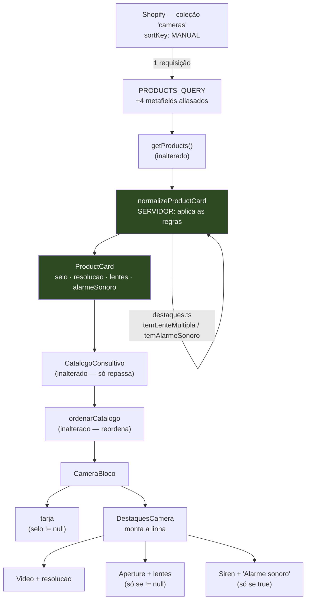

# Design Document

## Overview

A feature acrescenta **dois elementos ao `CameraBloco`** — uma tarja de
posicionamento e uma linha de destaques de spec — alimentados por **4 metafields
novos na `PRODUCTS_QUERY`**, com toda a decisão de "aparece ou não" tomada **no
servidor**, dentro de `normalizeProductCard`.

O eixo do design é uma escolha: **o `ProductCard` chega pronto à UI**. O bloco
não recebe `"Lente única"` para decidir se mostra; recebe `lentes: null`. Não
recebe `"Aplicativo"` para comparar; recebe `alarmeSonoro: false`. Isso é a
continuação literal da "opção A" já registrada em `normalize.ts` (*"cliente
recebe o card pronto"*), e tem três consequências que valem a pena:

1. **A regra de negócio fica num módulo puro e testável** (`destaques.ts`), não
   espalhada em `&&` dentro do JSX.
2. **O valor não-disparador nunca atravessa a fronteira.** `"Noticação"` e
   `"Aplicativo"` não chegam ao cliente — não há como um refactor futuro
   acidentalmente renderizá-los (Req 4.2).
3. **O bloco continua puramente apresentacional** (Req 5.5), como já é hoje.

Nada aqui muda o regime de renderização, o filtro, a ordem da coleção ou a ficha
técnica.

## Steering Document Alignment

### Technical Standards (tech.md)

| Padrão de `tech.md` | Como o design cumpre |
|---|---|
| Storefront API **2026-01** | A `PRODUCTS_QUERY` estendida foi **validada no Dev MCP contra 2026-01** (✅ VALID) antes deste documento. `client.ts` não muda. |
| **ISR vem do route segment** | `app/catalogo/page.tsx` **não é tocado** — `export const revalidate = 300` permanece. A feature não adiciona `fetchCache`, `force-cache`, `cookies()` nem `headers()`. |
| **Token server-only** | `queries.ts`/`products.ts` mantêm `import "server-only"`. Os arquivos novos (`destaques.ts`, `DestaquesCamera.tsx`) **não tocam o token** e não importam `client.ts`. |
| **Home continua `○ Static`** | Nada nesta feature toca `app/layout.tsx`, a Home ou o Sobre Nós. |
| **Build passa sem `.env.local`** | Nenhum módulo novo lê `process.env`. O check do Req 7 é script npm separado, **desacoplado do build**. |
| **lucide-react** é o padrão de ícones | Usa `Video`, `Aperture`, `Siren` da versão instalada (**1.24.0**, os três confirmados presentes), importados **nominalmente** (tree-shaking). |
| DoD = **build + verificação manual** | Sem infraestrutura de teste nova. A rede é estrutural: tipos, `server-only`, e o `verificar:destaques`. |

### Project Structure (structure.md)

- **pt-BR** em nomes de arquivo, funções e comentários: `destaques.ts`,
  `DestaquesCamera.tsx`, `temLenteMultipla`, `temAlarmeSonoro`, `alarmeSonoro`.
- **Onde as coisas moram** (tabela do `structure.md`), respeitado à risca:
  - *Query da Shopify* → `lib/shopify/queries.ts`
  - *Produto (dados)* → `lib/shopify/normalize.ts`
  - *Tipos compartilhados* → `lib/shopify/types.ts`
  - *UI do catálogo* → `components/loja/`
- **Fronteira cliente/servidor:** `CameraBloco` e `DestaquesCamera` importam da
  camada de dados **apenas tipos** (`import type`). `destaques.ts` é módulo
  **puro** (sem `server-only`, sem token, sem React) — pode ser importado dos
  dois lados sem risco, como `tags.ts`.
- **Comentários explicam o porquê** — a densidade dos arquivos vizinhos
  (`normalize.ts`, `ordenarCatalogo.ts`, `specs.ts`) é o padrão a manter.

## Code Reuse Analysis

### Existing Components to Leverage

- **`PRODUCTS_QUERY` (`queries.ts`)** — estendida com 4 campos aliasados. O
  documento inteiro (incluindo `sortKey: MANUAL`, `tags`, `resumo`) é preservado;
  a extensão é **puramente aditiva**.
- **`normalizeProductCard` (`normalize.ts`)** — é o **único construtor de
  `ProductCard`** no codebase (fato já documentado em `types.ts`). Ganha 4
  campos. Por ser único, os 3 produtores (catálogo, acessórios, recomendados)
  herdam o contrato sem alteração.
- **`RawProductCard` (`normalize.ts`)** — já tem o **precedente exato** deste
  caso: `tags?` e `resumo?` são opcionais *"de propósito: só a `PRODUCTS_QUERY`
  os seleciona"*. Os 4 novos entram como opcionais pelo mesmo motivo e pela mesma
  razão declarada.
- **`ProductCard` (`types.ts`)** — ganha 4 campos obrigatórios, seguros pela
  mesma lógica do bloco de comentário já existente ali.
- **`CameraBloco` (`CameraBloco.tsx`)** — recebe a tarja e a linha; a ordem de
  leitura existente (imagem → marca → nome → resumo → preço → botão) é
  preservada, com dois pontos de inserção.
- **`.catalogo-bloco__selo` (`globals.css`)** — **reusado como referência
  visual**, não alterado: a tarja nova é desenhada em **contraste deliberado**
  com ele (Req 1.6).
- **Padrão de ícone decorativo da `FichaTecnica`** — `<Icone aria-hidden />` com o
  texto ao lado carregando o significado (Req 5.4). Reusa-se o **padrão**, não o
  módulo (ver decisão abaixo).
- **`scripts/verificar-especificacoes.mjs`** — molde do check novo: paginação,
  `process.exitCode`, mensagem sem token, duplicação declarada.

### Integration Points

- **Storefront API / coleção `cameras`** — mesma requisição, mesma coleção, mesmo
  `sortKey: MANUAL`. **Zero chamadas adicionais.**
- **`getProducts()` (`products.ts`)** — **não muda uma linha.** Ele já mapeia
  `nodes.map(normalizeProductCard)`; os campos novos fluem sozinhos.
- **`CatalogoConsultivo` / `ordenarCatalogo`** — **não mudam.** Recebem
  `ProductCard[]` mais rico e o repassam. O `key={p.id}` já garante que a tarja
  acompanha o produto na reordenação (Req 6.6).
- **`app/catalogo/page.tsx`** — **não muda.** ISR e `try/catch` intactos.

## Architecture

### Decisão 1 — A regra mora no servidor, não no JSX

O `ProductCard` carrega o **resultado** da regra, não a matéria-prima:

```
custom.numero_de_lentes = "Lente única"   →  lentes: null           (não "Lente única")
custom.com_alarme       = "Aplicativo"    →  alarmeSonoro: false    (não "Aplicativo")
custom.com_alarme       = "Alarme sonoro" →  alarmeSonoro: true
```

**Por que `alarmeSonoro` é `boolean` e `lentes` é `string | null`** (a assimetria
é proposital, não descuido): o alarme exibe um **rótulo fixo** — o valor do
metafield coincide com ele por acaso, e o Req 4.3 avisa para não confundir isso
com "exibe o valor cru". Um `boolean` torna essa distinção **impossível de
violar**. Já as lentes exibem o **valor literal** ("Lente dupla" vs "Lente
tripla" são textos diferentes que o cliente lê), então o campo carrega a string —
mas apenas quando dispara.

### Decisão 2 — NÃO reusar `fichaTecnicaIcones.ts`

O briefing deixou a escolha para o design. **Não reusar**, e não tocar naquele
arquivo. Três razões:

1. **`ICONES_SPEC` é um mapa para lookup dinâmico** — a `FichaTecnica` itera
   `SPEC_METAFIELDS` (9 chaves variáveis) e busca o ícone por `key` em runtime.
   O catálogo tem **3 itens fixos, decididos em tempo de escrita**. Um `Record`
   para 3 constantes conhecidas é indireção sem lookup.
2. **`numero_de_lentes` não é uma spec da ficha.** Ela não está entre as 21 chaves
   de `SPEC_METAFIELDS` — a página de produto **nunca** renderiza essa key.
   Adicionar `numero_de_lentes: Aperture` ao `ICONES_SPEC` criaria uma entrada
   **morta** naquele mapa, que mentiria sobre o que a ficha exibe.
3. **Req 6.8 pede a ficha funcionalmente inalterada.** Não tocar no arquivo é a
   forma mais barata de garantir isso.

Os 3 ícones são importados **nominalmente** dentro de `DestaquesCamera.tsx`.
`Video` e `Siren` já estão no grafo do projeto via `fichaTecnicaIcones.ts` — o
custo incremental real no bundle é essencialmente o `Aperture`.

### Decisão 3 — `.catalogo-bloco__tarja`, não `__selo`

**`.catalogo-bloco__selo` já existe e é o selo de MARCA** (EseeCloud/iCSee).
Reaproveitar essa classe misturaria dois dados diferentes. A tarja nova é
`.catalogo-bloco__tarja`, e o contraste visual resolve o Req 1.6 e o Req 1.7 de
uma vez:

| | Selo de marca (existe) | Tarja de posicionamento (nova) |
|---|---|---|
| Fundo | accent a 16% (suave) | **accent sólido** |
| Texto | `var(--cor-destaque)` | `var(--cor-destaque-texto)` (par de contraste do tema) |
| Raio | `999px` (cápsula) | **`10px`** (retângulo arredondado) |
| Quebra | 1 linha | **quebra em várias linhas** (Req 1.7) |

O raio menor não é só estética: uma cápsula de `999px` com texto em duas linhas
fica deformada. `10px` **quebra bem** — o requisito de texto longo e o de
distinção visual pedem a mesma coisa. O par sólido `--cor-destaque` /
`--cor-destaque-texto` já tem precedente no projeto
(`.catalogo-filtro[data-ativo="true"]`), então o contraste é o do tema, não
inventado aqui.

### Fluxo de dados



O nó verde é a fronteira: **à esquerda dele existem `"Lente única"` e
`"Aplicativo"`; à direita, não.**

### O que NÃO muda (auditoria de não-regressão)

| Arquivo | Muda? | Por quê |
|---|---|---|
| `app/catalogo/page.tsx` | **Não** | ISR, `try/catch` e layout intactos |
| `components/loja/CatalogoConsultivo.tsx` | **Não** | só repassa `ProductCard[]` |
| `components/loja/ordenarCatalogo.ts` | **Não** | invariante de comprimento preservado |
| `lib/shopify/products.ts` | **Não** | `getProducts` já mapeia o normalizador |
| `lib/shopify/client.ts` | **Não** | mesma versão de API, mesmo fetch |
| `lib/shopify/specs.ts` | **Não** | as 21 specs da ficha, intactas (Req 6.8) |
| `components/loja/fichaTecnicaIcones.ts` | **Não** | Decisão 2 |
| `components/loja/FichaTecnica.tsx` | **Não** | — |
| `lib/shopify/acessorios.ts` / `recomendados.ts` | **Não** | herdam campos `null`/`false`, inertes |
| `ACESSORIOS_QUERY` / `RECOMENDADOS_QUERY` | **Não** | não selecionam os metafields novos |

## Components and Interfaces

### 1. `lib/shopify/destaques.ts` — **novo**

- **Purpose:** As duas regras condicionais da feature, isoladas num módulo puro.
  É o **único lugar** onde os gatilhos são decididos.
- **Interfaces:**
  ```ts
  export function temLenteMultipla(valor: string | null | undefined): boolean
  export function temAlarmeSonoro(valor: string | null | undefined): boolean
  ```
- **Dependencies:** nenhuma. Sem React, sem `server-only`, sem `process.env`.
- **Reuses:** o padrão de `ordenarCatalogo.ts` — núcleo puro, sem imports de
  valor da camada Shopify, exercitável isoladamente.
- **Regras:**
  - `temLenteMultipla`: `trim()` → `toLowerCase()` → contém `"dupla"` **ou**
    `"tripla"`. `"Lente única"` não contém nenhum dos dois — **nunca dispara**
    (Req 3.2). Ausente/vazio/desconhecido → `false` (fail-closed, Req 3.3).
  - `temAlarmeSonoro`: `trim()` → `toLowerCase()` → **igualdade** com
    `"alarme sonoro"`. É igualdade, **não `includes`** — só este valor dispara
    (Req 4.1/4.2). `"Noticação"`, `"Aplicativo"`, vazio → `false`.
  - **Acento faz parte da comparação** (`toLowerCase()` preserva acento; não há
    `normalize("NFD")`): nenhuma das duas regras depende de casar caractere
    acentuado — `"dupla"`, `"tripla"` e `"alarme sonoro"` são todos ASCII. É
    `única` que **não deve** casar, e não casa.

### 2. `lib/shopify/queries.ts` — **modificado**

- **Purpose:** Selecionar os 4 metafields na mesma requisição.
- **Interfaces:** `PRODUCTS_QUERY` (mesmo nome, mesmas variáveis
  `$handle`/`$first` — a assinatura não muda, então `products.ts` não muda).
- **Reuses:** o documento existente; a extensão é aditiva.
- **Forma validada no Dev MCP 2026-01 (✅ VALID):**
  ```graphql
  resumo:    metafield(namespace: "custom", key: "resumo")            { value }
  selo:      metafield(namespace: "custom", key: "selo")              { value }
  resolucao: metafield(namespace: "custom", key: "tipo_de_resolucao") { value }
  lentes:    metafield(namespace: "custom", key: "numero_de_lentes")  { value }
  alarme:    metafield(namespace: "custom", key: "com_alarme")        { value }
  ```
  Aliases em pt-BR seguindo o precedente do `resumo:`. **As `key` são as literais
  da loja**, confirmadas na sondagem (Req 6.1) — nunca o rótulo do admin.

### 3. `lib/shopify/normalize.ts` — **modificado**

- **Purpose:** Aplicar as regras e produzir o `ProductCard` pronto.
- **Interfaces:** `RawProductCard` ganha 4 opcionais; `normalizeProductCard`
  ganha 4 campos no retorno. **Assinaturas inalteradas.**
- **Dependencies:** `./destaques` (novo import de valor — puro, seguro).
- **Reuses:** o padrão `raw.resumo?.value?.trim() || null`, que já resolve
  `""`/ausente → `null` numa expressão.
- **As 4 expressões, explícitas** (para não sobrar ambiguidade na implementação):
  ```ts
  selo:      raw.selo?.value?.trim()      || null,
  resolucao: raw.resolucao?.value?.trim() || null,
  // Lentes: o valor SÓ sobrevive se disparar. "Lente única" → null.
  lentes:       temLenteMultipla(raw.lentes?.value)
                  ? raw.lentes!.value.trim()
                  : null,
  // Alarme: veredito, não valor. O "Aplicativo"/"Noticação" morre aqui.
  alarmeSonoro: temAlarmeSonoro(raw.alarme?.value),
  ```
  Note que **`lentes` usa o mesmo `trim()`** que o gatilho usou para decidir — o
  texto exibido e o texto avaliado são o mesmo.

### 4. `lib/shopify/types.ts` — **modificado**

- **Purpose:** Contrato compartilhado. **Continua sem `server-only`.**
- **Interfaces:** 4 campos obrigatórios em `ProductCard`.

### 5. `components/loja/DestaquesCamera.tsx` — **novo**

- **Purpose:** Renderizar a linha de destaques. Decide **apenas presença**, nunca
  regra de negócio — os campos já chegam decididos.
- **Interfaces:**
  ```tsx
  export function DestaquesCamera({
    resolucao, lentes, alarmeSonoro,
  }: {
    resolucao:    string | null
    lentes:       string | null
    alarmeSonoro: boolean
  }): React.ReactElement | null
  ```
- **Dependencies:** `lucide-react` (`Video`, `Aperture`, `Siren` — nominais).
- **Reuses:** o padrão de ícone decorativo da `FichaTecnica`.
- **Comportamento:** monta os itens na ordem fixa **resolução → lentes → alarme**
  (Req 5.3); se a lista sair vazia, retorna **`null`** — sem container (Req 5.2),
  exatamente como `FichaTecnica` faz com `specs.length === 0`.
- **Cada item é `ícone + texto`, SEM rótulo** (Req 2.3). Reusa-se o padrão de
  ícone decorativo da `FichaTecnica`, mas **não** o seu `ficha-card__label`: aqui
  o item de resolução é `<Video/> Full HD`, nunca `<Video/> Resolução: Full HD`.
  O bloco é vitrine; a ficha é que tem rótulos.
- **Props explícitas, não `produto: ProductCard`:** o componente fica utilizável e
  legível sem conhecer o card inteiro, e o compilador impede que ele alcance
  `tags`/`preco` por engano.
- **Sem `"use client"` próprio** (Req 5.5). Herda o contexto de cliente do
  `CatalogoConsultivo`, como o `CameraBloco` já herda hoje.

### 6. `components/loja/CameraBloco.tsx` — **modificado**

- **Purpose:** Dois pontos de inserção; o resto do bloco intacto.
- **Reuses:** `ROTULO_MARCA`, `ImageSlot`, `Text`, `PriceTag`, `Link` — nada
  removido.
- **Nova ordem de leitura:**
  ```
  imagem
  ├─ [linha do topo]  tarja de posicionamento  +  selo de marca   ← inserção 1
  ├─ nome (h2 + link)
  ├─ resumo
  ├─ DestaquesCamera                                              ← inserção 2
  ├─ preço
  └─ "Ver detalhes"
  ```
  A tarja vem **antes** do selo de marca na linha do topo: é a recomendação
  editorial ("Menor preço"), o dado mais acionável do bloco. Os dois convivem num
  wrapper `flex` com `flex-wrap`, para o mobile quebrar sem estourar.

### 7. `app/globals.css` — **modificado**

- **Purpose:** Estilo da tarja e da linha, no bloco `/* Catálogo consultivo */` já
  existente.
- **Classes novas:** `.catalogo-bloco__topo`, `.catalogo-bloco__tarja`,
  `.catalogo-destaques`, `.catalogo-destaque`, `.catalogo-destaque__icone`.
- **Reuses:** variáveis `--cor-*` (zero hex hard-coded — Req 1.4) e a estrutura
  mobile-first do arquivo.
- **Contra o estouro horizontal (Req 6.4/1.7):** `flex-wrap: wrap` na linha de
  destaques e na linha do topo; `overflow-wrap: anywhere` na tarja. O
  `min-width: 0` de `.catalogo-bloco__conteudo` já existe e continua segurando o
  encolhimento no layout de 40%.
- **⚠️ `.catalogo-bloco__topo` precisa de `width: 100%`.** O pai
  `.catalogo-bloco__conteudo` tem `align-items: flex-start` (`globals.css:524`),
  que encolhe os filhos ao conteúdo — sem a largura explícita, o `flex-wrap` do
  topo nunca teria de onde quebrar e o Req 1.7 falharia **em silêncio**. Mesmo
  cuidado vale para `.catalogo-destaques`.
- **⚠️ A tarja NÃO leva `text-transform`.** `uppercase` reescreveria o texto do
  admin na tela e violaria o Req 1.1 ("sem capitalizar de forma diferente") sem
  ninguém notar. O `.catalogo-bloco__selo` vizinho usa só `letter-spacing`, sem
  `text-transform` — seguir esse precedente.

### 8. `scripts/verificar-destaques.mjs` — **novo** (Req 7)

- **Purpose:** Fazer a premissa cair com barulho. Ataca o modo de falha **desta**
  feature: não é "a chave sumiu" (isso o `verificar:especificacoes` já pegaria
  para 2 das 4 chaves), é **"a redação mudou no admin e o gatilho desligou, sem
  zerar a chave"**.
- **Interfaces:** `npm run verificar:destaques` → exit `0` ou `1`.
- **Reuses:** o molde de `verificar-especificacoes.mjs`.
- **Consulta:** a **coleção `cameras` com `sortKey: MANUAL`** — não `products`
  global. Tem de olhar exatamente o conjunto que o catálogo exibe.
- **Saída:** por câmera, os 4 valores; por chave, preenchidas/total **e os
  valores distintos** (Req 7.3); e a contagem de quantas disparam cada gatilho.
- **Falha (exit 1)** em quatro casos, **nesta ordem** — a ordem importa:
  0. **`collection` nula ou sem produtos.** ⚠️ Tem de ser checado **primeiro e
     separado**: sem ele, zero câmeras faria as 4 chaves aparecerem como `0/0` e
     o script culparia a *grafia da chave* — apontando para o lugar errado. A
     mensagem correta é *"coleção `cameras` não publicada no canal Storefront ou
     handle trocado"*, o mesmo modo de falha que `products.ts` já documenta.
     (O molde `verificar-especificacoes.mjs` não sofre disso porque consulta
     `products` global; este consulta a **coleção**, e por isso precisa do caso.)
  1. alguma das 4 chaves com **0** preenchidas (grafia da chave — Req 7.2);
  2. **0** câmeras disparando o gatilho de lentes (Req 7.4);
  3. **0** câmeras disparando o gatilho de alarme (Req 7.4).

  A mensagem do caso 2/3 declara a premissa e diz o que fazer se ela cair de
  verdade: *remover o destaque, não silenciar o check*.
- **Duplicação declarada** (mesma nota dos scripts irmãos): roda em Node puro,
  fora do Next — **não pode importar `destaques.ts`** (é TypeScript). As duas
  regras são reescritas ali, com comentário apontando a fonte da verdade.
- **`process.exitCode`, nunca `process.exit()`** — a armadilha do libuv no
  Windows, já documentada em `verificar-especificacoes.mjs`.
- **Não acoplado ao build** (Req 7.6).

### 9. `package.json` — **modificado**

- **Purpose:** Registrar o check. Sem esta entrada o Req 7.5 fica **sem dono** —
  o `.mjs` existiria mas ninguém conseguiria rodá-lo com o `.env.local` carregado
  (o Next é quem carrega o env; fora dele, quem carrega é o `--env-file`).
- **Interfaces:** uma linha em `"scripts"`, no padrão exato dos 6 irmãos:
  ```json
  "verificar:destaques": "node --env-file=.env.local scripts/verificar-destaques.mjs"
  ```
- **Reuses:** o padrão de `verificar:especificacoes`.
- **Nada mais muda no arquivo** — nenhuma dependência nova (o `lucide-react` já
  está instalado na 1.24.0, com os 3 ícones).

## Data Models

### `RawProductCard` (`lib/shopify/normalize.ts`) — 4 opcionais novos

```ts
export interface RawProductCard {
  id:            string
  handle:        string
  title:         string
  featuredImage: RawImage | null
  priceRange:    RawPriceRange
  // OPCIONAIS de propósito (nota já existente): só a PRODUCTS_QUERY os seleciona.
  tags?:         string[]
  resumo?:       { value: string } | null
  // ── feature catalogo-destaques ──────────────────────────────────────────────
  // 🔴 TODOS OS 4 SÃO VALORES CRUS, direto da Shopify — NENHUM passou pelas
  // regras de destaques.ts. Aqui ainda existem "Lente única", "Aplicativo" e
  // "Noticação"; no ProductCard, não. Não confunda um lado com o outro.
  selo?:         { value: string } | null   // custom.selo
  resolucao?:    { value: string } | null   // custom.tipo_de_resolucao
  lentes?:       { value: string } | null   // custom.numero_de_lentes — CRU:
                                            //   inclui "Lente única" (≠ ProductCard.lentes)
  alarme?:       { value: string } | null   // custom.com_alarme — CRU:
                                            //   inclui "Aplicativo"/"Noticação"
}
```

**Sobre os nomes** — `alarme` (cru) vs `alarmeSonoro` (veredito) diferem de
propósito: um é `"Aplicativo"`, o outro é `false`; nomes iguais convidariam a
passar um pelo outro.

**`lentes`, porém, tem o MESMO nome nos dois lados com semânticas diferentes** —
o cru inclui `"Lente única"`, o do `ProductCard` nunca. O nome se mantém (o alias
`lentes:` é o natural no GraphQL e renomear o cru para `numeroDeLentes` só moveria
a assimetria de lugar), mas **a distinção fica declarada no comentário acima com
a mesma ênfase do `alarme`** — é exatamente o risco que o argumento do `alarme`
descreve, e não vale fingir que não existe aqui.

### `ProductCard` (`lib/shopify/types.ts`) — 4 campos obrigatórios novos

```ts
export interface ProductCard {
  // … campos existentes: id, handle, title, image, price,
  //    marca, resumo, maisRecursos, precoNumerico
  /** `custom.selo` — recomendação editorial. `null` = sem tarja (Req 1.3). */
  selo:         string | null
  /** `custom.tipo_de_resolucao` — valor literal ("Full HD", "4K Ultra HD"). */
  resolucao:    string | null
  /** `custom.numero_de_lentes`, SÓ quando dupla/tripla. `null` quando é única
   *  ou desconhecida — o valor não-disparador NUNCA chega aqui (Req 3.2/3.3). */
  lentes:       string | null
  /** VEREDITO, não valor: `custom.com_alarme === "Alarme sonoro"`. O texto
   *  exibido é o rótulo fixo, nunca o metafield (Req 4.3). */
  alarmeSonoro: boolean
}
```

**Obrigatórios, não opcionais** — pelo mesmo argumento já escrito em `types.ts`
para `marca`/`resumo`/`maisRecursos`: `normalizeProductCard` é o único construtor,
todos os produtores passam por ele, e se alguém montar um `ProductCard` literal o
compilador **deve** exigir os campos (falha desejada, não regressão).

### Matriz de comportamento — as 7 câmeras reais

Derivada dos dados sondados. É a tabela de verificação visual do DoD:

| Câmera | Tarja | Resolução | Lentes | Alarme |
|---|---|---|---|---|
| A31H | Mais vendida | Full HD | Lente dupla | — (`"Aplicativo"`) |
| P9 | Menor preço | HD | — (`única`) | — (`"Noticação"`) |
| Q6 | Mais custo-benefício | Full HD | Lente dupla | — |
| Lâmpada | Maior praticidade | HD | — (`única`) | — |
| A38 | Mais completa | 4K Ultra HD | Lente dupla | **Alarme sonoro** |
| Q8 | Melhor para área externa | Full HD | Lente dupla | **Alarme sonoro** |
| S8 | Visão mais ampla | 3K Vertical | Lente tripla | — |

P9 e Lâmpada exercitam o caminho **"só a resolução"**; A38 exercita **os três
itens**; A31H prova que `"Aplicativo"` **não** vira sirene — o falso positivo que
a regra de igualdade evita.

## Error Handling

### Cenários

1. **Metafield ausente, nulo ou `""`**
   - **Handling:** `raw.X?.value?.trim() || null` → `null`; os gatilhos recebem
     `null` e devolvem `false`.
   - **User Impact:** o elemento simplesmente não aparece. Nenhuma caixa vazia
     (Req 1.3, 3.3, 4.2).

2. **Valor inesperado** (`numero_de_lentes = "Quatro lentes"`, admin renomeou)
   - **Handling:** **fail-closed** — não contém "dupla"/"tripla" → não dispara.
   - **User Impact:** o bloco perde um destaque, mas **não mostra nada errado**.
     Silencioso na UI **de propósito** — quem faz barulho é o
     `verificar:destaques` (Req 7.3), no lugar certo: o terminal do dev.

3. **Chave do metafield divergente** (renomear quebra a `custom.<key>`)
   - **Handling:** a query devolve `null` para aquele alias; tudo degrada para
     "sem destaque". `npm run verificar:destaques` sai **1** apontando a chave.
   - **User Impact:** catálogo íntegro, sem destaques até o conserto.

4. **Coleção `cameras` despublicada / handle errado**
   - **Handling:** já coberto — `collection` vem `null`, `getProducts` devolve
     `[]` via `?? []`. **Inalterado.**
   - **User Impact:** "Nenhum produto disponível no momento."

5. **Shopify fora do ar**
   - **Handling:** já coberto pelo `try/catch` de `app/catalogo/page.tsx`.
     **Inalterado.**
   - **User Impact:** "Não foi possível carregar os produtos."

6. **Selo com texto muito longo**
   - **Handling:** `overflow-wrap: anywhere` + raio de `10px`; a tarja quebra em
     linhas dentro do bloco.
   - **User Impact:** tarja mais alta. Sem truncar, sem rolagem horizontal
     (Req 1.7).

> **Nenhum cenário derruba o catálogo.** Todo caminho de erro converge para
> "renderiza sem o destaque" — a lista de produtos, o filtro e o SEO seguem.

## Testing Strategy

`tech.md` é explícito: **sem suíte de testes formal**, e não se deve adicionar
infraestrutura de teste sem pedido. A rede de segurança é estrutural.

### Unit Testing

Não há runner no projeto. O que substitui:

- **`destaques.ts` é puro e sem dependências** — verificável por inspeção direta
  e, se necessário, por um `node -e` descartável contra os 3 valores reais de
  lentes e os 3 de alarme. **Não** se cria `*.test.ts` nem se instala runner.
- **O compilador é o teste de contrato:** `ProductCard` com campos obrigatórios
  garante, em tempo de build, que todo produtor os fornece.

### Integration Testing

- **`npm run verificar:destaques`** é o teste de integração real desta feature:
  bate na loja de verdade, com a coleção de verdade, e falha com exit `1`.
- **`npx tsc --noEmit`** limpo — pega a fronteira cliente/servidor: se algum
  arquivo de UI importar valor de um módulo `server-only`, o build quebra.
- **`npm run build` sem `.env.local`** continua passando (Req 7.6 / DoD 3).
- **Auditoria de token:** buscar token e domínio em `.next/static` → **0
  ocorrências**.

### End-to-End Testing

Verificação manual em `npm run dev`, contra a matriz das 7 câmeras:

1. **Tarja:** as 7 câmeras exibem a tarja com o texto exato do admin, visualmente
   distinta do selo de marca.
2. **Só resolução:** P9 e Lâmpada mostram **apenas** `HD` — sem ícone de lentes,
   sem sirene.
3. **Os três itens:** A38 mostra `4K Ultra HD` + `Lente dupla` + `Alarme sonoro`.
4. **Falso positivo evitado:** A31H mostra `Full HD` + `Lente dupla` e **nenhuma
   sirene** (o valor é `"Aplicativo"`).
5. **Tripla:** S8 mostra `3K Vertical` + `Lente tripla`, sem sirene.
6. **SEO (Req 5.6):** `view-source:` / `curl` em `/catalogo` → a tarja e os
   valores de destaque **estão no HTML inicial**.
7. **Filtro não regride:** trocar entre os 5 filtros — as 7 câmeras continuam
   visíveis, e tarja/destaques acompanham o produto certo (Req 6.6).
8. **Responsivo:** DevTools em 360px e ≥768px — sem rolagem horizontal, com a
   tarja mais longa ("Melhor para área externa") e a resolução mais longa
   ("4K Ultra HD").
9. **Não-regressão fora do catálogo:** abrir `/produtos/camera-seguranca-a38` —
   ficha técnica com as 21 specs intacta; acessórios e "Você também pode gostar"
   inalterados.
10. **Regime de build:** na saída do `npm run build`, `/` e `/sobre-nos` seguem
    `○ (Static)`; `/catalogo` e `/produtos/[handle]` seguem com ISR.
