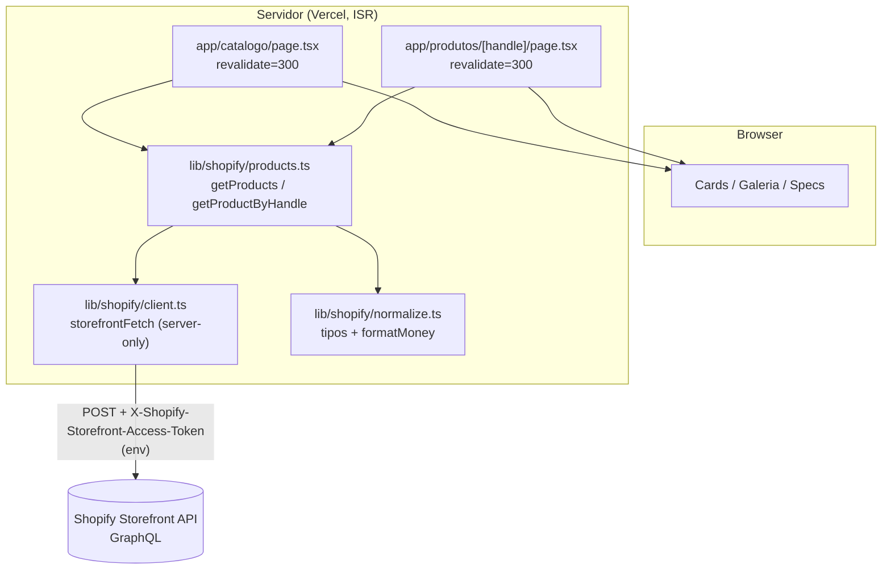
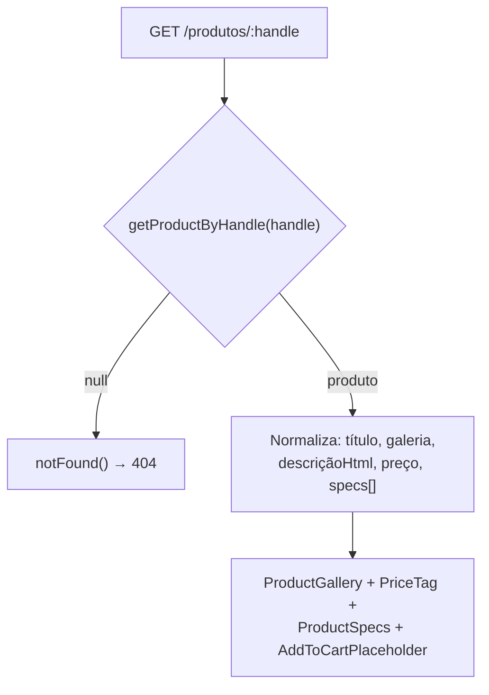

# Design Document — Catálogo da Loja (catalogo-loja)

## Overview

Adiciona uma **camada de dados Shopify (Storefront API / GraphQL)** e duas rotas
novas ao site do Ta Hora:

- **`/catalogo`** — vitrine que lista **todos** os produtos da Shopify.
- **`/produtos/[handle]`** — página individual de produto (galeria, descrição,
  preço, specs de metafields, placeholder de carrinho).

Os dados vêm da Shopify em **runtime com ISR** (o site deixa de ser static export
para servir preço/estoque frescos). O **design** reutiliza a paleta `--cor-*` e os
primitivos de `components/ui/` (`PriceTag`, `ImageSlot`, `Heading`, `Text`,
`CtaButton`). As páginas institucionais (Home, Sobre Nós) permanecem intactas —
elas não tocam a Shopify e passam a ser **SSG** normais após a remoção do export.

## Steering Document Alignment

### Technical Standards (tech.md)
- Concretiza a seção **"Modelo de build — atual vs. loja"**: remove
  `output: "export"` de `next.config.ts` e adota **SSR/ISR na Vercel**. Isso é a
  migração esperada, não regressão.
- **Token só em env** (Security): `import "server-only"` no cliente Shopify
  garante que o token nunca entre no bundle do browser; `.env`/`.env.local` já são
  gitignored; adiciona `.env.example` (rastreável — verificado com
  `git check-ignore`). **Defesa em profundidade:** `import "server-only"` também em
  `products.ts` e `queries.ts` (falha de build se importados no cliente no futuro,
  ex. na spec do carrinho); os componentes `components/loja/` importam apenas
  **tipos** via `import type` (apagados na compilação — impossível arrastar runtime
  do servidor pro cliente).
- **Tema por variáveis CSS**: as novas páginas consomem `--cor-*` (paleta de
  fábrica "Elegante" do `:root`), sem tocar no `:root` — coerente com o modelo de
  `lib/paleta.ts`.
- **`images.unoptimized` mantido**: os primitivos usam `` puro
  (`ImageSlot`), então não há dependência do otimizador do Next; imagens vêm do
  **CDN da Shopify** com parâmetros de tamanho na URL (responsivas, sem CLS via
  `aspect-ratio`).
  - **Melhoria FUTURA de performance (fora desta spec, não bloqueia):** imagem
    impacta conversão em loja — avaliar migrar `ImageSlot`/cards para `next/image`
    (com `remotePatterns` do CDN Shopify) ou servir AVIF/WebP com `sizes`/`srcset`
    responsivos. Registrado como frente seguinte; não construir agora.
- **Acessibilidade e responsividade (NFRs):** as páginas da loja herdam
  `prefers-reduced-motion` porque os primitivos usam Framer Motion e o site aplica
  `MotionConfig reducedMotion="user"` (não é necessário re-declarar nas rotas da
  loja — os primitivos respeitam o media query nativamente via CSS em `globals.css`
  e via `useReducedMotion`). Responsividade: grid `auto-fit` (mesmo padrão do
  `ProductGrid`) + `useIsMobile` onde houver ramo mobile/desktop. Cards são
  `<Link>` (foco/teclado nativos).

### Project Structure (structure.md)
- **Idioma pt-BR** em nomes de domínio e comentários; nomes de API Next/React em
  inglês.
- **Nova pasta de dados** `lib/shopify/` (segue o padrão "libs em `lib/`").
- **Novos componentes** em `components/loja/` (mesma convenção de
  `components/sections/` e `components/ui/`: um arquivo por componente, primitivos
  reutilizados em vez de recriados).
- **Rotas** em `app/` seguindo App Router (uma pasta por rota, `page.tsx`).

## Code Reuse Analysis

### Existing Components to Leverage
- **`components/ui/PriceTag`**: exibe preço no padrão do site. Recebe `price` como
  string BR ("1.799,90") + `currency` "R$" + `oldPrice`/`installments` opcionais.
  → usado no card do catálogo e na página de produto.
- **`components/ui/ImageSlot`**: `` com `borderRadius`, `objectFit`,
  placeholder "Imagem aqui" quando `src` ausente (atende ao requisito de
  placeholder de imagem). → imagem do card e imagem principal da galeria.
- **`components/ui/Heading` / `Text`**: título/descrição com tipografia e cores do
  tema.
- **`components/ui/CtaButton`**: base visual do botão placeholder de carrinho
  (renderizado **sem `href`** e inerte).
- **`lib/utils.ts` (`cn`, `contrastColor`)**: classes e contraste de cor.
- **Tema `:root` (`app/globals.css`) + `lib/tokens.ts`**: variáveis `--cor-*`,
  raios e `tokens.accent.default` como accent padrão das páginas da loja.

### Integration Points
- **`app/layout.tsx` (RootLayout)**: as rotas novas herdam `<html lang="pt-BR">` e
  o `globals.css` — nenhum ajuste necessário além de existirem sob `app/`.
- **`next.config.ts`**: única mudança estrutural — remover `output: "export"`
  (mantendo `images.unoptimized`).
- **Shopify Storefront API**: nova integração externa (GraphQL POST), isolada em
  `lib/shopify/`.
- **Navbar/Footer (JSON de layout)**: os layouts `_home.json` e `sobre-nos.json`
  **já contêm o rótulo "Catálogo"** na navbar (`link1Label`) e no footer
  (`column1Link1Label`), porém **sem href** (cai no default `"#"`). A integração é
  puramente **aditiva**: setar `link1Href = "/catalogo"` (navbar) e
  `column1Link1Href = "/catalogo"` (footer) nos dois JSONs. A `Navbar`/`Footer`
  renderizam links como `<a href>` — um href de rota (`/catalogo`) funciona sem
  alteração de componente.

## Architecture

Camadas isoladas: **rotas (Server Components)** chamam a **camada de dados
`lib/shopify/`** (server-only), que normaliza a resposta GraphQL em tipos limpos;
as rotas passam esses tipos para **componentes de apresentação** que reutilizam os
primitivos de UI. O token nunca cruza a fronteira servidor→cliente.



Fluxo da página de produto (incl. 404 e specs de metafields):



## Components and Interfaces

### `lib/shopify/client.ts` — cliente Storefront (server-only)
- **Purpose:** executar consultas GraphQL contra a Storefront API com o token de
  env, no servidor.
- **Interfaces:**
  - `storefrontFetch<T>(query: string, variables?: Record<string, unknown>, opts?: { revalidate?: number }): Promise<T>`
- **Comportamento:**
  - Primeira linha do módulo: `import "server-only"` (erro de build se importado no
    cliente).
  - Lê `SHOPIFY_STORE_DOMAIN`, `SHOPIFY_STOREFRONT_TOKEN` e
    `SHOPIFY_STOREFRONT_API_VERSION` (constante default `2025-01`, sobrescrevível
    por env). Se domínio/token ausentes → `throw new Error("Shopify env ausente: ...")`.
  - `fetch(endpoint, { method: "POST", headers: { "Content-Type": "application/json", "X-Shopify-Storefront-Access-Token": token }, body, next: { revalidate } })`.
  - Se `!res.ok` ou `json.errors` → lança `Error` com mensagem **sem** o token.
- **Dependencies:** `fetch` (Node/Vercel), env.
- **Reuses:** —

### `lib/shopify/queries.ts` — documentos GraphQL
- **Purpose:** strings de query versionadas.
- **Interfaces (constantes):**
  - `PRODUCTS_QUERY` — `products(first: N)` → `id, handle, title, featuredImage, priceRange.minVariantPrice{amount,currencyCode}`.
  - `PRODUCT_BY_HANDLE_QUERY` — `product(handle: $handle)` → `title, descriptionHtml, images(first: N), priceRange, variants(first:1)`, e `metafields(identifiers: $identifiers)` para as specs.
- **Reuses:** `SPEC_METAFIELDS` (abaixo) para montar `identifiers`.

### `lib/shopify/specs.ts` — mapa de metafields de specs
- **Purpose:** declarar quais metafields são "especificações técnicas" e seus
  rótulos legíveis. **Fonte da verdade a preencher pelo usuário** (namespace/keys
  reais da Shopify dele).
- **Interfaces:**
  - `SPEC_METAFIELDS: { namespace: string; key: string; label: string }[]`
    (ex.: `{ namespace: "specs", key: "resolucao", label: "Resolução" }`,
    `conexao → "Conexão"`, `visao_noturna → "Visão noturna"`).
- **Nota:** valores placeholder iniciais + comentário `// TODO: confirmar
  namespace/keys reais na Shopify`. Metafield ausente/nulo é omitido.

### `lib/shopify/normalize.ts` — normalização + formatação
- **Purpose:** converter GraphQL cru → tipos limpos; formatar dinheiro para o
  `PriceTag`.
- **Interfaces:**
  - `formatMoney(m: Money): { price: string; currency: string }` — respeita o
    `currencyCode` retornado pela Shopify (não assume BRL fixo): BRL →
    `currency "R$"`, demais → símbolo/código correspondente; número formatado no
    padrão pt-BR (milhar ".", decimal ","), ex. `"1799.90"/BRL` → `"1.799,90"/"R$"`.
  - `normalizeProductCard(raw): ProductCard`
  - `normalizeProduct(raw): Product` — extrai `specs: Spec[]` dos metafields via
    `SPEC_METAFIELDS`, descartando ausentes.
- **Reuses:** `SPEC_METAFIELDS`.

### `lib/shopify/products.ts` — API de dados de alto nível
- **Purpose:** funções que as rotas consomem.
- **Interfaces:**
  - `getProducts(): Promise<ProductCard[]>`
  - `getProductByHandle(handle: string): Promise<Product | null>` (retorna `null`
    quando a Shopify devolve `product: null`).
- **Reuses:** `storefrontFetch`, `queries`, `normalize`.

### `app/catalogo/page.tsx` — vitrine (Server Component)
- **Purpose:** renderizar a lista de produtos.
- **Interfaces:** `export const revalidate = 300`; `export default async function`.
- **Comportamento:** `try { const products = await getProducts() } catch → <CatalogError/>`.
  Lista vazia → estado vazio. Renderiza `<CatalogGrid products>`.
- **Reuses:** `getProducts`, `CatalogGrid`.

### `app/produtos/[handle]/page.tsx` — produto (Server Component)
- **Purpose:** renderizar um produto.
- **Interfaces:** `export const revalidate = 300`; `export const dynamicParams = true`;
  opcional `generateStaticParams()` pré-renderizando handles conhecidos (ISR cobre
  o resto); `generateMetadata()` para `<title>`.
- **Comportamento (2 modos de falha DISTINTOS — não confundir):**
  - **Handle inexistente** → `getProductByHandle` retorna `null` → `notFound()`.
  - **Shopify offline / erro de fetch** → `getProductByHandle` **lança** → capturar
    e renderizar UI de erro amigável (não é 404).
  - **Armadilha:** `notFound()` funciona **lançando** `NEXT_NOT_FOUND`; se ficar
    dentro do mesmo `try` que captura o erro de fetch, o `catch` o **engole** e
    todo 404 vira "erro da Shopify". Padrão correto — `notFound()` FORA do try:
    ```ts
    let product: Product | null
    try { product = await getProductByHandle(handle) }
    catch { return <ProductError /> }   // Shopify offline
    if (!product) notFound()             // 404 — fora do try
    ```
- **Tolerância a build sem env:** `generateStaticParams()` e `generateMetadata()`
  envolvem a chamada à Shopify em `try/catch` → em erro retornam `[]` / título
  genérico (o build não quebra sem `.env.local`; tudo cai no ISR on-demand).
- **Reuses:** `getProductByHandle`, `ProductGallery`, `ProductSpecs`,
  `AddToCartPlaceholder`, `PriceTag`, `Heading`, `Text`.

### `components/loja/CatalogGrid.tsx`
- **Purpose:** grid responsivo de cards + estado vazio.
- **Interfaces:** `{ products: ProductCard[] }`.
- **Reuses:** grid `auto-fit` (padrão do `ProductGrid`), `ProductCardLink`.

### `components/loja/ProductCardLink.tsx` (client)
- **Purpose:** card clicável (imagem, título, preço) → link para o produto.
- **Interfaces:** `{ product: ProductCard }`.
- **Comportamento:** `<Link href={\`/produtos/${handle}\`}>` envolvendo
  `ImageSlot` (aspect-ratio fixo) + `Text` (título) + `PriceTag`.
- **Reuses:** `ImageSlot`, `Text`, `PriceTag`, `TiltCard` (hover opcional).

### `components/loja/ProductGallery.tsx` (client)
- **Purpose:** imagem principal + thumbnails com troca via `useState`.
- **Interfaces:** `{ images: ProductImage[]; title: string }`.
- **Acessibilidade:** cada `ImageSlot` recebe `alt={img.altText ?? title}` (nunca
  o default `""`), atendendo ao NFR de imagens com `alt`. O mesmo vale para o
  `ImageSlot` do `ProductCardLink`.
- **Reuses:** `ImageSlot`.

### `components/loja/ProductSpecs.tsx`
- **Purpose:** tabela/lista de pares rótulo/valor das specs.
- **Interfaces:** `{ specs: Spec[] }`. Vazio → não renderiza a seção.
- **Reuses:** `Text`, variáveis de tema.

### `components/loja/AddToCartPlaceholder.tsx` (client)
- **Purpose:** botão "Adicionar ao carrinho" **inerte** (Req 3.5).
- **Interfaces:** `{}` — botão visível, sem handler, não navega nem envia dados.
- **Decisão de implementação:** usar um `<button type="button" disabled aria-disabled>`
  estilizado com o tema (variáveis `--cor-*` + raios de `tokens`), **não** o
  `CtaButton`. Motivo: `CtaButtonProps = Omit<MotionProps,"ref">` não inclui
  atributos HTML como `disabled`/`aria-disabled`, então passá-los quebraria o
  `tsc` em `strict`. Comentário `// TODO: spec do carrinho`.
- **Reuses:** variáveis de tema + `tokens` (visual alinhado ao `CtaButton` sólido).

## Data Models

```
Money
- amount:       string   // "1799.90" (cru da Shopify)
- currencyCode: string   // "BRL"

ProductImage
- url:    string
- altText: string | null
- width:  number | null
- height: number | null

Spec                       // par rótulo/valor derivado de metafield
- label: string            // "Resolução"
- value: string            // "4MP / 2K"

ProductCard                // usado na vitrine
- id:       string
- handle:   string
- title:    string
- image:    ProductImage | null
- price:    { price: string; currency: string }   // já formatado p/ PriceTag

Product                    // usado na página individual
- id:            string
- handle:        string
- title:         string
- descriptionHtml: string
- images:        ProductImage[]
- price:         { price: string; currency: string }
- specs:         Spec[]
```

Variáveis de ambiente (documentadas em `.env.example`):

```
SHOPIFY_STORE_DOMAIN=xxxxx.myshopify.com
SHOPIFY_STOREFRONT_TOKEN=xxxxxxxxxxxxxxxxxxxxxxxxxxxxxxxx
# opcional — default "2025-01" (usar versão estável recente; a atual da Shopify
# em 2026 é 2026-07 — trocável aqui sem tocar no código)
SHOPIFY_STOREFRONT_API_VERSION=2025-01
```

### Scopes do token da Storefront (verificar na Shopify)
O token da Storefront precisa dos scopes habilitados:
`unauthenticated_read_product_listings` e
`unauthenticated_read_product_inventory` (este para refletir estoque). Sem eles,
as queries retornam vazio ou erro de permissão. → *Confirmação do usuário na
configuração do app na Shopify (não é código).*

## Error Handling

### Error Scenarios
1. **Env da Shopify ausente**
   - **Handling:** `storefrontFetch` lança erro explícito no servidor/build.
     **Exceção — build sem `.env.local`:** `generateStaticParams`/`generateMetadata`
     capturam esse erro e retornam `[]`/título genérico, para que `npm run build`
     **não quebre** sem credenciais (páginas caem no ISR on-demand). As rotas de
     runtime (`/catalogo`, `/produtos/[handle]`) também degradam via `try/catch`.
   - **User Impact:** build passa sem env; token nunca embutido.
2. **Shopify offline / erro GraphQL na vitrine**
   - **Handling:** `catch` na `app/catalogo/page.tsx` → renderiza estado de erro
     amigável ("Não foi possível carregar os produtos"). Páginas institucionais
     não são afetadas (não importam `lib/shopify/`).
   - **User Impact:** mensagem amigável na `/catalogo`; resto do site funciona.
3. **Handle inexistente** (distinto do cenário 8)
   - **Handling:** `getProductByHandle` retorna `null` → `notFound()`.
   - **User Impact:** página 404 padrão.
8. **Shopify offline na PÁGINA DE PRODUTO** (distinto do 404 do cenário 3)
   - **Handling:** `getProductByHandle` **lança** → capturar e renderizar UI de
     erro amigável. `notFound()` fica **fora** do `try` para não ser engolido pelo
     `catch` (ver a armadilha `NEXT_NOT_FOUND` na seção do componente da rota).
   - **User Impact:** mensagem amigável na página de produto (não um 404 enganoso);
     handles já cacheados continuam servindo o stale via ISR.
4. **Produto sem imagem / sem specs**
   - **Handling:** `ImageSlot` mostra placeholder; `ProductSpecs` omite seção.
   - **User Impact:** layout íntegro, sem buracos.
5. **Token vazando em mensagem de erro**
   - **Handling:** mensagens de erro nunca interpolam o token.
   - **User Impact:** —
6. **`descriptionHtml` (conteúdo do lojista)**
   - **Handling:** a descrição da Shopify é HTML e será renderizada via
     `dangerouslySetInnerHTML`. Fronteira de confiança: conteúdo é **controlado
     pelo próprio lojista** (não é entrada de usuário anônimo) → risco baixo e
     aceito. Sem sanitização nesta spec; se no futuro a descrição passar a aceitar
     entrada de terceiros, adicionar sanitização.
   - **User Impact:** —
7. **Estado de erro cacheado pelo ISR**
   - **Handling:** com `revalidate = 300` no nível da página, uma falha capturada
     da Shopify poderia manter a UI de erro em cache por até 5 min. **Decisão
     consciente:** aceitável para a vitrine; a próxima revalidação recupera. (Se
     incomodar, encurtar a janela no caminho de erro é uma otimização futura.)
   - **User Impact:** vitrine pode mostrar erro por alguns minutos; resto do site OK.

## Testing Strategy

Conforme `tech.md` (DoD = **Build + verificação manual**; sem suíte formal — não
adicionar infra de teste a menos que pedido).

### Unit Testing
- Sem framework novo. Verificação pontual manual de `formatMoney` (ex.: `"1799.90"/BRL`
  → `"1.799,90"/"R$"`) e de `normalizeProduct` (metafield nulo é omitido) durante o
  desenvolvimento.

### Integration Testing
- `npm run build` deve compilar sem erros de TypeScript com o build de runtime
  (sem `output: "export"`).
- Rodar com `.env.local` real e validar: `/catalogo` lista produtos; card leva a
  `/produtos/[handle]`; página de produto mostra galeria, preço e specs.

### End-to-End Testing (manual, `npm run dev`)
- **Fluxo loja:** `/catalogo` → clicar card → `/produtos/[handle]` com dados corretos.
- **404:** `/produtos/handle-inexistente` → página 404.
- **Não-regressão:** `/` e `/sobre-nos` continuam renderizando corretamente.
- **Resiliência:** com env inválida, `/catalogo` mostra erro amigável e as páginas
  de conteúdo seguem OK.
- **Segurança:** inspecionar o bundle do cliente e confirmar que o token não aparece.
