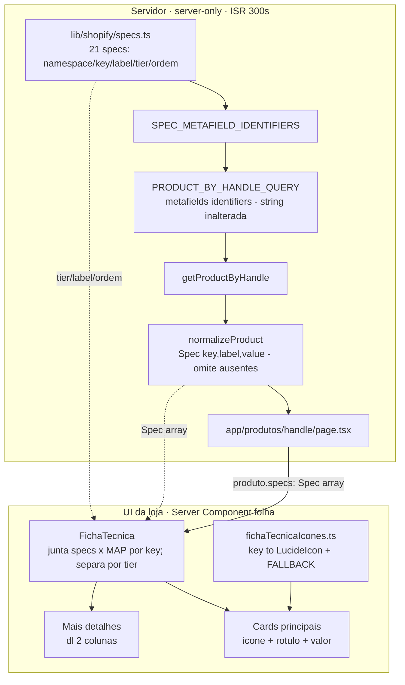

# Design Document — Ficha Técnica (Especificações do produto)

## Overview

Renderiza uma seção **"Especificações técnicas"** na página de produto
(`/produtos/[handle]`), em **largura total centralizada**, **entre** o `<article>`
de compra/descrição e a seção `RecomendadosRelacionados` — como **irmã** de ambos
(nunca dentro do grid de 2 colunas). A ficha tem dois níveis: **cards com ícone**
para as specs decisivas (principais) e uma lista discreta **"Mais detalhes"** para
as técnicas (secundárias).

O eixo do design é o **reuso da fundação que já existe** e o **server-first**:

- **A infra de dados já está 80% pronta.** `Spec` (tipo), `metafields(identifiers:)`
  na `PRODUCT_BY_HANDLE_QUERY`, `SPEC_METAFIELD_IDENTIFIERS` derivado de
  `SPEC_METAFIELDS`, e `normalizeProduct` que **já omite metafields ausentes/nulos**
  existem. Esta feature (a) **corrige e expande** `lib/shopify/specs.ts` de 3
  placeholders (namespace errado `"specs"`) para as **21 specs reais** (namespace
  `custom`), com `tier` e ordem; (b) adiciona `key` ao `Spec`; (c) cria a **UI**
  server-only que hoje não existe montada na página.
- **Sem componente de cliente novo.** A seção é um **Server Component** (padrão de
  `RecomendadosRelacionados`); os ícones `lucide-react` são SVG sem hooks, que
  renderizam no servidor e vão no HTML inicial (indexável). Reusa o `Heading`
  (que é `"use client"` + framer-motion) **já presente** na página via
  `RecomendadosRelacionados` — ou seja, **nenhum componente de cliente novo** entra
  no bundle (não "zero JS": o `Heading` já estava lá). Client components também são
  SSR, então o HTML inicial sai completo.

**As 21 chaves foram descobertas e confirmadas AO VIVO (7/7 câmeras)** por sondagem
contra a loja real — a Storefront API 2026-01 **não enumera** metafields (exige
`identifiers`) e a loja só expõe token Storefront (sem Admin). Achado decisivo: os
metafields foram **renomeados no admin, mas a Shopify preserva a chave original** —
por isso a chave reflete o nome ANTIGO (ex.: rótulo "Aplicativo" → chave
`custom.marca`; "Motorizada" → `custom.notorizada`). Isso torna a **salvaguarda
`verificar:especificacoes`** (padrão `verificar:resumo`) essencial: uma chave que
"muda de significado" no admin sem mudar de nome é justo o tipo de divergência
silenciosa que o projeto combate.

## Steering Document Alignment

### Technical Standards (tech.md)
- **Regime preservado:** `/produtos/[handle]` mantém `export const revalidate = 300`
  e `dynamicParams`. A seção não lê `cookies()`/`headers()`; Home/`sobre-nos`
  seguem `○ Static`. Nada muda o regime de nenhuma rota.
- **Token server-only:** as mudanças de dados ficam em `specs.ts`/`queries.ts`/
  `normalize.ts`/`types.ts` (server-only ou puros). A UI é Server Component. Após
  o build, token/domínio = **0 ocorrências** em `.next/static`.
- **Uma requisição:** os 21 metafields entram nos `identifiers` (variável) da query
  **já existente** — a string da query **não muda**; só cresce o array. Validado
  contra **Storefront 2026-01** via Dev MCP (✅ VALID). Limite de identifiers:
  teto documentado 250/chamada; **comprovado empiricamente 132 numa só query** — 21
  é folgado, sem N+1.
- **Money/valores da Shopify:** os valores das specs são o **texto cru** do
  metafield (a Shopify é a fonte). A UI não interpreta, converte unidade nem calcula.
- **Acessibilidade fora do PreviewContent:** a seção é estática (sem animação de
  layout), então não precisa de `MotionConfig`. Ícones são **decorativos**
  (`aria-hidden`); o rótulo textual carrega o significado.

### Project Structure (structure.md)
- UI da loja em `components/loja/`; primitivos em `components/ui/`; dados em
  `lib/shopify/`; CSS de layout em `app/globals.css` (precedente `.recomendados-*`);
  salvaguarda em `scripts/verificar-*.mjs`. pt-BR em nomes/comentários.
- **Fonte única dos dados** das specs em `lib/shopify/specs.ts` (namespace/key/
  label/tier/ordem) — deriva **query + normalização + agrupamento/ordem da UI**. O
  **ícone** (componente React lucide) vive num mapa **co-localizado na UI**
  (`components/loja/fichaTecnicaIcones.ts`), para **não** arrastar `lucide-react`
  para o grafo de import de `queries.ts`/`normalize.ts` (data layer permanece
  React-free). Os dois se juntam por `key` — mesma disciplina de `tags.ts` (dado)
  vs `ROTULO_MARCA` (exibição).

## Code Reuse Analysis

### Existing Components to Leverage
- **`lib/shopify/specs.ts` → `SPEC_METAFIELDS`, `SpecMetafield`**: corrigido
  (namespace `custom`) e expandido para 21 specs, com `tier` e ordem. Continua a
  fonte dos `identifiers`.
- **`lib/shopify/queries.ts` → `PRODUCT_BY_HANDLE_QUERY` + `SPEC_METAFIELD_IDENTIFIERS`**:
  **inalterados** — a query já pede `metafields(identifiers: $identifiers)`;
  expandir `SPEC_METAFIELDS` já expande os identifiers automaticamente.
- **`lib/shopify/normalize.ts` → `normalizeProduct`**: mudança mínima — passa a
  incluir `key` em cada `Spec`; a lógica de **omitir ausentes/nulos já existe** e é
  preservada.
- **`lib/shopify/types.ts` → `Spec`**: ganha `key` (aditivo; consumidores atuais
  compilam).
- **`components/loja/RecomendadosRelacionados.tsx`**: **modelo literal** da seção-
  irmã server-only (guarda de vazio → `return null`, `Heading` `<h2>`, classe de
  largura). `FichaTecnica` segue o mesmo padrão.
- **`components/ui/*`**: `Heading` (título), `Text` (valores/rótulos). Ícones de
  `lucide-react` (já dependência; usada em `AcessoriosSugeridos`, `CarrinhoDrawer`…).
- **`app/globals.css`**: classes novas no estilo `.recomendados-*` (largura,
  centralização, grade).
- **`scripts/verificar-resumo.mjs`**: modelo literal para `verificar-especificacoes.mjs`.

### Integration Points
- **Shopify Storefront API 2026-01**: só `SPEC_METAFIELDS` cresce; `getProductByHandle`
  mantém assinatura (`Promise<Product | null>`).
- **`Product.specs` (contrato compartilhado)**: ganha `key` por `Spec`; a página
  passa `produto.specs` para `FichaTecnica`.
- **Página de produto**: um único ponto de inserção — a seção-irmã entre `</article>`
  e `<RecomendadosRelacionados>`.

## Architecture



**Regra de ouro:** `FichaTecnica` é Server Component; seu HTML sai completo no ISR,
indexável, sem JS. A ordem e o tier vêm do **mapa** (fonte única); os valores vêm de
`produto.specs`; o ícone vem do mapa de ícones da UI. Nada é montado no cliente.

## Components and Interfaces

### 1. Mapa de specs (dados) — `lib/shopify/specs.ts`
- **Propósito:** fonte única dos DADOS de spec — dirige query, normalização e a
  ordem/tier da UI.
- **Forma:**
  ```ts
  export type SpecTier = "principal" | "secundaria"
  export interface SpecMetafield {
    namespace: string          // "custom" (corrigido; era "specs")
    key:       string          // chave REAL (reflete nome ANTIGO — ver nota do rename)
    label:     string          // rótulo pt-BR de EXIBIÇÃO (desacoplado da key)
    tier:      SpecTier
  }
  // Ordem do array = ordem de exibição (Req 2.5/3.4).
  export const SPEC_METAFIELDS: SpecMetafield[] = [ /* 21 entradas — ver Data Models */ ]
  ```
- **Nota do rename (crítica):** comentar que a **chave preserva o nome original** ao
  renomear no admin — por isso `custom.marca` tem rótulo "Aplicativo" e
  `custom.notorizada` tem rótulo "Motorizada". Nunca "consertar" a key pelo rótulo:
  isso zera a spec em silêncio (lição `eseecloud`/`resumo`). `verificar:especificacoes`
  é quem trava isso.
- **Reuses:** `SPEC_METAFIELD_IDENTIFIERS` (queries.ts) continua derivando de
  `SPEC_METAFIELDS.map(({namespace,key})=>({namespace,key}))` — sem mudança.

### 2. Ícones da ficha (UI) — `components/loja/fichaTecnicaIcones.ts`
- **Propósito:** mapa `key → LucideIcon` só para os cards **principais**, + um
  **fallback**. Vive na UI para manter `lucide-react` fora do data layer.
- **Forma:**
  ```ts
  import type { LucideIcon } from "lucide-react"
  import { Video, Moon, MoonStar, Droplets, Mic, PersonStanding,
           Wifi, Siren, Smartphone, Info } from "lucide-react"

  export const ICONE_FALLBACK: LucideIcon = Info
  export const ICONES_SPEC: Record<string, LucideIcon> = {
    tipo_de_resolucao:          Video,
    visao_noturna:              Moon,
    com_visao_noturna_colorida: MoonStar,
    resistente_a_agua:          Droplets,
    audio_bidirecional:         Mic,
    com_sensor_de_movimento:    PersonStanding,
    conectividade:              Wifi,
    com_alarme:                 Siren,
    marca:                      Smartphone, // rótulo "Aplicativo" (rename)
  }
  ```
- **Reuses:** `lucide-react` (dependência instalada, `^1.21.0`).
- **Alinhamento com Req 6.1 (letra vs. intenção — decisão registrada):** o Req 6.1
  pede o `icon` "no mapa". O design **satisfaz a intenção** (fonte única de
  `tier`/`label`/ordem em `specs.ts`), mas **coloca o `icon` co-localizado na UI**
  (unido por `key`) por **exigência do Req 7.2/7.3**: pôr um componente React lucide
  em `specs.ts` arrastaria `lucide-react` para o grafo de import de `queries.ts`/
  `normalize.ts` (data layer). Preferimos data layer React-free a "um arquivo só".
  Trade-off consciente, a aprovar pelo usuário.

### 3. Contrato `Spec` estendido — `lib/shopify/types.ts`
```ts
export interface Spec {
  key:   string // novo — permite juntar com o mapa (tier/ícone/ordem) na UI
  label: string
  value: string
}
```
- **Compat:** `ProductSpecs.tsx` (órfão) usa `label`/`value` — segue compilando.

### 4. Normalização — `lib/shopify/normalize.ts`
- **Mudança mínima:** ao montar cada `Spec`, incluir `key: def.key`. A lógica de
  omitir metafields ausentes/`!value` **permanece** (Req 4.1/5.5).
  ```ts
  const specs: Spec[] = SPEC_METAFIELDS.map((def) => {
    const mf = raw.metafields.find((m) => m && m.namespace === def.namespace && m.key === def.key)
    if (!mf || !mf.value) return null
    return { key: def.key, label: def.label, value: mf.value }
  }).filter((s): s is Spec => s !== null)
  ```

### 5. `FichaTecnica` (Server Component) — `components/loja/FichaTecnica.tsx`
- **Interface:** `{ specs: Spec[] }`.
- **Comportamento:**
  ```tsx
  export function FichaTecnica({ specs }: { specs: Spec[] }) {
    if (specs.length === 0) return null                     // Req 4.2 (seção some)
    const valor = new Map(specs.map((s) => [s.key, s.value]))
    // ORDEM e TIER vêm do mapa (fonte única); só entram os com valor presente.
    const presentes = SPEC_METAFIELDS.filter((d) => valor.has(d.key))
    const principais = presentes.filter((d) => d.tier === "principal")
    const secundarias = presentes.filter((d) => d.tier === "secundaria")
    // Defensivo: `presentes` só contém keys do mapa, então isto praticamente não
    // ocorre após `specs.length > 0` — protege contra `key` órfã/stale.
    if (principais.length === 0 && secundarias.length === 0) return null
    return (
      <section className="ficha-tecnica" aria-label="Especificações técnicas">
        <Heading as="h2" size="grande" text="Especificações técnicas"
                 color="var(--cor-texto)" accentColor="var(--cor-destaque)" />
        {principais.length > 0 && (
          <div className="ficha-cards">
            {principais.map((d) => {
              const Icone = ICONES_SPEC[d.key] ?? ICONE_FALLBACK
              return (
                <div key={d.key} className="ficha-card">
                  <Icone className="ficha-card__icone" aria-hidden size={28} />
                  <span className="ficha-card__label">{d.label}</span>
                  <span className="ficha-card__valor">{valor.get(d.key)}</span>
                </div>
              )
            })}
          </div>
        )}
        {secundarias.length > 0 && (
          <div className="ficha-detalhes">
            <span className="ficha-detalhes__titulo">Mais detalhes</span>
            <dl className="ficha-detalhes__lista">
              {secundarias.map((d) => (
                <Fragment key={d.key}>
                  <dt>{d.label}</dt><dd>{valor.get(d.key)}</dd>
                </Fragment>
              ))}
            </dl>
          </div>
        )}
      </section>
    )
  }
  ```
- **Guardas de subseção:** grade só quando há principais (Req 2.6); "Mais detalhes"
  só quando há secundárias (Req 3.5); seção inteira só quando há algo (Req 4.2).
- **Reuses:** `Heading`, `Fragment`, `SPEC_METAFIELDS`, `ICONES_SPEC`. `import type`
  para `Spec`. Sem hooks/estado.

### 6. Página (Server Component) — `app/produtos/[handle]/page.tsx`
- **Muda só a inserção:** `import { FichaTecnica }` e renderizar
  `<FichaTecnica specs={produto.specs} />` **entre** `</article>` e
  `<RecomendadosRelacionados ... />`. Mantém tudo o mais (sticky, botão, descrição,
  try/catch, `revalidate`, `dynamicParams`).

### 7. CSS de layout — `app/globals.css` (aditivo)
- `.ficha-tecnica` (largura total centralizada, `max-width:1200px`, `margin-inline:auto`,
  padding lateral responsivo — espelha `.recomendados-secao`; `> h2` centralizado).
- `.ficha-cards` (grid `repeat(auto-fit, minmax(200px, 1fr))` → ~3 col no desktop,
  1–2 no mobile; gap; **sem scroll horizontal**).
- `.ficha-card` (coluna: ícone → label → valor; `background: var(--cor-card)`;
  borda `color-mix(--cor-destaque 14%)`; radius 16; padding).
- `.ficha-card__icone` (`color: var(--cor-destaque)`).
- `.ficha-card__label` (`--cor-texto-secundario`, menor) e `.ficha-card__valor`
  (`--cor-texto`, peso maior).
- `.ficha-detalhes` + `.ficha-detalhes__lista` (`<dl>` grid 2 col no desktop, 1 no
  mobile; texto menor/apagado `--cor-texto-fraco`; `dt` peso 600, `dd` normal).

### 8. Salvaguarda — `scripts/verificar-especificacoes.mjs` + `npm run verificar:especificacoes`
- **Modelo literal** de `verificar-resumo.mjs`: Node puro, `--env-file=.env.local`,
  versão default `2026-01` duplicada com comentário, `process.exitCode` (nunca
  `process.exit()`), mensagem sem token.
- **Diferença:** as **21 chaves** vivem no script (duplicadas de `specs.ts`, com
  comentário "mude nos dois lugares" — o script não importa `lib/shopify/`). Para
  cada câmera, conta quantas das 21 specs têm valor; reporta por câmera e agrega
  quantas câmeras têm cada spec. **Exit 1 se alguma chave der 0/7 em TODAS as
  câmeras** (chave divergente — a lição do rename), exit 0 caso contrário.

## Data Models

### `SpecTier` (novo — `specs.ts`)
```
type SpecTier = "principal" | "secundaria"
```

### `Spec` (estendido — `types.ts`)
```
+ key: string   (chave do metafield; junta com o mapa para tier/ícone/ordem)
```

### Mapa completo das 21 specs (ordem de exibição; todas confirmadas 7/7 na loja)

**🟡 Principais — cards com ícone (9):**

| Ordem | key (`custom.`) | label | ícone | ex. valor |
|---|---|---|---|---|
| 1 | `tipo_de_resolucao` | Resolução | `Video` | Full HD |
| 2 | `visao_noturna` | Visão noturna | `Moon` | Sim |
| 3 | `com_visao_noturna_colorida` | Visão noturna colorida | `MoonStar` | Sim |
| 4 | `resistente_a_agua` | Resistência à água | `Droplets` | Sim |
| 5 | `audio_bidirecional` | Áudio bidirecional | `Mic` | Sim |
| 6 | `com_sensor_de_movimento` | Sensor de movimento | `PersonStanding` | Sim |
| 7 | `conectividade` | Conectividade | `Wifi` | Wi-Fi |
| 8 | `com_alarme` | Alarme | `Siren` | Notificação |
| 9 | `marca` | **Aplicativo** | `Smartphone` | EseeCloud |

**⚪ Secundárias — lista "Mais detalhes" (12, sem ícone):**

| Ordem | key (`custom.`) | label | ex. valor |
|---|---|---|---|
| 10 | `qualidade_de_resolucao` | Resolução detalhada | 1920×2160 |
| 11 | `campo_visual` | Campo de visão | 330° |
| 12 | `zoom` | Zoom | 4x |
| 13 | `tipo_de_movimento` | Tipo de movimento | PTZ |
| 14 | `notorizada` | **Motorizada** | Sim |
| 15 | `diametro_da_lente_da_camera` | Diâmetro da lente | 4.0mm |
| 16 | `temperatura_maxima_suportada` | Temperatura máxima | 45 °C |
| 17 | `temperatura_minima_suportada` | Temperatura mínima | −10 °C |
| 18 | `lugares_de_montagem` | Locais de uso | Interna, Externa |
| 19 | `modelo` | Modelo | ES-Q6 |
| 20 | `linha` | Linha | Câmera Segurança Wi-Fi |
| 21 | `cor` | Cor | Branca e preto |

> **Notas de rename** (chave = nome antigo): `custom.marca` → rótulo "Aplicativo"
> (valor é o app: EseeCloud/ICSee); `custom.notorizada` → rótulo "Motorizada". O
> **selo de marca** do produto NÃO usa este metafield — vem da **tag**
> (`eseecloud`/`icsee`, `marcaDoProduto`). Por isso não há linha "Marca" na ficha.
> **Dado observado:** `custom.com_alarme` = "Noticação" (typo de "Notificação" no
> admin) — exibido cru; corrigir é trabalho de admin.

## Error Handling

### Error Scenarios
1. **Metafield ausente/`null`/vazio para uma câmera:** `normalizeProduct` não gera a
   `Spec` (`!mf || !mf.value`) → sem card/linha (Req 4.1). *Obs.: um valor presente
   como "Não" é dado real e é exibido — só ausência some.*
2. **Nenhuma spec presente:** `FichaTecnica` retorna `null` — sem seção, título ou
   container (Req 4.2), igual a `RecomendadosRelacionados`.
3. **Só principais / só secundárias:** guardas por subseção evitam grade órfã ou
   título "Mais detalhes" órfão (Req 2.6/3.5).
4. **Chave divergente (rename sem atualizar o mapa):** `verificar:especificacoes`
   acusa 0/7 fora do build — a spec sumiria em silêncio; o script derruba a premissa
   com barulho.
5. **Shopify offline:** o `try/catch` já existente na página cobre — erro amigável,
   sem vazar token/endpoint. A ficha nem é alcançada.

## Testing Strategy

Alinhado ao **DoD** (tech.md): **build + verificação manual**, sem suíte formal.

### Unit-ish
- `FichaTecnica` é apresentacional puro (entrada `Spec[]` → saída determinística):
  verificável à mão com listas pequenas (0 specs → null; só principais → sem "Mais
  detalhes"; só secundárias → sem grade; ordem = ordem do mapa).

### Integration
- `npx tsc --noEmit` limpo; `npm run build` OK; saída mostra `/` e `/sobre-nos`
  `○ (Static)`, `/catalogo` e `/produtos/[handle]` ISR (sem migração de regime).
- Build **sem `.env.local`** conclui.
- `.next/static` sem token/domínio.
- Query validada 2026-01 no Dev MCP (feito nesta fase — ✅ VALID).

### End-to-End (verificação manual — auditoria)
- Ver "Plano de Auditoria" abaixo.

---

## Plano de Auditoria (executar ANTES de considerar concluído)

### (a) Dados reais confirmados na loja
- `npm run verificar:especificacoes` → cada uma das 21 chaves retorna valor (esperado
  7/7 hoje); zero em alguma → investigar rename/grafia antes de seguir. Confirma a
  premissa que o Dev MCP (schema) não cobre.

### (b) Render e regras de omissão
- `npm run dev` numa página de produto: cards principais (com ícone dourado) +
  "Mais detalhes"; nenhuma linha/card vazio nem "—"; ordem = ordem do mapa.
- (Se possível) uma câmera com spec faltando → o card/linha some, sem buraco.

### (c) SEO / server-side
- `npm run build && npm start`; `curl -s .../produtos/<handle>` → a ficha (rótulos +
  valores) aparece no **HTML bruto**, antes de qualquer JS; nenhum `"use client"` em
  `FichaTecnica`.

### (d) Não-regressão + DoD
- `tsc` limpo; build OK (com e sem `.env.local`); regime de rotas intacto; token 0 em
  `.next/static`.
- Na página de produto: sticky da coluna esquerda, `BotaoAdicionar` + acessórios,
  descrição e `RecomendadosRelacionados` **abaixo** da ficha — todos intactos.
- Catálogo/acessórios/recomendados seguem (mesma camada Shopify; `Spec.key` é aditivo).
