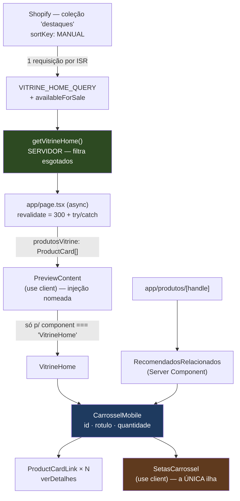

# Design Document

## Overview

A feature tem duas metades que se encontram num ponto só: **uma seção nova na
Home**, alimentada pela coleção `destaques` da Shopify, e **um carrossel de
mobile** que essa seção e a de "Você também pode gostar" compartilham.

O eixo do design é uma fronteira que já existe no projeto e que esta feature
atravessa pela primeira vez: **o mundo dirigido por JSON (Home, Sobre Nós) e o
mundo da loja (Shopify) se tocam**. Até hoje eles eram estanques — `product.md`
diz "os dados da loja NÃO moram em JSON", e a Home cumpria isso literalmente
**não tendo dados de loja nenhum** (só placeholders). Agora ela tem.

O desenho resolve esse encontro com **uma costura explícita e nomeada** no
`PreviewContent`, em vez de espalhar conhecimento de Shopify pelo template. E
resolve o carrossel com **CSS puro numa media query de mobile**, deixando o
JavaScript reduzido a uma ilha: dois botões que rolam um container.

Nada aqui toca `ProductGrid`, `useCarousel`, `Hero`, `Testimonials`, o preview do
Builder, o catálogo, a ficha técnica ou o carrinho.

## Steering Document Alignment

### Technical Standards (tech.md)

| Padrão de `tech.md` | Como o design cumpre |
|---|---|
| Storefront API **2026-01** | `VITRINE_HOME_QUERY` **validada no Dev MCP contra 2026-01 (✅ VALID)**, já com `availableForSale`. `client.ts` não muda. |
| **ISR vem do route segment** | `app/page.tsx` passa a declarar `export const revalidate = 300`. É daí que vem o ISR — não do `fetch`. |
| **Mudança de regime deliberada** | A Home sai de `○ Static` para ISR **de propósito**, exatamente o caso que `tech.md` → "Home estática" já pré-autorizou. `/sobre-nos` **não** muda. |
| **Sem `cookies()`/`headers()`** | A Home continua sem os dois — ISR, não `ƒ` dynamic. |
| **Token server-only** | `queries.ts`/`products.ts` mantêm `import "server-only"`. `PreviewContent`, `VitrineHome`, `CarrosselMobile` e `SetasCarrossel` importam **apenas tipos**. |
| **Imports estáticos no `componentMap`** | `VitrineHome` entra com import estático + entrada no mapa, como manda o checklist. `ProductGrid` **continua registrado**. |
| **`MotionConfig` só cobre o `PreviewContent`** | Por isso as setas **não usam Framer Motion** (Decisão 5) — na página de produto elas rodam sob o `StoreShell`, que não tem `MotionConfig`. |
| **Build passa sem `.env.local`** | A busca está em `try/catch`; sem env a seção some e a Home renderiza o resto. |
| DoD = **build + verificação manual** | Sem infraestrutura de teste nova. A rede é estrutural: tipos, `server-only`, `verificar:vitrine`. |

### Project Structure (structure.md)

- **pt-BR** em tudo que é novo: `VitrineHome`, `CarrosselMobile`, `SetasCarrossel`,
  `getVitrineHome`, `.vitrine-home__grade`, `verificar:vitrine`.
- **Onde as coisas moram**, à risca:
  - *Query da Shopify* → `lib/shopify/queries.ts`
  - *Produto (dados)* → `lib/shopify/products.ts`
  - *Nova seção de conteúdo* → `components/sections/VitrineHome/` (+ `index.ts` barrel)
  - *Primitivo reutilizável* → `components/ui/` (o carrossel serve duas seções de
    camadas diferentes; não pertence a `loja/` nem a `sections/`)
  - *Conteúdo editorial* → `layouts/_home.json`
- **Checklist "Nova seção"** cumprido nos 6 passos (import estático, `componentMap`,
  efeitos via contexto, primitivos de `ui/`, cores por `--cor-*`).
- **Comentários explicam o porquê** — densidade dos vizinhos (`normalize.ts`,
  `specs.ts`, `PreviewContent.tsx`).

## Code Reuse Analysis

### Existing Components to Leverage

- **`ProductCardLink`** — **é o card da Home**, sem card novo. Já é um `<a>` único
  (`next/link`), já resolve o `alt` com `product.image?.altText ?? product.title`
  (Req 3.5 sai **de graça**), já trava o título em 2 linhas para altura uniforme
  (Req 5.7), e já usa `--cor-*`. Ganha **uma prop opt-in** para a chamada "Ver
  detalhes" (Req 3.8).
- **`normalizeProductCard`** — único construtor de `ProductCard`. **Não muda uma
  linha**: o tipo cru novo **estende** `RawProductCard`, e o `availableForSale`
  extra é simplesmente ignorado por ele. Precedente literal: `RawRecomendado`.
- **`getProducts()` / `PRODUCTS_QUERY`** — molde da busca por coleção com
  `sortKey: MANUAL` e do tratamento `collection` nulo → `?? []`.
- **`recomendados.ts`** — molde do **filtro de `availableForSale` em JS** (não na
  string de busca) e do teto de API declarado em constante.
- **`Heading` + `SectionLabel`** — o cabeçalho da seção nova reusa os mesmos
  primitivos que o `GridHeader` do `ProductGrid` usa hoje, **inclusive o parser
  `%%destaque%%`** do `Heading`, que a headline atual do JSON usa.
- **`.recomendados-grade`** — **reusada como está no desktop** e apenas *estendida*
  no mobile pela media query. Não é alterada (Req 7.2).
- **`app/catalogo/page.tsx`** — molde do `try/catch` da rota + `revalidate`.
- **`scripts/verificar-destaques.mjs`** — molde do check novo.

### Integration Points

- **Storefront API / coleção `destaques`** — **1 requisição nova**, na revalidação
  de ISR da Home. A página de produto não ganha nenhuma.
- **`PreviewContent`** — ponto de costura entre os dois mundos (Decisão 1). Mudança
  aditiva: uma prop opcional e uma injeção nomeada.
- **`layouts/_home.json`** — a entrada de índice 3 troca de componente e perde os
  produtos falsos.
- **`RecomendadosRelacionados`** — envolve os cards no carrossel; continua Server
  Component e continua devolvendo `null` sem recomendados.

## Architecture

### Decisão 1 — A seção é um Client Component no `componentMap`, **não** um slot de servidor

O requisito deixou as duas portas abertas (Req 2.2) e pediu avaliação do custo de
bundle. **Avaliadas as duas, a escolha é a seção cliente registrada no mapa.**

| | **A — slot renderizado no servidor** | **B — seção cliente no `componentMap`** ✅ |
|---|---|---|
| Como chega | `page.tsx` renderiza a seção e passa o **JSX pronto** como prop ao `PreviewContent` | `page.tsx` busca e passa **os dados**; o mapa renderiza a seção |
| Custo de bundle | **os cards + as setas** (ver abaixo) | os cards **+** as setas **+** o corpo da seção |
| Efeitos de entrada | **não consegue** — Server Component não lê `SectionEffectsContext` | iguais às seções irmãs |
| Aderência ao steering | inventa mecanismo novo no renderizador compartilhado | é **literalmente** o checklist "Nova seção" de `structure.md` |
| Risco ao preview/Builder | muda o **fluxo de renderização** de todas as seções | muda só a **construção de props** de uma |

**O que decidiu: o custo de bundle da opção B é quase inexistente, e isso é
verificável nos imports, não uma esperança.**

`PreviewContent` importa `ProductGrid` **estaticamente**, e o Req 2.5 manda
**mantê-lo registrado** (JSONs antigos e o preview dependem dele). Logo
`ProductGrid` e tudo que ele importa continuam no grafo de cliente da Home
**exista esta feature ou não** — e ele já importa `ImageSlot`, `Text`, `PriceTag`,
`TiltCard`, `CtaButton`, `StarRating`, `NavArrow`, `CarouselDots` e `useCarousel`.

O card novo é `ProductCardLink`, cujas dependências são `next/link`, `ImageSlot`,
`Text` e `PriceTag` — **as três últimas já estão lá**.

🔴 **E aqui a opção A economiza menos do que parece: `ProductCardLink` tem
`"use client"` na primeira linha.** Mesmo sob a opção A, um Server Component que
renderize os cards **manda `ProductCardLink` para o bundle do cliente do mesmo
jeito** — "renderizado no servidor" não desmonta um componente de cliente, só
posterga a hidratação. Então a diferença real entre A e B **não** são os cards:
é **apenas o corpo do `VitrineHome`** (um cabeçalho e um `map`).

Ou seja: a opção A pagaria **um mecanismo novo no renderizador compartilhado e a
perda das animações de entrada** para economizar algumas centenas de bytes que o
`ProductGrid` já gasta ao lado. **O trade não fecha, e fecha ainda menos depois de
corrigir o custo de A.** A NFR de Performance previa exatamente esta comparação;
ela está feita e o resultado está registrado aqui.

> **Quando A voltaria a fazer sentido:** se um dia o `ProductGrid` sair do
> `componentMap` (o Builder deixar de precisar dele), o grafo de cliente da Home
> encolhe e o cálculo muda. Aí vale reabrir — e o `CarrosselMobile` já é
> compatível com os dois caminhos por construção (Decisão 4).

### Decisão 2 — Nomenclatura: `VitrineHome`, não "destaques"

**Já existe `lib/shopify/destaques.ts`** — e ele é sobre outra coisa: as regras de
**destaques de spec** (lente múltipla, alarme sonoro) do bloco do `/catalogo`. Um
`getDestaques()` ou um `destaques-home.ts` ao lado dele seria uma armadilha de
leitura permanente.

A coleção continua se chamando `destaques` (é o handle real na loja, e o código
**não pode** renomeá-la), mas tudo que o código cria leva o nome do **lugar**, não
o da coleção:

| Conceito | Nome | Colide com… |
|---|---|---|
| Query | `VITRINE_HOME_QUERY` | — |
| Busca | `getVitrineHome()` | — |
| Handle | `HOME_COLLECTION_HANDLE = "destaques"` | espelha `CATALOGO_COLLECTION_HANDLE` |
| Seção | `VitrineHome` | — |
| CSS | `.vitrine-home__grade` | — |
| Check | `verificar:vitrine` / `verificar-vitrine-home.mjs` | **evita** `verificar-destaques.mjs`, que **já existe** |

### Decisão 3 — O `sectionLabel` tem de ir para o JSON, senão some em silêncio

**Armadilha real, encontrada ao ler o JSON contra o componente.** O rótulo
"Nossos Produtos" **não está** em `_home.json`: ele vem do `DEFAULT_CONTENT` do
`ProductGrid`. No instante em que a entrada trocar de `component`, esse default
deixa de existir e **o rótulo desaparece da Home** — sem erro, sem aviso.

Por isso a edição do JSON **adiciona `sectionLabel: "Nossos Produtos"`
explicitamente**. Não é conteúdo novo: é conteúdo que já estava na tela e que
passa a morar onde `product.md` manda (JSON), em vez de num default de template.

A `headline` (`"%%Escolha%% o modelo ideal para você"`) **já está** no JSON e
permanece — inclusive a sintaxe `%%…%%`, que o `Heading` parseia e que a seção
nova preserva por reusar o mesmo primitivo.

### Decisão 4 — As setas acham a faixa pelo **`id` no DOM**, não por `ref`

O carrossel é **dois componentes**, e a divisão é o que mantém o JavaScript numa
ilha:

- **`CarrosselMobile`** — sem `"use client"`. Renderiza o wrapper, a faixa e
  decide, **no servidor**, se o carrossel está ativo (`quantidade > 1`).
- **`SetasCarrossel`** — `"use client"`. Dois `<button>`, um handler cada.

As setas **não recebem um `ref`** da faixa: recebem o **`id`** dela e fazem
`document.getElementById(alvo)` **dentro do clique**. Isso tem três consequências
que valem a decisão:

1. **`CarrosselMobile` pode ser Server Component** — um `ref` obrigaria a faixa a
   ser cliente para compartilhar o objeto. Assim, em `RecomendadosRelacionados`
   (Server Component) a faixa **é servidor de verdade**, e a única coisa **nova**
   que vai para o bundle da página de produto são os dois botões — o
   `ProductCardLink` já está lá hoje (é a mesma nuance da Decisão 1).
2. **Nada de `useRef` + `useEffect`** — o Req 6.3 proíbe medir em efeito; ler o DOM
   no handler é o que ele explicitamente permite.
3. **O design continua compatível com a opção A da Decisão 1**, se um dia ela
   voltar.

O handler faz, tudo dentro do clique e nada fora:

```
faixa       = document.getElementById(alvo);  if (!faixa) return
primeiro    = faixa.firstElementChild
larguraCard = primeiro ? primeiro.getBoundingClientRect().width : faixa.clientWidth * 0.8
gap         = parseFloat(getComputedStyle(faixa).columnGap) || 0   // ⚠️ ver abaixo
suave       = !matchMedia("(prefers-reduced-motion: reduce)").matches   // Req 6.6
faixa.scrollBy({ left: ±(larguraCard + gap), behavior: suave ? "smooth" : "auto" })
```

⚠️ **O `parseFloat(...) || 0` não é decoração.** `getComputedStyle().columnGap`
devolve **string** (`"12px"`), e devolve **`"normal"`** quando não há gap definido.
Somar a string concatenaria; `parseFloat("normal")` é `NaN`, e um `scrollBy` com
`NaN` **não faz nada** — a seta pareceria quebrada, sem erro no console.

Sem estado, sem índice, sem `useEffect`, sem listener de `resize`, sem autoplay,
sem bolinhas. Nos extremos o `scrollBy` é **no-op** do próprio navegador — que é
exatamente o comportamento que o Req 6.7 pediu, de graça.

### Decisão 5 — **Não** reusar `NavArrow`

`NavArrow` existe, tem os glifos `‹ ›` certos e é usada por 3 seções do template.
**Mesmo assim, não.** Dois motivos, e o segundo é o que decide:

1. Ela é `motion.button` do **Framer Motion**. As setas desta spec não animam nada
   — arrastariam uma dependência de animação para dentro de uma ilha cujo requisito
   é ser mínima (Req 6.3).
2. **A armadilha do `MotionConfig`.** `tech.md` é explícito: o
   `MotionConfig reducedMotion="user"` existe **só** no `PreviewContent`. Na Home a
   `NavArrow` estaria coberta; em `RecomendadosRelacionados`, que roda sob o
   `StoreShell`, **não estaria**. O mesmo componente teria garantia de
   acessibilidade em uma seção e não na outra — a pior espécie de inconsistência,
   porque é invisível.

`SetasCarrossel` são `<button>` puros, estilizados por CSS com as variáveis do
tema, e tratam `prefers-reduced-motion` explicitamente no handler (Req 6.6). Isso
vale nos dois lugares, sem depender de quem envolve a seção.

### Decisão 6 — Classe própria para a grade da Home

A Home **não** reusa `.recomendados-grade`. Ela ganha `.vitrine-home__grade`, com
as mesmas propriedades de base (flex-wrap centralizado, base flexível) mas nome
próprio.

Motivo: o **Req 7.2 congela `.recomendados-grade`** ("idêntico ao de hoje"). Se a
Home passasse a depender dela, qualquer ajuste futuro na vitrine da Home teria de
sair por uma classe nova de qualquer jeito — ou violaria o congelamento. Separar
agora custa ~6 linhas de CSS e evita o acoplamento.

O que **é** compartilhado é o comportamento de carrossel: as duas grades recebem
a classe `.carrossel__faixa` e, portanto, exatamente as mesmas regras de mobile.

### Decisão 7 — O CSS do carrossel mora **dentro** de uma media query de mobile

`globals.css` é mobile-first por convenção. **Este bloco inverte isso de
propósito**, porque o Req 7.4 pede uma prova verificável por diff: *remover a
media query devolve exatamente o CSS de hoje*. Com mobile-first, o desktop seria o
override e a prova não existiria.

```
@media (max-width: 767.98px) { … todo o carrossel … }
```

`767.98px` e não `767px`: cobre viewports fracionários (zoom/DPI) sem deixar um
vão de 1px onde nem o carrossel nem a grade se aplicariam.

### Decisão 8 — Sem `tabindex` na faixa ✅ **EMENDA AO REQ 5.8 — APROVADA**

O Req 5.8 tem duas cláusulas: (a) quando rolável, faixa **focável** com nome
acessível, rolando pelas setas do teclado; (b) quando **não** rolável, **sem tab
stop**. Como CSS não altera `tabindex`, **nenhuma opção sem JavaScript cumpre as
duas** — e o Req 6.3 proíbe o `useEffect` com media query que cumpriria.

As duas opções reais, honestamente:

| | **Sem `tabindex`** ✅ recomendada | **`tabIndex={quantidade > 1 ? 0 : undefined}`** |
|---|---|---|
| Custo em JS | zero | zero (o servidor já sabe `quantidade`) |
| Cláusula (a), mobile | **não cumpre a letra** | cumpre |
| Cláusula (b), desktop | cumpre | **não cumpre** — tab stop morto em toda visita de desktop |
| WCAG 2.1.1 | **cumprida** | cumprida |

A segunda opção existe e é barata — **o design anterior errou ao não a
considerar**, tratando a escolha como "sempre `tabindex`" contra "nunca".

**Por que ainda recomendo a primeira:** a faixa contém **apenas
`ProductCardLink`, que são `<a>`**. Quem navega por teclado já percorre todos os
cards com Tab, e o navegador **rola cada card focado para dentro da vista** — todo
o conteúdo é alcançável e operável, que é o que a WCAG 2.1.1 exige (é a isenção
conhecida: região rolável só precisa de `tabindex` quando **não** tem conteúdo
focável dentro). O `tabindex` no container acrescentaria, no mobile, um caminho
redundante ao que Tab e as setas já dão; e cobraria, no desktop, uma parada de Tab
que não faz nada — em **toda** visita, para **todo** usuário de teclado.

> ✅ **Decidido na revisão do design: opção da esquerda (sem `tabindex`).** A
> cláusula (a) do Req 5.8 foi emendada para *"todos os itens da faixa devem ser
> alcançáveis por teclado, e o item focado deve entrar na vista"*, e o
> `requirements.md` já registra a emenda com o motivo. A coluna da direita fica
> documentada aqui apenas como a alternativa que foi pesada e descartada.

O `scroll-padding-inline` (Req 5.9) garante que o card que recebe foco não encoste
na borda, nos dois caminhos.

### Fluxo de dados



O nó verde é onde o esgotado morre. O azul é o componente compartilhado pelas duas
pontas. O laranja é **todo** o JavaScript novo.

### O que NÃO muda (auditoria de não-regressão)

| Arquivo | Muda? | Por quê |
|---|---|---|
| `components/sections/ProductGrid/ProductGrid.tsx` | **Não** | Req 9.3 — template do Builder |
| `lib/useCarousel.ts` | **Não** | Req 9.3 — o carrossel novo é CSS |
| `components/ui/NavArrow.tsx` / `CarouselDots.tsx` | **Não** | Decisão 5 |
| `components/sections/Hero`, `Testimonials`, `Features`, `FAQ`, `HowItWorks`, `CTAFinal`, `Navbar`, `Footer` | **Não** | Req 9.1 |
| `app/sobre-nos/page.tsx` / `layouts/sobre-nos.json` | **Não** | Req 2.6 — segue `○ Static` |
| `lib/shopify/normalize.ts` / `types.ts` | **Não** | o tipo cru novo **estende**; o normalizador ignora o campo extra |
| `lib/shopify/client.ts` / `specs.ts` / `acessorios.ts` / `recomendados.ts` | **Não** | Req 9.4 |
| `app/catalogo/page.tsx`, `CatalogoConsultivo`, `ordenarCatalogo`, `CameraBloco`, `DestaquesCamera`, `FichaTecnica` | **Não** | Req 9.4 |
| `lib/shopify/destaques.ts` | **Não** | outra feature; Decisão 2 evita até o nome |
| `.recomendados-grade` (regras atuais) | **Não** | só recebe regras **dentro** da media query |

## Components and Interfaces

### 1. `lib/shopify/queries.ts` — **modificado**

- **Purpose:** trazer os produtos da vitrine da Home em uma requisição.
- **Interfaces:** `VITRINE_HOME_QUERY` (novo export). Nenhuma query existente é
  tocada.
- **Reuses:** a forma da `PRODUCTS_QUERY`; o padrão de `availableForSale` fora da
  string de busca da `RECOMENDADOS_QUERY`.
- **Forma validada no Dev MCP 2026-01 (✅ VALID):**
  ```graphql
  query ProdutosDestaque($handle: String!, $first: Int!) {
    collection(handle: $handle) {
      products(first: $first, sortKey: MANUAL) {
        nodes {
          id
          handle
          title
          availableForSale
          featuredImage { url altText width height }
          priceRange { minVariantPrice { amount currencyCode } }
        }
      }
    }
  }
  ```
  **Sem `tags`, sem metafields** — a Home é vitrine simples (Req 3.3). **Com
  `availableForSale`** — o filtro do Req 1.6 precisa dele.

### 2. `lib/shopify/products.ts` — **modificado**

- **Purpose:** a busca de alto nível da vitrine.
- **Interfaces:**
  ```ts
  const HOME_COLLECTION_HANDLE = "destaques"
  const HOME_VITRINE_TETO = 12   // Req 1.5
  export async function getVitrineHome(): Promise<ProductCard[]>
  ```
- **Dependencies:** `storefrontFetch`, `VITRINE_HOME_QUERY`, `normalizeProductCard`.
- **Reuses:** `getProducts()` inteiro como molde — mesma estrutura, mesmo
  `collection?.products?.nodes ?? []`, mesmo `revalidate`.
- **Comportamento:** `collection` nulo → `[]`; **filtra `availableForSale === false`
  ANTES de normalizar**; devolve na ordem da API (sem `sort`).
- **⚠️ O teto se aplica na query (`first: 12`), o filtro depois** — 12 pedidos com 2
  esgotados dão 10 na tela, como o Req 1.6 declara.

### 3. `app/page.tsx` — **modificado**

- **Purpose:** buscar no servidor e entregar ao renderizador.
- **Interfaces:** ganha `export const revalidate = 300` e vira `async`.
- **Reuses:** o `try/catch` de `app/catalogo/page.tsx`.
- **Forma:**
  ```tsx
  export const revalidate = 300   // Req 4.1/4.2 — daqui vem o ISR

  export default async function Page() {
    let produtosVitrine: ProductCard[] = []
    try {
      produtosVitrine = await getVitrineHome()
    } catch {
      // Shopify fora do ar → a Home renderiza sem a vitrine (Req 1.7).
      // As outras 8 seções não dependem da loja.
    }
    return (
      <main style={{ background: fundo, minHeight: "100vh" }} className="w-full">
        <PreviewContent layout={layout} produtosVitrine={produtosVitrine} />
      </main>
    )
  }
  ```
- **Não** adiciona `cookies()`/`headers()` (Req 4.4). Os `const` de módulo
  (`layout`, `paleta`, `fundo`) ficam como estão.

### 4. `components/preview/PreviewContent.tsx` — **modificado (a costura)**

- **Purpose:** entregar os produtos à seção certa, sem ensinar Shopify ao template.
- **Interfaces:** `PreviewContentProps` ganha **um opcional**:
  ```ts
  interface PreviewContentProps {
    layout: Layout
    /** Produtos da vitrine da Home. Ausente em /sobre-nos — e é por isso que
     *  ele é OPCIONAL: o Sobre Nós não tem vitrine e não deve ser obrigado a
     *  passar nada (Req 2.6). */
    produtosVitrine?: ProductCard[]
  }
  ```
  `import type { ProductCard }` — **tipo apenas**, a fronteira cliente/servidor
  intacta.
- **A injeção, dentro do `map` existente:**
  ```tsx
  // ── Costura JSON ↔ Shopify ────────────────────────────────────────────────
  // O renderizador é genérico DE PROPÓSITO: ele não sabe o que cada seção faz.
  // Esta é a ÚNICA exceção nomeada, e ela existe porque a vitrine da Home é a
  // primeira seção cujo conteúdo NÃO vem do JSON — vem da Shopify (product.md:
  // "os dados da loja NÃO moram em JSON"). Buscar aqui dentro é impossível: este
  // arquivo é "use client". Então o servidor busca e injeta, e a exceção fica
  // visível num lugar só, em vez de virar um `useEffect` dentro da seção.
  const propsDaVitrine =
    section.component === "VitrineHome"
      ? { produtos: produtosVitrine ?? [], idSecao: section.id }
      : null
  ```
  O `idSecao` viaja junto porque a faixa precisa de um id **único por seção**
  (Componente 5) — e `section.id` é a única fonte de unicidade que o renderizador
  conhece.
  e no JSX: `<Component … {...section.content} content={…} accentColor={…} {...propsDaVitrine} />`
- **`{...propsDaVitrine}` vem DEPOIS do `{...section.content}`** de propósito: se
  algum JSON antigo tiver uma chave `produtos`, quem vence é o servidor.
- **Reuses:** todo o resto do arquivo — `MotionConfig`, wrapper de paleta,
  `ParallaxWrapper`, `AnimatedBackground`, `disableEntry`, `firstContentIdx`,
  `OWN_ENTRY` — **intocado** (Req 9.2).
- **Import estático de `VitrineHome` + entrada no `componentMap`**; `ProductGrid`
  **permanece** nos dois (Req 2.5).

### 5. `components/sections/VitrineHome/VitrineHome.tsx` — **novo**

- **Purpose:** a seção "Nossos Produtos" com produtos reais.
- **Interfaces:**
  ```tsx
  export function VitrineHome({
    produtos, idSecao, sectionLabel, headline, accentColor,
  }: {
    produtos:      ProductCard[]
    /** id da seção no JSON — vira o id da faixa. Ver "id único" abaixo. */
    idSecao:       string
    sectionLabel?: string
    headline?:     string
    accentColor?:  string
  }): React.ReactElement | null
  ```
- **🔴 Contêiner externo — cópia literal do `ProductGridGrid`**, porque o Req 9.1
  exige os mesmos paddings e **a conta dos 72% (Componente 10) depende deste
  número**:
  ```tsx
  <section id="vitrine-home" style={{ padding: "clamp(64px, 8vw, 96px) 0" }}>
    <div style={{ maxWidth: 1200, margin: "0 auto", padding: "0 clamp(20px, 5vw, 64px)" }}>
      <motion.div {...containerProps} style={{ display: "flex", flexDirection: "column", gap: 32 }}>
        {/* cabeçalho + carrossel */}
  ```
  O `PreviewContent` já aplica `paddingTop`/`paddingBottom` (default 80) no wrapper
  de fora; este `padding` interno é **adicional e existe hoje** — reproduzi-lo é o
  que mantém o espaçamento idêntico.
- **🔴 O `id` da faixa vem de `idSecao`**, nunca de uma constante: `PreviewContent`
  renderiza o que o JSON listar, e **dois `VitrineHome` no mesmo layout gerariam
  ids duplicados** — os dois pares de setas rolariam a primeira faixa. `idSecao` é
  o `section.id`, que o `PreviewContent` já usa como `key` e como
  `id={`section-${section.id}`}`, então a unicidade já está garantida pelo JSON.
- **`"use client"`** — é uma seção do `componentMap` (Decisão 1) e consome
  `useSectionEffects()` como as irmãs.
- **Dependencies:** `SectionLabel`, `Heading`, `ProductCardLink`, `CarrosselMobile`,
  `framer-motion` (o `motion.div` do snippet acima), e os helpers de efeito
  **completos**: `useSectionEffects()`, **`useEffectsMode()`** e
  `buildSectionContainerProps(se?.sectionEntry, mode)` +
  `buildSectionItemProps(se?.sectionEntry)`. ⚠️ **O `mode` do `useEffectsMode()`
  não é opcional:** o `ProductGrid` monta `containerProps` com ele, e omiti-lo
  constrói a animação de entrada errada — a seção nova destoaria das irmãs sem
  erro nenhum.
- **Reuses:** o `GridHeader` do `ProductGrid` como **padrão** (não como import — é
  função interna dele): `SectionLabel` + `Heading` centralizados, com o parser
  `%%…%%`.
- **Comportamento:**
  - `produtos.length === 0` → **`return null`** (Req 1.8), sem título órfão.
  - Cabeçalho, depois `<CarrosselMobile>` com um `ProductCardLink` por produto.
  - Passa `verDetalhes` ao card (Req 3.1).
- **Não** contém regra de negócio: recebe a lista já filtrada e ordenada.
- **`components/sections/VitrineHome/index.ts`** — barrel, como as irmãs.

### 6. `components/ui/CarrosselMobile.tsx` — **novo**

- **Purpose:** a faixa. Carrossel no mobile, grade no desktop — **decidido por CSS**.
- **Interfaces:**
  ```tsx
  export function CarrosselMobile({
    id, rotulo, quantidade, classeFaixa, children,
  }: {
    /** id único da faixa — as setas o usam para achá-la no DOM (Decisão 4). */
    id:          string
    /** nome acessível da região ("Nossos produtos" / "Você também pode gostar"). */
    rotulo:      string
    /** quantos itens — decide NO SERVIDOR se o carrossel liga (Req 5.6). */
    quantidade:  number
    /** classe da grade de desktop do consumidor, preservada intacta. */
    classeFaixa: string
    children:    React.ReactNode
  }): React.ReactElement
  ```
- **Sem `"use client"`** — nenhum hook. Em `RecomendadosRelacionados` (servidor) a
  faixa é servidor; em `VitrineHome` (cliente) ela vira cliente por contágio, e
  tudo bem.
- **Estrutura:**
  ```tsx
  <div className="carrossel">
    <div
      id={id}
      role="group"
      aria-label={rotulo}
      data-ativo={quantidade > 1}
      className={`${classeFaixa} carrossel__faixa`}
    >
      {children}
    </div>
    {quantidade > 1 && <SetasCarrossel alvo={id} />}
  </div>
  ```
- **`data-ativo` é o interruptor** e é decidido no **servidor**: com 1 item vira
  `"false"`, o CSS não liga o carrossel e as setas nem existem no HTML (Req 5.6).
- **Sem `tabindex`** — Decisão 8.
- **A faixa acumula as duas classes:** a do consumidor governa o desktop; a
  `.carrossel__faixa` só é lida dentro da media query.

### 7. `components/ui/SetasCarrossel.tsx` — **novo, o único `"use client"`**

- **Purpose:** rolar a faixa em um card.
- **Interfaces:** `export function SetasCarrossel({ alvo }: { alvo: string })`
- **Dependencies:** **nenhuma** além do React. Sem Framer Motion (Decisão 5), sem
  `lucide-react` (os glifos `‹ ›` são texto).
- **Comportamento:** **este componente é o dono do wrapper `.carrossel__setas`** —
  ele renderiza `<div className="carrossel__setas">` com dois
  `<button type="button">` dentro, com `aria-label` "Anterior" / "Próximo" e
  `aria-controls={alvo}`; handler conforme a Decisão 4. O `CarrosselMobile` só o
  monta; não embrulha nada em volta.
- **Proibido aqui, por contrato:** `useState`, `useEffect`, `useRef`,
  `addEventListener`, autoplay, bolinhas, índice.

### 8. `components/loja/ProductCardLink.tsx` — **modificado (aditivo, opt-in)**

- **Purpose:** ganhar a chamada "Ver detalhes" **sem** afetar quem já o usa.
- **Interfaces:**
  ```tsx
  export function ProductCardLink({
    product,
    verDetalhes = false,   // 🔴 default false = recomendados INALTERADO (Req 7.2)
  }: {
    product:      ProductCard
    verDetalhes?: boolean
  })
  ```
- **`verDetalhes` renderiza um `<span>` visual**, nunca um `<button>` nem um
  segundo `<a>` — o card inteiro já é o link (Req 3.2). É afetado por CSS, não por
  semântica de controle.
- **Nada mais muda:** o `alt` com fallback, o clamp de 2 linhas, o `PriceTag` e as
  cores ficam como estão.

### 9. `components/loja/RecomendadosRelacionados.tsx` — **modificado**

- **Purpose:** ganhar o carrossel no mobile.
- **Mudança:** o `<div className="recomendados-grade">` vira
  `<CarrosselMobile id="carrossel-recomendados" rotulo="Você também pode gostar"
  quantidade={produtos.length} classeFaixa="recomendados-grade">`, com os mesmos
  filhos.
- **Continua Server Component**, continua `return null` sem recomendados (Req 9.5).
- **`verDetalhes` NÃO é passado** — os cards de recomendados seguem como hoje.

### 10. `app/globals.css` — **modificado**

- **Purpose:** a grade da Home e o carrossel de mobile.
- **Fora de media query** (base, vale em toda largura):
  - grade de desktop da Home (Req 3.9): `.vitrine-home__grade` — `display: flex`,
    `flex-wrap: wrap`, `justify-content: center`, **`align-items: stretch`**
    (explícito, como o `.recomendados-grade` faz: é o que dá aos cards da mesma
    linha a mesma altura — Req 5.7), `gap: 20px`; e `.vitrine-home__grade > *` com
    base `clamp(150px, 42vw, 240px)` e `max-width: 260px`. Espelha o comportamento
    de `.recomendados-grade` **sem depender dela** (Decisão 6);
  - **`.carrossel__setas { display: none }`** — 🔴 as setas **existem no HTML** e
    ficam ocultas por padrão; é a media query que as revela (Reqs 7.1/7.3). Por
    isso esta regra é **base**, não mobile;
  - `.carrossel__setas button` — alvo de toque **`min-width: 40px; min-height: 40px`**
    (Req 6.4), cor `var(--cor-destaque)`, fundo e borda derivados por `color-mix`
    da mesma variável (padrão do `.catalogo-filtro`).
- **Dentro de `@media (max-width: 767.98px)`** (Decisão 7), **todo o resto**:
  ```css
  .carrossel__faixa[data-ativo="true"] {
    flex-wrap:             nowrap;
    overflow-x:            auto;
    overflow-y:            hidden;     /* ⚠️ ver "o hover cortado" abaixo */
    gap:                   12px;       /* ⚠️ a conta dos 72% depende DESTE valor */
    padding-block:         6px;        /* espaço p/ o hover:-translate-y-1 do card */
    scroll-snap-type:      x mandatory;
    scroll-padding-inline: 16px;       /* Req 5.9 */
    justify-content:       flex-start; /* anula o center do desktop */
    overscroll-behavior-inline: contain; /* não encadeia no gesto de "voltar" */
  }
  .carrossel__faixa[data-ativo="true"] > * {
    flex:              0 0 72%;   /* Req 5.2 — ver a conta abaixo */
    max-width:         none;      /* anula o max-width:260px de .recomendados-grade > * */
    scroll-snap-align: start;
  }
  .carrossel__setas { display: flex; gap: 8px; justify-content: center; }
  ```
- **⚠️ O hover cortado — armadilha que o `overflow-x` cria sozinho.** Pelo CSS,
  quando um eixo é `auto` o outro **não pode continuar `visible`**: ele computa
  para `auto` também. Sem o `overflow-y: hidden` explícito, a faixa viraria um
  container de rolagem **vertical** — e o `hover:-translate-y-1` que o
  `ProductCardLink` já tem seria **clipado** no mobile. O `padding-block: 6px` dá
  o respiro para o card levantar dentro da faixa. Isto também é o que responde a
  NFR *"o carrossel não captura o scroll vertical"*: com `overflow-y: hidden` o
  arrasto vertical passa direto para a página.
- **A conta dos 72%** (Req 5.2), com os paddings **reais** — `clamp(20px, 5vw, 64px)`
  nas duas seções (`.recomendados-secao` no `globals.css`; o contêiner do
  Componente 5 na Home) — e o **`gap: 12px`** fixado acima:

  | Viewport | Faixa útil | Card (72%) | Gap | Próximo visível | ≥24px? | ≤80%? |
  |---|---|---|---|---|---|---|
  | 360px | 320,0px | 230,4px | 12px | **77,6px** | ✔ | ✔ (72%) |
  | 414px | 372,6px | 268,3px | 12px | **92,3px** | ✔ | ✔ (72%) |

  Com o `scroll-padding-inline: 16px` descontado no pior caso (card encostado no
  início da snapport), a espiada cai para **~61,6px** em 360px — ainda **2,5×** o
  mínimo do Req 5.2.

  🔴 **O `gap: 12px` do mobile é premissa desta tabela, não detalhe.** O
  `.recomendados-grade` usa `gap: 20px` no desktop; se a media query não
  sobrescrever, a espiada cai para 69,6px (ainda passa, mas a tabela deixa de
  reproduzir). Mudar o gap **exige refazer esta conta**.

- **Especificidade:** `.carrossel__faixa[data-ativo="true"] > *` (0,2,0 + elemento)
  vence `.recomendados-grade > *` (0,1,0) — **é isso que permite** sobrepor a base
  e o `max-width` do desktop sem tocar naquelas regras.
- **`.carrossel__setas` é `display:none` por padrão**, fora da media query — as
  setas **existem no HTML** e o CSS as revela só no mobile (Req 7.1/7.3).
- **Zero hex hard-coded** — só `--cor-*`.
- **`prefers-reduced-motion`:** `scroll-behavior: auto` sob
  `@media (prefers-reduced-motion: reduce)` (o par CSS do que o handler faz em JS).

### 11. `layouts/_home.json` — **modificado (só a entrada de índice 3)**

- **Muda:** `"component": "ProductGrid"` → `"VitrineHome"`; **adiciona**
  `content.sectionLabel: "Nossos Produtos"` (Decisão 3); **remove** todas as chaves
  `product*` (`product1Name`, `product2Name`, `product3Name` e quaisquer irmãs).
- **Preserva:** `id`, `type`, `variation`, `effect`, `effects`, `paddingTop`,
  `paddingBottom`, `content.headline`, `content.gridWidth` e **qualquer campo
  desconhecido** (Req 9.7). A posição na lista **não muda**.
- **`type` e `gridWidth` viram legado inerte**, declarado: eram do `ProductGrid`
  (`type` escolhia entre grid/destaque/carrossel; `gridWidth` entre total e
  centralizado). O `VitrineHome` **não os lê** — a grade dele já é centralizada por
  construção. Ficam no JSON por causa do Req 9.7 (não "limpar" o arquivo) e porque
  removê-los não traz benefício algum. Quem ler o JSON depois precisa saber que não
  têm efeito.
- **As outras 8 entradas não são tocadas.**

### 12. `scripts/verificar-vitrine-home.mjs` + `package.json` — **novos (Req 10)**

- **Purpose:** a coleção `destaques` sumindo faz barulho no terminal.
- **Interfaces:** `npm run verificar:vitrine` → exit `0` ou `1`.
- **Reuses:** o molde de `verificar-destaques.mjs`.
- **Consulta:** `collection(handle: "destaques")` com `sortKey: MANUAL`, pedindo
  **`first: 250`** — 🔴 **acima do teto de 12 da feature, de propósito** (Req 10.5):
  espelhar o `first: 12` impediria o script de distinguir "exatamente 12" de "13 ou
  mais", e o aviso nunca dispararia. `250` é o teto da API, o mesmo valor já usado
  em `recomendados.ts`.
- **Saída:** quantos produtos, a ordem manual, quantos indisponíveis (que o Req 1.6
  filtra da tela), e quantos excedem o teto.
- **Exit 1** (Req 10.2): `collection` nula, coleção sem produtos, ou **todos**
  indisponíveis. **Aviso sem exit 1** (Req 10.5): mais de 12 produtos.
- **`process.exitCode`, nunca `process.exit()`** — a armadilha do libuv no Windows.
- **Duplicação declarada** no cabeçalho; **não acoplado ao build**.

### 13. `.claude/steering/tech.md` — **modificado (entregável, não pós-it)**

- **Purpose:** impedir que o steering passe a mentir sobre o regime da Home. É o
  DoD item 6, e está aqui como **componente numerado** justamente para virar tarefa
  em vez de boa intenção.
- **Dois pontos, os dois obrigatórios:**
  1. **A tabela "Modelo de build"** — a linha que hoje diz `/` (Home) e
     `/sobre-nos` juntos em `○ Static (SSG)` **se divide**: `/sobre-nos` continua
     `○ Static`; `/` passa a **ISR 300s**, com a origem do regime
     (`export const revalidate = 300` em `app/page.tsx`).
  2. **O bloco "Home estática: o que é regra e o que NÃO é"** — a nota que hoje
     começa com *"**Já planejado:** a frente do `ProductGrid` da Home por tag…"*
     passa a registrar que **esta spec fez a mudança**, e que a fonte é a **coleção
     `destaques`**, não uma tag. A frase que manda tratar `/` como `○ (Static)` na
     verificação do DoD **deixa de valer para a Home** e é substituída por "`/` é
     ISR" — o próprio `tech.md` já antecipa essa substituição.
- **⚠️ Não mexer em mais nada do arquivo.** O item 2 do DoD de `tech.md` (linha que
  manda conferir o regime na saída do build) continua valendo para `/sobre-nos`,
  `/catalogo` e `/produtos/[handle]`.

## Data Models

### `RawVitrineProduto` (`lib/shopify/products.ts`) — novo, local

```ts
// Espelha RawRecomendado: RawProductCard + availableForSale. O campo extra é
// IGNORADO por normalizeProductCard — é usado só para FILTRAR antes de normalizar
// (Req 1.6). Por isso normalize.ts NÃO muda.
interface RawVitrineProduto extends RawProductCard {
  availableForSale: boolean
}
```

### `ProductCard` (`lib/shopify/types.ts`) — **inalterado**

A vitrine não seleciona `tags` nem os 5 metafields, então `marca`, `resumo`,
`maisRecursos`, `selo`, `resolucao`, `lentes` chegam `null` e `alarmeSonoro`
chega `false`. **Isso é correto e inerte:** o `ProductCardLink` não lê nenhum
desses campos. É o mesmo contrato que acessórios e recomendados já exercitam.

### A entrada de `_home.json` — antes e depois

```
ANTES                                  DEPOIS
─────────────────────────────────────  ─────────────────────────────────────
id:        <mantido>                   id:        <mesmo>
component: "ProductGrid"          →    component: "VitrineHome"
type:      "grid"                      type:      "grid"        (preservado)
content:                               content:
  headline:  "%%Escolha%% o modelo…"     headline:     "%%Escolha%% o modelo…"
  gridWidth: "centralizado"              gridWidth:    "centralizado"
  (sectionLabel AUSENTE — vinha do  →    sectionLabel: "Nossos Produtos"  ← Decisão 3
   DEFAULT_CONTENT do ProductGrid)
  product1Name: "Produto 01"        →    (removido)
  product2Name: "Produto 02"        →    (removido)
  product3Name: "Produto 03"        →    (removido)
effects:   <mantido>                   effects:   <mesmo>
```

## Error Handling

### Cenários

1. **Coleção `destaques` despublicada do canal Storefront / handle trocado**
   - **Handling:** `collection` vem `null` → `?? []` em `getVitrineHome`.
   - **User Impact:** a seção some; as outras 8 seções da Home renderizam normal.
     `npm run verificar:vitrine` sai **1** apontando canal/handle.

2. **Shopify fora do ar, timeout, ou `.env.local` ausente**
   - **Handling:** `try/catch` em `app/page.tsx` → `[]`.
   - **User Impact:** idêntico ao cenário 1. **O build sem `.env.local` passa**
     (Req 4.5).

3. **Todos os produtos da coleção esgotados**
   - **Handling:** o filtro do Req 1.6 esvazia a lista → `VitrineHome` devolve
     `null`.
   - **User Impact:** seção some, sem título órfão. O check sai **1** (Req 10.2) —
     este é o caso que a UI **não** consegue distinguir de "coleção vazia", e por
     isso o barulho tem de vir do terminal.

4. **Produto sem `featuredImage`**
   - **Handling:** `ImageSlot` sem `src` → placeholder já existente.
   - **User Impact:** card íntegro, sem imagem quebrada, layout preservado.

5. **`altText` nulo (os 3 produtos de hoje)**
   - **Handling:** `ProductCardLink` já faz `?? product.title`.
   - **User Impact:** leitor de tela anuncia o nome do produto.

6. **Mais de 12 produtos na coleção**
   - **Handling:** a query corta em 12; a Home mostra os 12 primeiros da ordem
     manual.
   - **User Impact:** nenhum visível — e é exatamente por isso que o check
     **avisa** (Req 10.5). A Home continua correta; o lojista precisa saber.

7. **JavaScript desligado ou quebrado**
   - **Handling:** `scroll-snap` é CSS; os cards são `<a href>`.
   - **User Impact:** o carrossel continua funcionando **por arrasto**; só as setas
     ficam inertes (Req 6.5).

8. **`prefers-reduced-motion: reduce`**
   - **Handling:** `scroll-behavior: auto` no CSS **e** `behavior: "auto"` no
     `scrollBy` — os dois, porque cada um cobre um caminho.
   - **User Impact:** a faixa pula direto para o card, sem deslize.

> **Nenhum cenário derruba a Home nem a página de produto.** Todo caminho de erro
> converge para "a seção não aparece" ou "o destaque não anima".

## Testing Strategy

`tech.md` é explícito: **sem suíte de testes formal**, e não se deve adicionar
infraestrutura de teste sem pedido. A rede de segurança é estrutural.

### Unit Testing

Não há runner no projeto. O que substitui:

- **`getVitrineHome` é uma função pequena e determinística** — verificável por
  inspeção e pelo próprio `verificar:vitrine`, que bate na loja real.
- **O compilador é o teste de contrato:** `RawVitrineProduto extends RawProductCard`
  falha em build se a query e o tipo divergirem; `produtosVitrine?: ProductCard[]`
  falha se alguém passar outra coisa.

### Integration Testing

- **`npm run verificar:vitrine`** — o teste de integração real: coleção de verdade,
  ordem de verdade, exit `1` quando a premissa cai.
- **`npx tsc --noEmit` limpo** — pega o contrato de tipos (a query contra
  `RawVitrineProduto`, as props da seção), **mas não a fronteira
  cliente/servidor**: o `server-only` é imposto pelo **bundler**, via condição de
  export do pacote, e portanto só estoura no **`npm run build`**. São dois checks
  diferentes e nenhum substitui o outro — descrever o `tsc` como guardião da
  fronteira superestimaria a rede.
- **`npm run build`** — é aqui que um `import` de valor de módulo `server-only`
  dentro de `PreviewContent`/`VitrineHome`/`CarrosselMobile` quebra.
- **`npm run build` sem `.env.local`** continua passando.
- **Auditoria de token:** token e domínio em `.next/static` → **0 ocorrências**.
- **Regime de rotas na saída do build:** `/` com ISR, `/sobre-nos` ainda `○`.

### End-to-End Testing

Verificação manual, com `rm -rf .next` antes de auditar HTML de build (lição da
spec `catalogo-destaques`):

1. **Home, desktop:** `Q6 → A31H → A38` na ordem manual, com foto, preço e link;
   grade centralizada e íntegra (Req 3.9); rótulo **"Nossos Produtos"** presente
   (a prova da Decisão 3) e a headline com o realce `%%Escolha%%`.
2. **Home, mobile (360 e 414px):** ~1,5 card, próximo espiando ≥24px, snap
   encaixando, setas rolando um card, **sem rolagem horizontal da página**.
3. **Página de produto:** "Você também pode gostar" com carrossel no mobile e
   **idêntico ao de hoje em ≥768px** (Req 7.2) — comparar lado a lado.
4. **SEO (`curl` no HTML bruto):** os 3 produtos da Home e os recomendados
   presentes, com `<a href="/produtos/…">` reais e nenhum `display:none` neles.
5. **Teclado:** Tab percorre os cards; cada card focado entra na vista sem encostar
   na borda; as setas têm nome acessível.
6. **Não-regressão da Home:** as outras 8 seções idênticas — `Hero` na primeira
   dobra ainda visível (a lógica `disableEntry` intacta), parallax e fundo animado
   funcionando.
7. **Não-regressão do preview:** `/sobre-nos` renderiza igual e segue `○ (Static)`.
8. **Degradação:** desabilitar JS e confirmar que a faixa ainda arrasta.
