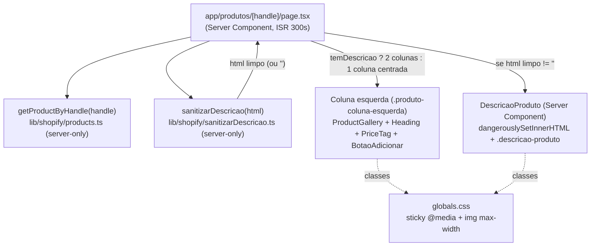
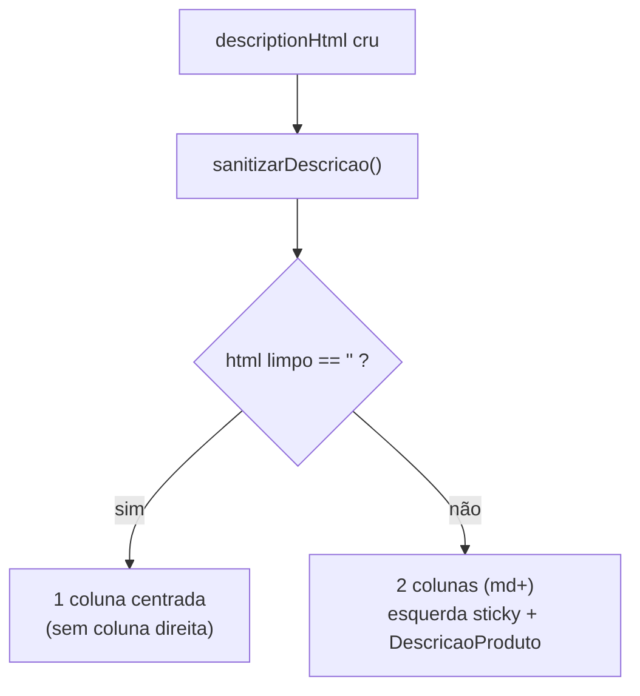

# Design Document

## Overview

Reforma de layout da página `/produtos/[handle]`. A mudança é **de disposição e
de segurança de renderização**, não de dados: a query, a normalização, o
carrinho, a galeria e a sugestão de acessórios ficam intocados.

Três peças novas, todas pequenas:

1. **`lib/shopify/sanitizarDescricao.ts`** (`server-only`) — sanitiza o
   `descriptionHtml` por allowlist e injeta `loading="lazy"` + `?width=800` nas
   `` da CDN. Roda **só no servidor**.
2. **`components/loja/DescricaoProduto.tsx`** (Server Component, sem `"use
   client"`) — recebe o HTML **já limpo** e o injeta com `dangerouslySetInnerHTML`
   num contêiner com classe CSS que contém as imagens (`max-width:100%`).
3. **Reforma da `app/produtos/[handle]/page.tsx`** — passa a decidir o grid: 2
   colunas com esquerda sticky quando há descrição; coluna única centralizada
   quando não há.

Mais: uma regra de CSS em `globals.css` (sticky condicional + estilo das imagens
injetadas) e a salvaguarda `scripts/verificar-descricao.mjs`.

## Steering Document Alignment

### Technical Standards (tech.md)

- **Fronteira cliente/servidor.** A sanitização vive em módulo `server-only`
  (como `client.ts`/`products.ts`), então a dependência `sanitize-html` **nunca
  entra no bundle do cliente**. O `DescricaoProduto` é Server Component — o HTML
  já chega limpo ao cliente, sem JS de sanitização no navegador (Req 3.1, 6.5).
- **Regime de render preservado.** `app/produtos/[handle]/page.tsx` mantém
  `export const revalidate = 300` e `dynamicParams = true`. Nada nesta spec lê
  `cookies()`/`headers()` — `/` e `/sobre-nos` seguem `○ (Static)` (Req 6.2, 6.4).
- **Build sem `.env.local`.** Nenhuma peça nova depende de env em build: a
  sanitização é função pura sobre a string que a página já busca dentro do
  try/catch existente. O script de salvaguarda é fora do build (Req 6.3, 8.3).
- **`images.unoptimized` + `` puro.** Coerente com o projeto: as imagens da
  descrição são `` no HTML da Shopify, servidas pela CDN dela (não pelo
  otimizador do Next). A otimização de peso é via **query da CDN**
  (`?width=800`), não via `next/image` (Req 4.2).
- **DoD = build + verificação manual.** Sem suíte de testes nova (tech.md §5). A
  rede é estrutural: `server-only`, tipos, e o script `verificar:descricao`.

### Project Structure (structure.md)

- Dados/sanitização em `lib/shopify/` (camada de dados `server-only`); UI da loja
  em `components/loja/`; rota em `app/produtos/[handle]/`. Exatamente o mapa
  "onde as coisas moram".
- Nomes de domínio em **pt-BR**: `sanitizarDescricao`, `DescricaoProduto`,
  `verificar-descricao.mjs`.
- Script de salvaguarda no padrão `scripts/verificar-*.mjs` + entrada em
  `package.json` (como `verificar:tags`, `verificar:variantes`).

## Code Reuse Analysis

### Existing Components to Leverage

- **`ProductGallery`** (`components/loja/ProductGallery.tsx`): reusada sem
  mudança na coluna esquerda.
- **`BotaoAdicionar`** (`components/loja/BotaoAdicionar.tsx`): reusado sem
  mudança — recebe o mesmo `handle` da rota; drawer + acessórios seguem idênticos
  (Req 6.1).
- **`PriceTag`** (`components/ui/PriceTag.tsx`) e **`Heading`**
  (`components/ui/Heading.tsx`): reusados para preço e nome, como hoje.
- **`StoreShell`** (`components/loja/StoreShell.tsx`): continua envolvendo a
  página (chrome + paleta).
- **Tipo `Product`** (`lib/shopify/types.ts`): já expõe `descriptionHtml`. **Sem
  mudança de query nem de tipos** — o campo já é buscado e validado contra 2026-01.

### Integration Points

- **`lib/shopify/products.ts` → `getProductByHandle`**: inalterado. A página
  continua recebendo o `Product` com `descriptionHtml` cru; a sanitização acontece
  **na página**, depois da busca.
- **`app/globals.css`**: recebe **duas** regras novas, escopadas por classe
  (`.descricao-produto`, `.produto-coluna-esquerda`) — não toca `:root` nem base.
- **`package.json` → scripts**: ganha `verificar:descricao`.

### Nova dependência

- **`sanitize-html`** (+ `@types/sanitize-html` em devDependencies). Escolhida na
  fase de requisitos: madura, server-side, e o `transformTags` resolve num passo
  só a allowlist **e** a injeção de `loading="lazy"`/`?width=`. Importada **apenas**
  por `lib/shopify/sanitizarDescricao.ts` (`server-only`) → fora do bundle do
  cliente. Roda no runtime Node das rotas (não edge).

## Architecture



**Fluxo de decisão do layout (na página, no servidor):**



## Components and Interfaces

### Component 1 — `sanitizarDescricao` (função `server-only`)

- **Arquivo:** `lib/shopify/sanitizarDescricao.ts`
- **Purpose:** transformar o `descriptionHtml` cru num HTML seguro e otimizado, ou
  em `""` quando não há conteúdo visível.
- **Interface:**
  ```ts
  import "server-only"
  /** Sanitiza o descriptionHtml da Shopify. Retorna "" se vazio pós-limpeza. */
  export function sanitizarDescricao(htmlCru: string | null | undefined): string
  ```
- **Comportamento:**
  - **Allowlist de tags** (Req 3.2, 3.3): `p, br, strong, b, em, i, u, ul, ol, li,
    a, h2, h3, h4, blockquote, span, img`. Tudo fora disso é removido — por
    **não estarem na allowlist**, caem: `<script>`, `<iframe>`, `<object>`,
    `<embed>`, `<style>`, e os atributos `on*=` e `style=`. (Req 3.2 enumera
    `<object>`/`<embed>`: a allowlist os descarta implicitamente, verificado no
    protótipo com `<iframe>`.)
  - **Atributos** (`allowedAttributes`): `a` → `href, rel, target`; `img` →
    `src, alt, loading, decoding`. `allowedSchemes` sem `javascript:`.
    > ⚠️ **Armadilha verificada no protótipo:** o `sanitize-html` filtra os
    > atributos **depois** do `transformTags`. Os atributos que o transform
    > injeta (`loading`, `decoding`, `rel`, `target`) **precisam** estar na
    > `allowedAttributes`, senão são removidos logo após serem adicionados. O
    > primeiro protótipo, com só `href`/`src`/`alt` na allowlist, produziu
    > `` **sem** `loading` e `<a>` **sem** `rel` — falha silenciosa.
  - **`transformTags.a`**: injeta `rel="noopener noreferrer nofollow"` e
    `target="_blank"` (Req 3.5).
  - **`transformTags.img`** (Req 3.7, 4.1, 4.2, 4.4):
    - preserva `alt` como veio (não inventa);
    - adiciona `loading="lazy"` e `decoding="async"`;
    - se `src` é `cdn.shopify.com` **e não** traz já um `?width=`/`&width=` na URL
      → acrescenta `width=800` preservando a query existente (`?v=…`); senão,
      deixa o `src` intacto (degradação segura).
  - **Vazio pós-limpeza** (Req 2.1, 2.4): após sanitizar, remove tags e `&nbsp;`/
    espaços; se o texto e as imagens somam nada visível (`sem ` e texto em
    branco) → retorna `""`. É isso que faz `<p> </p>` contar como vazio.
  - **`?width=800` via `URL`** (Req 4.2): a montagem usa `new URL(src)` +
    `searchParams` (protótipo: preserva o `?v=…` e produz `…?v=…&width=800`),
    dentro de try/catch — URL inválida → `src` intacto.
- **Dependencies:** `sanitize-html` (+ `@types/sanitize-html` em
  devDependencies), `server-only`. As 2 vulnerabilidades `moderate` que o `npm
  audit` reporta são **pré-existentes** (postcss via next), **não** do
  `sanitize-html` — verificado.
- **Reuses:** convenção `server-only` de `lib/shopify/`.
- **Validação de design:** o comportamento acima foi **prototipado** contra o
  HTML real do ES-P9 e entradas adversariais (`<script>`, `onerror=`,
  `javascript:`, `style=`, `<iframe>`, `<p> </p>`) antes de aprovar — todas
  tratadas como especificado.

### Component 2 — `DescricaoProduto` (Server Component)

- **Arquivo:** `components/loja/DescricaoProduto.tsx`
- **Purpose:** renderizar o HTML **já limpo** da descrição, com as imagens
  contidas. **Não sanitiza** (recebe pronto) e **não** é `"use client"`.
- **Interface:**
  ```ts
  export function DescricaoProduto({ html }: { html: string }): JSX.Element | null
  ```
- **Comportamento:** se `html === ""` → `return null` (Req 2.1). Senão, um
  `<div className="descricao-produto" dangerouslySetInnerHTML={{ __html: html }}
  />`. A classe carrega o estilo das imagens (não-clicáveis, contidas) via CSS —
  não há `onClick`, então as imagens são **inertes** (Req 3.6).
- **Dependencies:** nenhuma (nem client, nem dados).
- **Reuses:** classe CSS de `globals.css`.

### Component 3 — `app/produtos/[handle]/page.tsx` (reforma)

- **Purpose:** decidir o grid e posicionar as peças. Continua Server Component
  `async`, com os mesmos `revalidate`/`dynamicParams`/`generateStaticParams`/
  `generateMetadata` e os **dois modos de falha** (Req 6.2, 6.7).
- **Mudança central** (após `if (!produto) notFound()`):
  ```tsx
  const descricaoLimpa = sanitizarDescricao(produto.descriptionHtml)
  const temDescricao   = descricaoLimpa !== ""

  return (
    <StoreShell>
      <article
        className={temDescricao
          ? "mx-auto grid max-w-[1100px] grid-cols-1 items-start gap-8 md:grid-cols-2 md:gap-[clamp(24px,4vw,56px)]"
          : "mx-auto flex max-w-[560px] flex-col"}
        style={{ padding: "40px clamp(20px,5vw,64px) 72px" }}
      >
        {/* Coluna esquerda — bloco de compra (sticky via classe) */}
        <div className="produto-coluna-esquerda" style={{ display:"flex", flexDirection:"column", gap:20 }}>
          <ProductGallery images={produto.images} title={produto.title} />
          <Heading as="h1" size="pequeno" text={produto.title} color="var(--cor-texto)" accentColor="var(--cor-destaque)" />
          <PriceTag price={produto.price.price} currency={produto.price.currency} size="grande" />
          <BotaoAdicionar handle={handle} />
        </div>

        {/* Coluna direita — só quando há descrição */}
        {temDescricao && <DescricaoProduto html={descricaoLimpa} />}
      </article>
    </StoreShell>
  )
  ```
- **Ordem no mobile** (Req 5.1): como a esquerda é UM `div` empilhado (galeria →
  nome → preço → botão) e a descrição vem **depois** no DOM, o `grid-cols-1`
  (mobile) já produz a ordem correta sem `order` explícito.
- **`ProductSpecs` removido** (Req 7): apaga o import e o uso. O arquivo do
  componente permanece no repo.
- **Reuses:** `StoreShell`, `ProductGallery`, `Heading`, `PriceTag`,
  `BotaoAdicionar`.

### Component 4 — CSS em `app/globals.css`

```css
/* Imagens da descrição: contidas, nunca estouram a coluna (Req 3.4).
   As  vêm da Shopify SEM width — a 1448px estourariam ~500px de coluna. */
.descricao-produto img {
  max-width: 100%;
  height: auto;
  display: block;
}
/* Reserva de espaço aproximada contra layout shift (Req 4.3): sem width/height
   no HTML, reservamos por aspect-ratio. As imagens medidas do ES-P9 são ~4:3/3:4;
   4/3 é uma reserva mais honesta que um min-height fixo (o validador apontou que
   120px deixava "salto" numa imagem de ~500px de altura). É aproximação, não
   exatidão — dimensões reais não vêm no HTML. */
.descricao-produto img:not([width]) { aspect-ratio: 4 / 3; }
.descricao-produto p { margin: 0 0 12px; }

/* Sticky condicional (Req 1.2, 1.3, 1.4): só gruda quando há LARGURA de 2 colunas
   (≥768px) E ALTURA suficiente para a coluna esquerda INTEIRA caber — com a
   galeria agora DENTRO dela, a esquerda passou a ~800–1000px no desktop. Por isso
   o limiar é 1000px, não 760: abaixo disso o botão "Adicionar" poderia grudar
   fora da tela (o risco nº 1 que o validador do design levantou). align-self:start
   é obrigatório — sem ele o item de grid estica e o sticky nunca dispara. Sem JS
   de medição (NFR Performance). O 1000px é ajustável na verificação manual. */
@media (min-width: 768px) and (min-height: 1000px) {
  .produto-coluna-esquerda {
    position: sticky;
    top: 24px;
    align-self: start;
  }
}
```

- **Reuses:** o `:root`/base do `globals.css`; usa `--cor-*` onde aplicável.

### Component 5 — `scripts/verificar-descricao.mjs` (salvaguarda, Req 8)

- **Purpose:** falhar com barulho se **nenhum** produto tiver descrição.
- **Interface de uso:** `npm run verificar:descricao` (via
  `node --env-file=.env.local`).
- **Comportamento:** consulta `products(first: 50){ nodes{ handle descriptionHtml } }`,
  conta quantos têm `descriptionHtml` não-vazio (trim), imprime o resumo; se a
  contagem é **0** → `process.exitCode = 1`.
- **Convenções obrigatórias** (Req 8.3): Node puro; **`process.exitCode`, nunca
  `process.exit()`** (armadilha do exit 127 no Windows já documentada em
  `verificar-tags.mjs`); repete `fetch`/env/versão da API por não poder importar
  `lib/shopify/` (TS + `server-only`) — duplicação declarada, igual aos outros
  scripts; **não** acoplado ao `npm run build`.
- **Reuses:** padrão de `scripts/verificar-tags.mjs`.

## Data Models

Nenhum modelo persistente novo. O único "modelo" é o contrato da função:

```
sanitizarDescricao(htmlCru: string | null | undefined) -> string
  - entrada: descriptionHtml cru da Shopify (pode ser "", null, undefined)
  - saída:   HTML sanitizado + imagens otimizadas, OU "" se sem conteúdo visível
  - pura, síncrona, sem I/O, sem env
```

O tipo `Product.descriptionHtml` (já existente) permanece como está.

## Error Handling

### Error Scenarios

1. **Descrição vazia / só `<p> </p>` / vira vazia pós-sanitização**
   - **Handling:** `sanitizarDescricao` retorna `""`; a página escolhe o layout de
     1 coluna centrada e não monta `DescricaoProduto`.
   - **User Impact:** página limpa e centrada, sem coluna fantasma nem erro
     (Req 2). É o estado de **6 dos 7 produtos** hoje.

2. **HTML malicioso (`<script>`, `onclick`, `javascript:`)**
   - **Handling:** removido pela allowlist do `sanitize-html` no servidor antes do
     DOM (Req 3.2).
   - **User Impact:** nenhum — o cliente nunca recebe o HTML perigoso.

3. **Imagem fora da CDN da Shopify, ou com `?width=` já presente**
   - **Handling:** `transformTags.img` deixa o `src` intacto e só adiciona
     `loading`/`decoding` (Req 4.4).
   - **User Impact:** imagem carrega normalmente, sem otimização de largura.

4. **Shopify offline / produto inexistente**
   - **Handling:** inalterado — try/catch → UI amigável; `notFound()` fora do try
     (Req 6.7).
   - **User Impact:** idêntico ao de hoje.

5. **Coluna esquerda mais alta que a viewport (notebook baixo)**
   - **Handling:** o `@media (min-height: 1000px)` não ativa o sticky; a esquerda
     rola normalmente (Req 1.4).
   - **User Impact:** botão "Adicionar" sempre alcançável.

6. **Todas as descrições somem do catálogo**
   - **Handling:** `npm run verificar:descricao` sai com código ≠ 0 (Req 8.2).
   - **User Impact:** mantenedor é avisado antes de a coluna direita virar código
     morto silencioso.

## Testing Strategy

Alinhado ao DoD do projeto (tech.md §5): **build + verificação manual**, sem
suíte formal nova.

### Unit Testing
- Sem framework de teste novo. A corretude do `sanitizarDescricao` é verificada
  **manualmente** com o HTML real do ES-P9 (medido: `<p>`+``) e com uma
  entrada adversarial pontual (`<script>`, `<p> </p>`) durante a implementação.

### Integration Testing
- `npm run build` **com** `.env.local`: confirmar na saída que
  `/produtos/[handle]` segue **ISR** (com `dynamicParams`) e que `/` e
  `/sobre-nos` seguem `○ (Static)` (Req 6.2, 6.4).
- `npm run build` **sem** `.env.local`: passa (Req 6.3).
- `npx tsc --noEmit` limpo (Req 6.6).
- `npm run verificar:descricao`: retorna contagem ≥ 1 hoje (ES-P9), exit 0.

### End-to-End Testing (manual em `npm run dev`)
- **ES-P9** (`/produtos/camera-seguranca-es-p9`): 2 colunas no desktop; esquerda
  gruda enquanto a descrição rola; solta no fim; as 4 imagens aparecem contidas,
  não clicáveis. Mobile: empilhado na ordem certa, botão no meio.
- **Qualquer produto sem descrição** (ex.: `camera-de-seguranca-q6`): 1 coluna
  centrada, sem espaço estranho.
- **Botão "Adicionar"**: abre o drawer e dispara os acessórios (Req 6.1).
- **DevTools › Network**: as 4 imagens vêm como WebP (`?width=800`), total ~434 KB
  (Req 4.2).
- **Notebook baixo** (janela ~700px de altura): esquerda não gruda; botão
  alcançável (Req 1.4).
- **Faixa de risco do sticky** (janela ~850–950px de altura): confirmar que o
  botão "Adicionar" fica **alcançável** — é a banda onde o limiar `min-height`
  pode ativar o sticky sem a coluna caber. Se o botão pinar fora da tela, subir o
  limiar de 1000px (é ajustável, por decisão do Req 1.4). *Risco nº 1 do
  validador.*
- **Invariante do boundary:** confirmar que `DescricaoProduto` **nunca** ganhou
  `"use client"` e que o build mantém **0 ocorrências** do token/endpoint em
  `.next/static` (checagem já usada na `catalogo-loja`) — o `sanitize-html` não
  pode vazar para o cliente (Req 3.1, 6.5).
