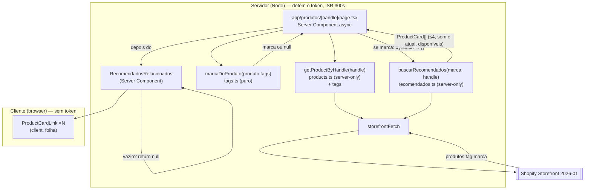
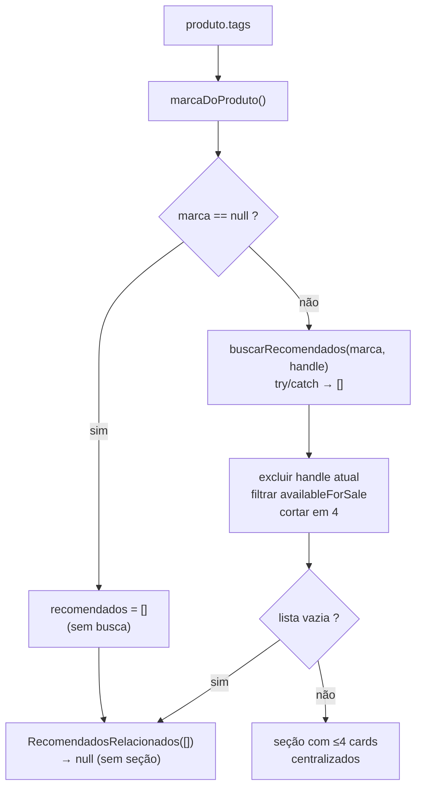

# Design Document — Produtos Recomendados (produtos-recomendados)

## Overview

Uma seção **"Você também pode gostar"** na página `/produtos/[handle]`, **abaixo**
do bloco de 2 colunas, com **até 4 câmeras da mesma marca** do produto atual, em
**grade fixa centralizada**.

A feature é **inteiramente server-side**. A página já é um Server Component async
que busca o produto no servidor; a recomendação é **mais uma leitura no mesmo
render**. Não há Server Action, estado de cliente, `useEffect`, `useMemo` nem
componente `"use client"` novo. É o oposto da `acessorios-sugeridos` (que vive no
carrinho, no cliente) — e por isso é bem mais simples.

Peças, todas pequenas:

1. **`tags` no `PRODUCT_BY_HANDLE_QUERY`** — um escalar novo para saber a marca do
   produto atual sem uma segunda busca. **Baixo risco:** a query só é usada por
   `getProductByHandle` (não toca o fragmento compartilhado do carrinho).
2. **`lib/shopify/tags.ts`** ganha as constantes de marca (`eseecloud`, `icsee`),
   a lista ordenada `MARCAS` (que define o desempate) e o helper puro
   `marcaDoProduto(tags)`.
3. **`lib/shopify/recomendados.ts`** (`server-only`) — busca por
   `tag:<marca>`, filtra `availableForSale` em JS, exclui o handle atual, corta em
   4, devolve `ProductCard[]`. Cópia fiel do padrão de `acessorios.ts`.
4. **`components/loja/RecomendadosRelacionados.tsx`** (Server Component) — recebe
   `ProductCard[]`, devolve `null` se vazio, senão `Heading` + grade de
   `ProductCardLink`.
5. **`app/produtos/[handle]/page.tsx`** — computa a marca, busca (em `try/catch` →
   `[]`) e renderiza a seção **depois do `</article>`**.
6. **`app/globals.css`** — duas classes (`.recomendados-secao`,
   `.recomendados-grade`) para a seção centralizada e a grade centralizada em
   qualquer quantidade.
7. **`scripts/verificar-marcas.mjs`** (salvaguarda **opcional**, Req 8).

### Fatos verificados (fundamentam o design)

Medidos no código real e contra o schema 2026-01 via Dev MCP — não são suposições:

| # | Fato verificado | Consequência no design |
|---|---|---|
| 1 | **`PRODUCT_BY_HANDLE_QUERY` com `tags` é ✅ VALID em 2026-01** (Dev MCP, sem depreciação). `Product.tags` é `[String!]!` (verificado; o fragmento do carrinho já seleciona `product.tags`) | Adicionar `tags` é seguro e o campo **nunca vem `undefined`** — chega array (vazio se sem tags) |
| 2 | `PRODUCT_BY_HANDLE_QUERY` é usada **só** por `getProductByHandle` (`products.ts`), **não** pelo carrinho | Diferente da `acessorios-sugeridos`, esta spec **não toca fragmento compartilhado**. O risco é local à página de produto |
| 3 | **Query de recomendados por tag é ✅ VALID em 2026-01** (Dev MCP). É idêntica em forma à `ACESSORIOS_QUERY` (`RawProductCard` + `availableForSale`) | `normalizeProductCard` serve sem adaptador; o filtro `availableForSale` fica em JS, como na `acessorios-sugeridos` |
| 4 | `CatalogGrid` **é Server Component** que renderiza `ProductCardLink` (`"use client"`) | Precedente exato: um server component da loja pode montar os cards client. `RecomendadosRelacionados` faz o mesmo |
| 5 | A página fecha em `<article>…</article>` dentro do `StoreShell`; o `<article>` é um grid de **2 filhos** | A seção é **irmã depois do `</article>`** — nunca um 3º filho do grid (cairia no auto-flow das 2 colunas) |
| 6 | O projeto usa classes explícitas em `globals.css` para layout da página de produto (`produto-grid`) porque "o `mx-auto` do Tailwind não é gerado" (comentário na `page.tsx`) | A grade centralizada vai por **classe em `globals.css`**, não por utilitárias Tailwind incertas — mesmo precedente da `layout-pagina-produto` |
| 7 | `storefrontFetch` tem união `{ semCache }` × `{ revalidate }`; `getProductByHandle` usa `{ revalidate: 300 }` | A busca de recomendados usa **o mesmo `{ revalidate: 300 }`** — participa do ISR da página; **nunca** `force-cache`/`semCache` |

## Steering Document Alignment

### Technical Standards (tech.md)

- **Regime de render preservado.** `app/produtos/[handle]/page.tsx` mantém
  `export const revalidate = 300` e `dynamicParams`. Nada aqui lê
  `cookies()`/`headers()` — `/` e `/sobre-nos` seguem `○ (Static)` (Req 7.2, 7.3).
- **Fronteira cliente/servidor.** `recomendados.ts` leva `import "server-only"`
  (como `acessorios.ts`/`products.ts`); o token nunca entra no bundle. A seção é
  Server Component; o cliente recebe HTML pronto (Req 6.1, 6.3).
- **Cache sem `force-cache`.** A busca usa `{ revalidate: 300 }` — que é **inerte**
  no `storefrontFetch` (POST não é cacheado pós-Next 15, ver `tech.md`); o cache
  "leve" desejado vem **do ISR da própria página** (`export const revalidate`),
  não de `force-cache`/`fetchCache` (Req 6.4). Ver §Cache: o ISR da página é o cache.
- **Build sem `.env.local`.** A busca roda dentro do try/catch da página; sem
  token → `storefrontFetch` lança → `catch` → `[]` → sem seção. O build nunca
  quebra (Req 7.4). O script de salvaguarda fica **fora** do build.
- **DoD = build + verificação manual.** Sem suíte de testes nova (tech.md §5). A
  rede é estrutural: `server-only`, tipos, e o `verificar:marcas` opcional.

### Project Structure (structure.md)

- Dados/tags em `lib/shopify/` (camada `server-only` para o que toca token; `tags.ts`
  **sem** `server-only`, pois o helper de marca é puro e pode ser usado dos dois
  lados no futuro). UI da loja em `components/loja/`. Rota em `app/produtos/[handle]/`.
- Nomes de domínio em **pt-BR**: `recomendados`, `marca`, `marcaDoProduto`,
  `RecomendadosRelacionados`, `verificar-marcas.mjs`.
- Script de salvaguarda no padrão `scripts/verificar-*.mjs` + entrada em
  `package.json` (como `verificar:tags`, `verificar:variantes`).

## Code Reuse Analysis

### Existing Components to Leverage

- **`ProductCardLink`** (`components/loja/ProductCardLink.tsx`): o card clicável,
  reusado **sem mudança**. Já é `<Link href="/produtos/${handle}">` com foto +
  nome + preço, **sem botão de comprar** — exatamente o Req 4. `"use client"`, mas
  é folha; montá-lo num Server Component é o mesmo que o `CatalogGrid` já faz.
- **`Heading`** (`components/ui/Heading.tsx`): título da seção, `size="grande"`.
  A `page.tsx` **já** usa `<Heading>` (para o nome do produto) — reuso consistente.
- **`storefrontFetch`** (`lib/shopify/client.ts`): único ponto de saída HTTP,
  usado **sem** modificação.
- **`normalizeProductCard`** (`lib/shopify/normalize.ts`): `RawProductCard` →
  `ProductCard`, sem mudança (fato 3).
- **`StoreShell`**: continua envolvendo a página (chrome + paleta); a seção herda
  as `--cor-*` dele (Req 4.5).
- **Padrão da `acessorios-sugeridos`**: `acessorios.ts` é o **molde** de
  `recomendados.ts` (mesma busca por tag, mesmo filtro em JS, mesmo `server-only`).
- **Padrão de grade do `CatalogGrid`**: reusado como **conceito** (cards
  responsivos), com a centralização adicionada em `globals.css`.

### Integration Points

- **`lib/shopify/queries.ts`** → `PRODUCT_BY_HANDLE_QUERY` ganha `tags`; ganha
  `RECOMENDADOS_QUERY` (novo documento).
- **`lib/shopify/normalize.ts`** → `RawProduct` ganha `tags: string[]`;
  `normalizeProduct` mapeia `tags: raw.tags ?? []`.
- **`lib/shopify/types.ts`** → `Product` ganha `tags: string[]`.
- **`lib/shopify/tags.ts`** → constantes de marca + `MARCAS` + `marcaDoProduto`.
- **`lib/shopify/recomendados.ts`** → **novo** (`server-only`).
- **`components/loja/RecomendadosRelacionados.tsx`** → **novo** (Server Component).
- **`app/produtos/[handle]/page.tsx`** → computa marca, busca, renderiza a seção.
- **`app/globals.css`** → duas classes novas, escopadas (`.recomendados-*`).
- **`package.json` / `README.md`** → `verificar:marcas` (opcional).

## Architecture

**Padrão: tudo no servidor, no render que já existe.**

A página já busca o produto. Com `tags` no produto, ela sabe a marca **sem
segunda busca**. Se há marca, faz **uma** busca a mais (recomendados), tudo dentro
do mesmo render ISR. O cliente recebe HTML pronto — nenhum JS de recomendação roda
no navegador.



**Fluxo de decisão (na página, no servidor):**



### Decisão: `tags` no produto (e não uma segunda busca)

Como saber a marca do produto atual? A página **já** busca o produto —
adicionar `tags` à query que já roda custa **zero** chamadas a mais. A
alternativa (uma query só de tags pelo handle) seria uma segunda ida à rede para
descobrir algo que a primeira já poderia trazer. Como `tags` é `[String!]!`, o
custo de payload é um array pequeno por produto — ruído. **Escolha: `tags` na
query existente** (Req 1.1).

### Decisão: a marca é whitelist, o desempate é a ordem de `MARCAS`

`marcaDoProduto(tags)` procura, **na ordem de `MARCAS`**, a primeira marca
conhecida presente nas tags do produto:

```ts
// ⚠️ "eseecloud" com DOIS "e" (es-ee-cloud) é a grafia CERTA da marca — NÃO é um
// typo. Confirmado com o usuário e MEDIDO na loja (§Validação): `tag:eseecloud`
// → 4 produtos; `tag:essecloud` → 0. NÃO "conserte" para "essecloud": isso faz a
// seção sumir em silêncio para toda câmera EsseCloud. Este arquivo existe para a
// grafia não divergir entre código e admin.
export const TAG_ESEECLOUD = "eseecloud"
export const TAG_ICSEE     = "icsee"

/** Ordem = desempate (Req 1.5): se um produto tiver as duas, ganha a primeira. */
export const MARCAS = [TAG_ESEECLOUD, TAG_ICSEE] as const

/** A marca do produto, ou null se não tiver nenhuma tag de marca conhecida. */
export function marcaDoProduto(tags: string[]): string | null {
  return MARCAS.find((m) => tags.includes(m)) ?? null
}
```

- **`null` → sem seção** (Req 1.3): a página nem busca.
- **Duas marcas (caso não esperado) → a primeira de `MARCAS`** (`eseecloud`),
  determinístico (Req 1.5).
- **Só a tag decide** — nunca título/handle/coleção (Req 1.4).
- O `tag:${marca}` da busca é montado a partir **desse** valor, que é
  **provadamente** um dos elementos de `MARCAS` — o cliente nunca escolhe a busca
  (Req 2.5, 6). Um valor arbitrário nunca chega ao `storefrontFetch`.

> **Onde mora o helper.** Em `tags.ts`, que **não** tem `server-only` (é string +
> função pura, sem token nem fetch — mesmo precedente de `TAG_CAMERA`). Assim a
> grafia das marcas vive num lugar só; um typo (`EsseCloud`, `ic-see`) faria a
> seção sumir **em silêncio**, e é isso que o `verificar:marcas` (opcional) vigia.

### Cache: o ISR da página É o cache (Req 6.4 × NFR de performance)

A `acessorios-sugeridos` usou `{ semCache: true }` **porque rodava no cliente**,
fora de qualquer ISR de página — cada carga refazia a busca. **Aqui é o oposto:**
a busca roda **dentro do render** da página, que é ISR 300s. Então:

- Passo **`{ revalidate: 300 }`** (igual ao `getProductByHandle` ao lado), **não**
  `semCache`, **nunca** `force-cache`.
- Pelo `tech.md`, o `next.revalidate` é **inerte** para o POST do `storefrontFetch`
  — mas **não importa**: o `export const revalidate = 300` da página captura o
  resultado da busca no **snapshot do ISR**. Uma câmera visitada 1000 vezes em 5
  min faz **uma** busca de recomendados, não mil.
- **Satisfaz** a NFR ("no máximo uma chamada extra por render") e a proibição de
  `force-cache` — **sem exceção**, porque não uso cache de fetch algum: uso o
  cache de página que já existe.

### Decisão: `RECOMENDADOS_QUERY` novo (e não reusar `ACESSORIOS_QUERY`)

A query de recomendados é **idêntica em forma** à `ACESSORIOS_QUERY`. Poderia
reusá-la, mas o nome (`Acessorios`) mentiria sobre o uso, e generalizá-la exigiria
**tocar** o documento de que a `acessorios-sugeridos` depende — risco sem ganho.
**Escolha: um documento novo `RECOMENDADOS_QUERY`**, cópia da forma. Duplicação
pequena, **zero risco** à feature que já funciona. *(Se um dia houver um terceiro
consumidor de "produtos por tag", aí sim vale extrair um `PRODUTOS_POR_TAG_QUERY`
compartilhado — com as duas features revalidadas.)*

### Decisão: a seção depois do `</article>`, não como 3º filho do grid

O `<article>` é um grid de 2 colunas com **exatamente 2 filhos** (esquerda +
descrição). Um 3º filho cairia no auto-flow das 2 colunas — a seção ficaria presa
a uma coluna. **A seção é irmã, depois do `</article>`, ainda dentro do
`StoreShell`** (Req 3.1). Assim ela é largura total e independente das colunas.

### Decisão: centralização por flex, não por grid de colunas

O Req 3.5 exige cards **sempre centralizados** (1, 2, 3 ou 4). Um grid de colunas
fracionárias (`grid-cols-4`) deixaria **1 card no canto esquerdo** com 3 colunas
vazias à direita. **Solução: flex com `justify-content: center`** e cards de base
fixa que **quebram linha** — 1 card fica no meio; 4 preenchem; nunca há buraco só
de um lado. Detalhe em §CSS.

## Components and Interfaces

### `lib/shopify/queries.ts` (modificar)

**`PRODUCT_BY_HANDLE_QUERY`** ganha **um** campo escalar, `tags`:

```graphql
query ProductByHandle($handle: String!, $identifiers: [HasMetafieldsIdentifier!]!) {
  product(handle: $handle) {
    id
    handle
    title
    descriptionHtml
    tags                       # ← novo (escalar; ✅ VALID 2026-01)
    images(first: 20) { nodes { url altText width height } }
    priceRange { minVariantPrice { amount currencyCode } }
    metafields(identifiers: $identifiers) { namespace key value }
  }
}
```

**`RECOMENDADOS_QUERY`** (novo) — mesma forma da `ACESSORIOS_QUERY`:

```graphql
query Recomendados($query: String!, $first: Int!) {
  products(first: $first, query: $query) {
    nodes {
      id
      handle
      title
      availableForSale
      featuredImage { url altText width height }
      priceRange { minVariantPrice { amount currencyCode } }
    }
  }
}
```

- `$query` vem por **variável**, montada no servidor a partir de `MARCAS`
  (`tag:eseecloud`/`tag:icsee`); o cliente nunca escolhe.
- `first: 250` (o teto da API, como na `acessorios-sugeridos`), **sem paginar**
  (Req 2.7). `availableForSale` **não** entra na string — filtro em JS.
- ✅ **VALID** contra 2026-01 (Dev MCP), sem depreciação (Req 9.1, 9.2).

### `lib/shopify/normalize.ts` (modificar)

- `RawProduct` ganha `tags: string[]`.
- `normalizeProduct` mapeia **`tags: raw.tags ?? []`** — padrão defensivo já usado
  no arquivo. Garante que `Product.tags` **nunca** é `undefined` (segura o
  `.includes()` do `marcaDoProduto`).

### `lib/shopify/types.ts` (modificar)

`Product` ganha `tags: string[]` (documentar: é o que permite descobrir a marca
para a seção de recomendados).

### `lib/shopify/tags.ts` (modificar)

Ganha `TAG_ESEECLOUD`, `TAG_ICSEE`, `MARCAS` e `marcaDoProduto` (código acima).
Comentar: grafia **minúscula, sem acento, `eseecloud` com dois "e"**, como
cadastrado na Shopify (medido); divergência faz a seção sumir em silêncio (mesmo
aviso das tags existentes) — e aqui a divergência **já foi medida de verdade**.

### `lib/shopify/recomendados.ts` (novo, `server-only`)

```ts
import "server-only"
import { storefrontFetch } from "./client"
import { RECOMENDADOS_QUERY } from "./queries"
import { normalizeProductCard, type RawProductCard } from "./normalize"
import type { ProductCard } from "./types"

const TETO_DA_API     = 250 // máximo da Storefront API
const MAX_RECOMENDADOS = 4  // Req 2.3 — acima disto vira carrossel (fora de escopo)

interface RawRecomendado extends RawProductCard { availableForSale: boolean }

/**
 * Outras câmeras da MESMA marca, para a seção "Você também pode gostar".
 * `marca` é sempre um elemento de MARCAS (vem de marcaDoProduto) — o cliente
 * nunca escolhe a busca. Exclui o produto atual e os indisponíveis; ≤4.
 */
export async function buscarRecomendados(
  marca: (typeof MARCAS)[number], // trava: só "eseecloud" | "icsee", nunca string solta
  handleAtual: string,
): Promise<ProductCard[]> {
  const data = await storefrontFetch<{ products: { nodes: RawRecomendado[] } }>(
    RECOMENDADOS_QUERY,
    { query: `tag:${marca}`, first: TETO_DA_API },
    { revalidate: 300 }, // participa do ISR da página; NUNCA force-cache/semCache
  )
  return data.products.nodes
    .filter((p) => p.availableForSale)   // Req 2.4 — antes de cortar
    .filter((p) => p.handle !== handleAtual) // Req 2.2 — exclui o atual
    .slice(0, MAX_RECOMENDADOS)          // Req 2.3 — no máximo 4
    .map(normalizeProductCard)           // Req 4.1/4.4 — preço já formatado
}
```

- **Ordem de operações:** filtra disponível → exclui o atual → corta em 4. Cortar
  **depois** de excluir o atual garante 4 **outras** câmeras, não 3 + o próprio
  (Req 2.2, 2.3, 2.6).
- **Pode lançar** (rede/Shopify fora) — quem trata é a página (§page.tsx),
  degradando para `[]`. *Não engole o erro aqui para manter a camada de dados
  honesta; a decisão de "extra não derruba a página" é da página, como já é para
  os dois modos de falha existentes.*

### `components/loja/RecomendadosRelacionados.tsx` (novo, Server Component)

```tsx
import { Heading } from "@/components/ui/Heading"
import { ProductCardLink } from "@/components/loja/ProductCardLink"
import type { ProductCard } from "@/lib/shopify/types"

// Server Component (SEM "use client"): monta a seção no servidor e renderiza os
// cards (client, folha). Mesmo padrão do CatalogGrid.
export function RecomendadosRelacionados({ produtos }: { produtos: ProductCard[] }) {
  // Guarda ÚNICA (Req 5.1): sem recomendados → nada. Cobre marca ausente,
  // só-o-atual, todos indisponíveis e falha de busca — a página já passa [] em
  // todos esses casos, então um único `length === 0` basta.
  if (produtos.length === 0) return null

  return (
    <section className="recomendados-secao" aria-label="Você também pode gostar">
      {/* Copy fixa no código — exceção declarada ao "conteúdo em JSON" do
          product.md. Precedente idêntico: "Você também vai precisar"
          (acessorios-sugeridos) e o SeloPagamento (carrinho-loja). */}
      <Heading
        as="h2" size="grande"
        text="Você também pode gostar"
        color="var(--cor-texto)" accentColor="var(--cor-destaque)"
      />
      <div className="recomendados-grade">
        {produtos.map((p) => <ProductCardLink key={p.id} product={p} />)}
      </div>
    </section>
  )
}
```

- **Sem props além de `produtos`** — a página faz toda a decisão.
- **`as="h2"`** (o `<h1>` é o nome do produto) — hierarquia correta (Req 3.3,
  Usability).
- **Cores só via `--cor-*`** herdadas do `StoreShell` (Req 4.5).
- **Sem carrossel, sem setas** (Req 3.6).

### `app/produtos/[handle]/page.tsx` (modificar)

Imports novos: `marcaDoProduto` (de `tags`), `buscarRecomendados` (de
`recomendados`), `RecomendadosRelacionados`, e `type ProductCard`.

Depois de `if (!produto) notFound()` e do cálculo de `descricaoLimpa`:

```tsx
// Marca do produto atual (ou null). Só busca recomendados se houver marca.
const marca = marcaDoProduto(produto.tags)
let recomendados: ProductCard[] = []
if (marca) {
  try {
    recomendados = await buscarRecomendados(marca, produto.handle)
  } catch {
    // Extra comercial NÃO derruba a página que vende (Req 5.2). Sem log: a
    // mensagem de storefrontFetch conteria o endpoint.
    recomendados = []
  }
}
```

E, no JSX, **depois do `</article>`** e ainda dentro do `<StoreShell>`:

```tsx
      </article>

      {/* Seção largura-total, abaixo das 2 colunas. Some sozinha se vazia. */}
      <RecomendadosRelacionados produtos={recomendados} />
    </StoreShell>
```

- **Aditivo (Req 3.7):** quando `marca` é `null` ou a busca falha,
  `recomendados = []` → a seção devolve `null` → a página renderiza **exatamente**
  como hoje.
- **Não muda** `revalidate`/`dynamicParams`/`generateStaticParams`/
  `generateMetadata` nem os dois modos de falha (Req 7.1, 7.3).

### `app/globals.css` (modificar) — a seção e a grade centralizada

```css
/* Seção "Você também pode gostar": largura total, container alinhado ao do
   /catalogo (mesma max-width e padding lateral), abaixo do produto. */
.recomendados-secao {
  max-width: 1200px;
  margin: 0 auto;
  /* padding-top 0: o <article> acima já tem padding-bottom 72px; um top extra
     somaria ~80px de vão (achado BAIXA-1 da auditoria). */
  padding: 0 clamp(20px, 5vw, 64px) 72px;
}

/* Grade: cards de base fixa que quebram linha e ficam SEMPRE centralizados —
   1, 2, 3 ou 4 (Req 3.5). flex + justify-center resolve a centralização em
   qualquer quantidade; um grid de colunas fracionárias deixaria 1 card no canto.
   base 240px: até 4 cabem centrados num container de ~1100–1200px; no mobile
   quebram para 1–2 por linha, ainda centrados. (240 é ajustável na verificação
   manual.) */
.recomendados-grade {
  display: flex;
  flex-wrap: wrap;
  justify-content: center;
  align-items: stretch;    /* cards da mesma linha com a mesma altura */
  gap: 20px;
  margin-top: 24px;
}
.recomendados-grade > * {
  /* base RESPONSIVA (achado MÉDIA-1): ~150px no celular → 2 cards por linha
     (como o /catalogo); 240px no desktop → até 4. grow:0 evita esticar. */
  flex: 0 1 clamp(150px, 42vw, 240px);
  max-width: 260px;
}
```

- **Reusa** `:root`/`--cor-*`; não toca `:root` nem base.
- `flex: 0 1 240px` — `grow: 0` impede que 1 card estique para a largura toda
  (o que quebraria a sensação de "card", não de "faixa").

### `scripts/verificar-marcas.mjs` (novo, **opcional** — Req 8)

- **Purpose:** falhar com barulho se **nenhum** produto publicado tiver
  `essecloud` **ou** `icsee`.
- **Comportamento:** consulta `products(first: 250){ nodes{ handle tags } }`,
  conta por marca, imprime o resumo; se **ambas** as marcas têm 0 →
  `process.exitCode = 1`. **Avisa (sem falhar)** produtos publicados **sem
  nenhuma** tag de marca, nomeando handles (Req 8.2).
- **Convenções obrigatórias** (Req 8.3): Node puro; **`process.exitCode`, nunca
  `process.exit()`** (armadilha do exit 127 no Windows, já documentada nos outros
  scripts); duplica env/versão da API (exceção declarada, comentada); **não**
  acoplado ao `npm run build`. `npm run verificar:marcas` no `package.json`.
- **Reusa:** estrutura de `scripts/verificar-tags.mjs`.

> **Escopo:** o Req 8 é **desejável, não bloqueante** (pré-condição de dados já
> atendida). Fica marcado como **opcional** no plano de tarefas — quem executar
> pode entregar a feature sem ele, mas a salvaguarda é barata e recomendada.

## Data Models

### `Product` — um campo novo (`lib/shopify/types.ts`)

```ts
export interface Product {
  // …campos existentes, inalterados…
  /** Tags do produto (`product.tags`). É o que permite descobrir a marca
   *  (essecloud/icsee) para a seção de recomendados. Nunca undefined:
   *  schema `[String!]!` + `?? []` em normalizeProduct. */
  tags: string[]
}
```

### `ProductCard` — **sem mudança**

O card recomendado é um `ProductCard` (`{id, handle, title, image, price}`).
`availableForSale` **não** entra: é **filtro do servidor** (nunca se recomenda
indisponível), não dado de exibição — não teria leitor.

### `RawRecomendado` (interno de `recomendados.ts`)

`RawProductCard` + `availableForSale: boolean` — para filtrar antes de normalizar
(mesmo padrão de `RawAcessorio`).

## Error Handling

### Error Scenarios

1. **Busca de recomendados falha (rede/Shopify fora/env ausente)**
   - **Handling:** a página captura em `try/catch` → `recomendados = []`; a seção
     devolve `null`.
   - **User Impact:** **nenhum.** A página de produto segue inteira (nome, preço,
     galeria, botão, acessórios, descrição). Sem erro, sem espaço vazio (Req 5.2).

2. **Produto sem tag de marca conhecida**
   - **Handling:** `marcaDoProduto` → `null` → a página **nem busca**;
     `recomendados = []` → sem seção.
   - **User Impact:** página normal, sem seção (Req 1.3).

3. **Marca com só o próprio produto (0 outros)**
   - **Handling:** a busca devolve só o atual → excluído pelo handle → `[]` → sem
     seção (Req 2.3, 5.1).
   - **User Impact:** página normal, sem seção.

4. **Marca com 1–3 outras câmeras**
   - **Handling:** mostra as que há (após excluir atual + indisponíveis),
     centralizadas (Req 2.3, 3.5).
   - **User Impact:** 1, 2 ou 3 cards, sempre centralizados.

5. **Produto com as duas tags de marca (caso não esperado)**
   - **Handling:** `marcaDoProduto` devolve a primeira de `MARCAS` (`eseecloud`),
     determinístico (Req 1.5). A busca usa essa marca.
   - **User Impact:** recomendações de EsseCloud — comportamento **definido**.

6. **`tags` volta vazio/`null` da Shopify**
   - **Handling:** `raw.tags ?? []` em `normalizeProduct`; `marcaDoProduto([])` →
     `null` → sem seção. Nenhum `.includes()` explode.
   - **User Impact:** página normal, sem seção.

7. **Build sem `.env.local`**
   - **Handling:** `generateStaticParams` já devolve `[]` (sem pré-render); em
     runtime, `storefrontFetch` sem token lança → `catch` → `[]`. Build passa.
   - **User Impact:** idêntico ao de hoje.

## Testing Strategy

> O `tech.md` fixa **"build + verificação manual"** e **sem suíte de testes
> formal**. A rede de segurança é **estrutural**.

### Unit / estrutural
- `import "server-only"` em `recomendados.ts` → o build **falha** se um componente
  de cliente importar a camada do token.
- `Product.tags: string[]` + `?? []` → `marcaDoProduto` nunca recebe `undefined`.
- `MARCAS`/`marcaDoProduto` num só lugar → a grafia das marcas não diverge.
- `RecomendadosRelacionados` com props `ProductCard[]` → o cliente não escolhe
  marca/query (no tipo).

### Integration
- **Dev MCP (feito neste design):** `PRODUCT_BY_HANDLE_QUERY` **com `tags`** e
  `RECOMENDADOS_QUERY` → **✅ VALID em 2026-01**, sem depreciação (Req 9.1, 9.2).
- `npx tsc --noEmit` limpo; `npm run build` limpo, **com e sem `.env.local`**.
- **Não-vazamento:** token e domínio em `.next/static` → **0 ocorrências** (Req 6.1).
- Nenhum componente importa `lib/shopify/recomendados` como **valor** (só a página).
- `grep` por `fetchCache`/`force-cache` → **0** (Req 6.4).
- Saída do build: `/` e `/sobre-nos` seguem `○ (Static)`; `/catalogo` e
  `/produtos/[handle]` seguem ISR 300s (Req 7.2, 7.3).

### End-to-End (manual, `npm run dev`)

> **Pré-condição (MEDIDA, §Validação):** `eseecloud` → 4 câmeras disponíveis,
> `icsee` → 3. Com isso: uma câmera `eseecloud` recomenda 3; uma `icsee`, 2 —
> ambas ≤ 4, sem truncar. A grafia de marca no código é **`eseecloud`** (decisão
> do usuário: bater com a loja).

1. **Produto EsseCloud com ≥5 câmeras EsseCloud** → seção "Você também pode
   gostar" com **exatamente 4** cards, **sem** o produto atual, todos EsseCloud,
   centralizados.
2. **Produto iCSee** → recomenda **iCSee** (nunca mistura marcas — Req 2, escopo).
3. **Marca com 1 outra câmera** → **1 card centralizado no meio** (o teste da
   centralização — Req 3.5). Repetir com 2 e 3 se houver dados.
4. **Produto sem tag de marca** (se houver) → **sem seção**, sem espaço vazio.
5. **Marca com só o produto atual** → **sem seção** (excluído pelo handle).
6. **Clicar num card** → navega para `/produtos/<handle>` daquele produto;
   **não** adiciona ao carrinho, **não** abre o drawer (Req 4.2, 4.3).
7. **Não-regressão da página** (Req 7.1): 2 colunas + sticky, botão Adicionar abre
   o drawer e dispara os acessórios, descrição rica, layout de 1 coluna num
   produto sem descrição — tudo intacto.
8. **Mobile:** os cards empilham (1–2 por linha), **centralizados**; a seção fica
   abaixo do produto.
9. **`.env.local` renomeado** → site sobe, página de produto degrada como já
   degradava, **sem seção e sem erro** (restaurar depois).
10. **Teclado:** os cards (`<Link>`) são focáveis e navegáveis.

## Validação via Dev MCP (Req 9.1) — resultado

Ferramenta: **`mcp__shopify-dev-mcp__validate_graphql_codeblocks`**,
`api: storefront-graphql`, `version: 2026-01`.

| Artefato | Conteúdo | Resultado |
|---|---|---|
| `product-by-handle + tags` | `product(handle:){ … tags … }` | ✅ VALID |
| `recomendados-por-tag` | `products(first:, query:){ nodes{ … availableForSale … } }` | ✅ VALID |

### Contagem por marca — MEDIDA na loja real (Req 9.4)

Executado contra a Storefront 2026-01 com o token de `.env.local`
(`node --env-file=.env.local`), 2026-07:

| Busca | Produtos | Disponíveis | Handles |
|---|---|---|---|
| `tag:essecloud` **(grafia do pedido)** | **0** | 0 | — |
| `tag:eseecloud` **(grafia REAL na loja)** | **4** | 4 | `camera-seguranca-es-p9`, `camera-de-seguranca-q6`, `camera-seguranca-q8`, `camera-seguranca-s8` |
| `tag:icsee` | **3** | 3 | `camera-seguranca-a31h`, `camera-seguranca-a38`, `camera-lampada` |
| **Total publicado** | **7** | — | todos os 7 têm `eseecloud` **ou** `icsee` (0 sem marca) |

> 🔴 **ACHADO CRÍTICO — a marca no admin está grafada `eseecloud` (dois "e":
> es-**ee**-cloud), NÃO `essecloud`.** É **exatamente** a armadilha que o
> `tags.ts` existe para evitar: `tag:essecloud` devolve **0**, e a seção sumiria
> **em silêncio** para toda câmera EsseCloud. `icsee` está correto. **A constante
> de marca precisa bater com a loja** — decisão pendente com o usuário
> (§Decisão pendente).
>
> **Com a grafia certa, os dados são ótimos:** uma câmera `eseecloud` recomenda as
> outras 3 (4 − o atual), todas disponíveis; uma `icsee` recomenda 2. Ambas ≤ 4,
> sem truncar. A feature não é código morto — funciona com o catálogo de hoje.

### Decisão (resolvida com o usuário): código usa `"eseecloud"`

`MARCAS = ["eseecloud", "icsee"]`. **O código bate com a grafia real da loja** —
`eseecloud` (dois "e") é a **grafia correta** da marca (confirmado com o usuário),
não um typo; a Shopify é a fonte da verdade e a feature funciona **já**, sem
tocar no admin.

*O `verificar:marcas` (Req 8) fica ainda mais justificado: o risco não é o admin
mudar, é **alguém "consertar" `eseecloud` para `essecloud` no código** achando que
é typo — e a seção some em silêncio. O check é a rede que pega isso.*
