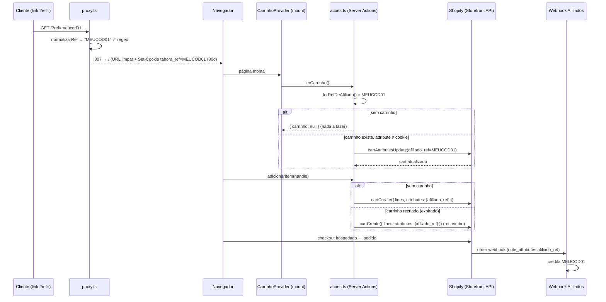

# Design Document

## Overview

O rastreamento de afiliados liga dois mundos que já existem e não mudam: o
**link do afiliado** (`?ref=CODIGO`) e o **webhook do sistema de afiliados**
(lê `note_attributes.afiliado_ref` do pedido Shopify). O que esta feature
constrói é a ponte na loja headless, em duas metades:

1. **Captura** — `proxy.ts` (o middleware do Next 16) intercepta qualquer
   rota com `?ref=` válido, grava o cookie `tahora_ref` (30 dias, httpOnly,
   last-touch) e redireciona para a URL limpa. Zero mudança nas páginas.
2. **Injeção** — as Server Actions do carrinho (que já leem cookie de
   sessão) passam a ler também o `tahora_ref` e a garantir o cart attribute
   `afiliado_ref` via Storefront API: no `cartCreate` (campo `attributes` do
   `CartInput`) quando o carrinho nasce, e via `cartAttributesUpdate`
   (read-repair) quando um carrinho preexistente está dessincronizado.

**Nenhum componente de cliente muda.** O `CarrinhoProvider`, o drawer e os
botões ficam intactos — a feature vive inteira no proxy e na camada de
servidor. As três operações GraphQL novas/alteradas foram **validadas contra o
schema 2026-01 via Shopify Dev MCP** (`validate_graphql_codeblocks`,
api: storefront-graphql): `cartCreate(input: { lines, attributes })`,
`cartAttributesUpdate(cartId, attributes)` e `cart { attributes { key value } }`.

### Premissa do polling confirmada como desnecessária

O snippet original (`tahora-attribution.js`) re-aplicava o attribute 10x
porque **temas Shopify** (cart.js, apps de tema) reescreviam os attributes por
fora. Na headless, o carrinho só é tocado pelas 6 operações da própria loja —
não existe terceiro escrevendo no carrinho. Além disso o design adota
**read-repair contínuo**: `lerCarrinho()` roda em toda carga de página e
reconcilia o attribute com o cookie. Se algo externo limpasse o attribute
(cenário sem mecanismo conhecido), a próxima carga de página o restauraria.
Polling descartado.

## Steering Document Alignment

### Technical Standards (tech.md)

- **ISR/SSG intocados**: a captura acontece no `proxy.ts`, ANTES do
  roteamento — nenhuma `page.tsx`/`layout.tsx` passa a ler
  `cookies()`/`headers()` no render. Os regimes de build não mudam (a saída
  do build ganha apenas a linha `ƒ Proxy`; as rotas mantêm `○`/ISR — ver
  Testing Strategy).
- **`server-only` e token**: os módulos novos que tocam a Shopify vivem em
  `lib/shopify/` (já `server-only`); o `lib/afiliados/cookie.ts` segue o
  padrão do `lib/carrinho/cookie.ts` (`server-only`, `next/headers`). O
  `lib/afiliados/ref.ts` é puro (regex + normalização), sem segredo — pode
  ser importado pelo proxy.
- **Carrinho jamais cacheado**: as operações novas usam `storefrontFetch`
  com `{ semCache: true }`, como as 6 existentes.
- **Actions nunca lançam**: toda falha de rastreamento é engolida e devolve o
  resultado que existiria sem a feature (Req 4). Mensagens nunca interpolam
  token/endpoint (padrão de `acoes.ts` mantido).
- **Build sem `.env.local` continua passando**: o proxy não depende de env; a
  injeção degrada junto com o carrinho (que já degrada amigável).

### Project Structure (structure.md)

- **Domínio em pt-BR**: novo diretório `lib/afiliados/` (`ref.ts`,
  `cookie.ts`), funções `normalizarRef`, `lerRefDeAfiliado`,
  `atualizarAtributos`, `recarimbar`.
- **Camadas respeitadas**: GraphQL só em `lib/shopify/queriesCarrinho.ts`;
  HTTP só via `storefrontFetch`; cookie + orquestração só em
  `lib/carrinho/acoes.ts` (a fronteira do cliente); nada novo cruza para
  `components/`.
- **Comentários explicam o porquê** nas armadilhas (307 vs 308, fragmento
  compartilhado, read-repair fora do caminho de erro) — padrão do projeto.

## Code Reuse Analysis

### Existing Components to Leverage

- **`lib/carrinho/cookie.ts`** (padrão): `lib/afiliados/cookie.ts` é um
  espelho dele — `cookies()` de `next/headers`, `httpOnly`, `secure` em
  produção, `sameSite: "lax"`. Muda só nome (`tahora_ref`), validade (30
  dias) e a revalidação do valor na leitura.
- **`storefrontFetch` + `executarMutation` (`lib/shopify/carrinho.ts`)**: a
  mutation nova (`cartAttributesUpdate`) entra pelo mesmo
  `executarMutation`; `criarCarrinhoCom` ganha um parâmetro opcional.
- **`comTratamentoDeErro` / `falha` (`lib/carrinho/acoes.ts`)**: a
  orquestração nova roda dentro do envelope de erro existente.
- **`CAMPOS_DO_CARRINHO` (fragmento)**: ganha `attributes { key value }` —
  todas as 6 operações passam a devolver os attributes de graça (é o que
  torna o read-repair grátis em rede quando já sincronizado).
- **`CarrinhoProvider` (cliente)**: **reusado sem nenhuma alteração** — o
  `lerCarrinho()` que ele já dispara no mount de toda página é o gatilho do
  read-repair.

### Integration Points

- **Storefront API 2026-01**: `cartCreate` (campo `attributes:
  [AttributeInput!]` do `CartInput`) e `cartAttributesUpdate` — formas
  validadas no Dev MCP.
- **Pedido Shopify → webhook de afiliados**: cart attributes viram
  `note_attributes` automaticamente no checkout hospedado; o webhook (projeto
  separado, pronto) lê `afiliado_ref`. Nada a integrar do nosso lado além do
  attribute correto.
- **Vercel**: `proxy.ts` roda como função na frente do cache de ISR —
  `NextResponse.next()` deixa o request seguir para o cache normalmente.

## Architecture



### Decisão-chave 1 — Captura: `proxy.ts`, não cliente pós-montagem

| Critério | `proxy.ts` (ESCOLHIDO) | Cliente pós-montagem |
|---|---|---|
| Impacto no ISR/SSG | **Zero.** O proxy roda ANTES do roteamento e fora do render; nenhuma rota lê `cookies()`/`headers()` no render, então nenhum regime muda. O build ganha a linha `ƒ Proxy`, e as rotas seguem `○`/ISR (verificável, Req 2.2) | Zero também (efeito pós-mount) — empate neste critério |
| Cookie | **`httpOnly`** — JS do cliente não lê nem forja; consistente com o `carrinho_id` | `document.cookie`, legível/forjável por qualquer script |
| Dependência de JS | **Nenhuma** — funciona com JS desabilitado/quebrado | Se o JS falhar, a atribuição se perde |
| Corrida com Server Actions | **Impossível** — o cookie está gravado antes de a página existir | Possível: efeito ainda não rodou quando o cliente clica |
| URL limpa (Req 1.5) | Redirect **307** para a URL sem `ref` (demais params preservados) | `history.replaceState` |
| Custo | 1 redirect extra **só** nas visitas com `?ref=`; passthrough (`NextResponse.next()`) nas demais | 1 componente novo montado em toda página |

Detalhes que são REGRA no proxy:

- **307, nunca 308**: um 308 (permanente) é cacheável pelo navegador — a
  visita seguinte a um link `?ref=` já visitado pularia o servidor e o
  `Set-Cookie` **não aconteceria** (last-touch quebrado em silêncio). O
  default do `NextResponse.redirect` já é 307; fica documentado como
  invariante.
- **`ref` inválido → `NextResponse.next()`** sem redirect e sem cookie (Req
  1.2): não "consertamos" a URL de quem não trouxe um ref válido.
- **`matcher` exclui** `api`, `_next/static`, `_next/image` e arquivos com
  extensão (uploads, favicon) — o proxy só considera rotas de página; e o
  primeiro statement é o guard `if (!searchParams.has("ref")) return next()`.
- **Try/catch total**: qualquer exceção no proxy devolve
  `NextResponse.next()` — o site nunca cai por causa da captura (Req 4).
- Next 16.2.9: a convenção é **`proxy.ts`** (rename oficial de
  `middleware.ts` — codemod `middleware-to-proxy`); export `function proxy()`.

### Decisão-chave 2 — Sincronização do carrinho preexistente (Req 3.2/3.8): read-repair no `lerCarrinho()`

O ponto de sincronização é o **`lerCarrinho()`**, e o motivo é estrutural: o
`CarrinhoProvider` (montado no root layout) dispara `lerCarrinho()` **no mount
de toda página** — inclusive a Home. Ou seja, **qualquer** visita com carrinho
preexistente passa por ali ANTES de o cliente conseguir clicar em qualquer
coisa (inclusive "Finalizar compra": o drawer só abre depois do mount). É
exatamente o cenário do Req 3.8 — novo `?ref=` → checkout direto sem adicionar
item: o proxy grava o cookie no request da página, o mount lê o carrinho, vê o
attribute divergente e recarimba. Não existe caminho até o checkout que não
passe por uma carga de página.

Mecânica (read-repair):

1. O fragmento `CAMPOS_DO_CARRINHO` passa a trazer `attributes { key value }`
   → **toda** resposta de carrinho informa o `afiliado_ref` atual **sem
   round-trip extra**.
2. `lerCarrinho()`: com cookie válido e attribute ≠ cookie →
   `cartAttributesUpdate` (1 mutation, só quando diverge) e devolve o
   carrinho atualizado. Attribute já igual → **zero** chamadas extra (Req
   3.7). Sem cookie → comportamento atual intacto (Req 3.6).
3. `adicionarItem()` em carrinho preexistente: reusa a resposta do
   `cartLinesAdd` (que já traz os attributes) para a mesma verificação —
   cinto e suspensório para o caso de o repair do mount ter falhado por rede
   (Req 3.2 literal, custo zero quando sincronizado).
4. Criação (`criarEGravar`): `cartCreate` já nasce com `attributes` — cobre
   carrinho novo (Req 3.1) e a recriação silenciosa de carrinho
   expirado/finalizado (Req 3.3), que passa pelo mesmo funil.

Casos de borda decididos:

- **Cookie ausente + carrinho COM attribute**: não removemos o attribute. O
  carimbo aconteceu dentro de uma janela válida de 30 dias (last-touch na
  época do carimbo); expirar o cookie depois não "descredita" o carrinho já
  marcado. Também mantém o princípio "sem ref → nenhuma mutation extra".
- **Falha do repair**: devolve o carrinho da leitura original, sem `erro` —
  leitura de fundo não vira erro na tela (comentário existente do
  `sincronizar()` no provider continua verdadeiro).
- **`afiliado_ref_ts`**: não enviado (Req 3.9).

## Components and Interfaces

### Component 1 — `proxy.ts` (raiz do projeto) — NOVO

- **Purpose:** capturar `?ref=` válido em qualquer rota de página, gravar
  `tahora_ref` e limpar a URL (Req 1.*).
- **Interfaces:** `export function proxy(request: NextRequest)`; `export
  const config = { matcher: [...] }`.
- **Dependencies:** `next/server`, `lib/afiliados/ref.ts` (validação +
  constantes do cookie).
- **Reuses:** semântica de cookie do projeto (`httpOnly`, `secure` em prod,
  `lax`).
- **Lógica:** sem `ref` → `next()`. `normalizarRef(primeira ocorrência)`
  válido → clona `nextUrl`, `searchParams.delete("ref")` (todas as
  ocorrências), `NextResponse.redirect(urlLimpa)` (307) +
  `response.cookies.set(TAHORA_REF, valor, opções)`. Inválido → `next()`.
  Tudo num try/catch que degrada para `next()`.

### Component 2 — `lib/afiliados/ref.ts` — NOVO (puro, sem `server-only`)

- **Purpose:** fonte única da regra do código de afiliado e das constantes do
  cookie — compartilhada por proxy e Server Actions.
- **Interfaces:**
  - `normalizarRef(bruto: string | null | undefined): string | null` —
    trim, `toUpperCase()`, testa `^[A-Z0-9]{8}$`; inválido → `null`.
  - `COOKIE_REF = "tahora_ref"`, `VALIDADE_REF_EM_SEGUNDOS = 60*60*24*30`.
- **Dependencies:** nenhuma. **Reuses:** —.

### Component 3 — `lib/afiliados/cookie.ts` — NOVO (`server-only`)

- **Purpose:** leitura do `tahora_ref` nas Server Actions, já revalidada.
- **Interfaces:** `lerRefDeAfiliado(): Promise<string | null>` — lê
  `cookies()`, passa por `normalizarRef` (cookie é entrada não confiável,
  Req 3.4); inválido → `null`.
- **Dependencies:** `next/headers`, `ref.ts`.
- **Reuses:** espelho de `lib/carrinho/cookie.ts` (mesmo padrão, mesmos
  comentários de porquê). Não precisa de `gravar`/`descartar` — quem grava é
  o proxy.

### Component 4 — `lib/shopify/queriesCarrinho.ts` — ALTERADO

- `CAMPOS_DO_CARRINHO` ganha `attributes { key value }` (campo de objeto —
  exige revalidar as 6 operações no Dev MCP, como manda o comentário do
  próprio fragmento).
- `CRIAR_CARRINHO_MUTATION` ganha `$attributes: [AttributeInput!]` e
  `cartCreate(input: { lines: $lines, attributes: $attributes })`.
  (Variável opcional/nullable: omitir = comportamento atual.)
- Nova `ATUALIZAR_ATRIBUTOS_MUTATION`:
  `cartAttributesUpdate(cartId: $cartId, attributes: $attributes)` com
  `RETORNO_DA_MUTATION` padrão. Formas já validadas (2026-01, Dev MCP).

### Component 5 — `lib/shopify/carrinho.ts` — ALTERADO

- **`criarCarrinhoCom(merchandiseId, quantidade?, atributos?)`**: novo
  parâmetro opcional `atributos?: { key: string; value: string }[]`;
  ausente → variável omitida (mutation idêntica à atual).
- **`atualizarAtributos(cartId, atributos): Promise<ResultadoCarrinho>`** —
  nova, via `executarMutation(..., "cartAttributesUpdate", ...)`.
- **Extração interna do attribute**: `lerCarrinhoPorId` e `adicionarLinhas`
  passam a devolver também `afiliadoRef: string | null` (lido do payload cru,
  `attributes.find(a => a.key === "afiliado_ref")`), no padrão do `id` do
  `criarCarrinhoCom` — **interno da camada `server-only`, não cruza para o
  cliente** (o tipo `Carrinho` de `types.ts` NÃO ganha attributes; a UI não
  precisa deles).
- ⚠️ **Call sites da mudança de shape do `lerCarrinhoPorId`**: além do
  `lerCarrinho()` em `acoes.ts`, o helper **`cuponsAtuais`
  (`lib/carrinho/acoes.ts:236-239`)** também chama `lerCarrinhoPorId` e lê
  `r.carrinho` direto — precisa ser atualizado para a nova forma
  `{ resultado, afiliadoRef }` (mecânico, mas esquecê-lo quebra o fluxo de
  cupom — risco de regressão do Req 4.3).

### Component 6 — `lib/carrinho/acoes.ts` — ALTERADO

- **`lerCarrinho()`**: após a leitura, chama o helper interno
  `recarimbar(cartId, resultado, afiliadoRefDoCarrinho)` — que lê o cookie e,
  SÓ se válido e divergente, dispara `atualizarAtributos`. Falha do repair →
  devolve o resultado original (try/catch próprio, fora do caminho de erro).
- **`adicionarItem()`**: no ramo de carrinho preexistente, mesma chamada a
  `recarimbar` com a resposta do `adicionarLinhas`.
- **`criarEGravar(merchandiseId)`**: lê `lerRefDeAfiliado()`; com ref →
  `criarCarrinhoCom(..., [{ key: "afiliado_ref", value: ref }])`. Se a
  criação COM attributes falhar (sem `cart`, com erro), **retenta uma vez sem
  attributes** (Req 4.2 — nunca perder a venda por causa do carimbo).
- Nenhuma assinatura pública muda → **`CarrinhoProvider` intocado**.

## Data Models

### Cookie `tahora_ref` (gravado pelo proxy, lido pelas actions)

```
Nome:     tahora_ref
Valor:    ^[A-Z0-9]{8}$ (normalizado para MAIÚSCULAS antes de gravar)
Max-Age:  2592000 (30 dias)  |  Path: /  |  SameSite: Lax
httpOnly: true  |  Secure: true em produção
Política: last-touch — novo ref válido SOBRESCREVE; inválido/ausente preserva
```

### Cart attribute (Storefront API → note_attributes do pedido)

```
AttributeInput { key: "afiliado_ref", value: "<REF>" }   // literal, sem "__"
afiliado_ref_ts: NÃO enviado (Req 3.9)
```

### Retornos internos da camada `server-only` (não cruzam a fronteira)

```
lerCarrinhoPorId → { resultado: ResultadoCarrinho, afiliadoRef: string | null }
adicionarLinhas  → { resultado: ResultadoCarrinho, afiliadoRef: string | null }
criarCarrinhoCom → { id: string | null, resultado: ResultadoCarrinho }  // como hoje
```

`Carrinho` (types.ts, client-visible) **não muda** — attributes ficam do lado
do servidor.

## Error Handling

### Error Scenarios

1. **`cartAttributesUpdate` falha (rede/Shopify/userError) no read-repair**
   - **Handling:** try/catch próprio no `recarimbar`; devolve o resultado da
     operação principal intacto; sem log com endpoint (padrão do arquivo).
   - **User Impact:** nenhum — carrinho normal; próxima carga de página
     tenta de novo. Pior caso acumulado: venda sem crédito (Req 4.1).
2. **`cartCreate` com attributes falha**
   - **Handling:** retry único sem attributes dentro do `criarEGravar`.
   - **User Impact:** compra segue; carrinho nasce sem carimbo e o
     read-repair das cargas seguintes recarimba (Req 4.2).
3. **Cookie `tahora_ref` adulterado (valor fora do padrão)**
   - **Handling:** `lerRefDeAfiliado` devolve `null` (revalidação
     server-side, Req 3.4) → tratado como "sem ref".
   - **User Impact:** nenhum; nenhuma mutation extra.
4. **Exceção dentro do `proxy.ts`**
   - **Handling:** try/catch devolve `NextResponse.next()`.
   - **User Impact:** página carrega normalmente; só a atribuição se perde.
5. **`?ref=` inválido na URL**
   - **Handling:** `next()` sem cookie e sem redirect (Req 1.2); cookie
     anterior preservado (Req 1.4).
   - **User Impact:** navegação idêntica à atual (o param fica na URL — não
     limpamos URL de ref inválido, comportamento declarado).

## Testing Strategy

DoD do projeto: **build + verificação manual** (sem suíte formal — não
adicionar infra de teste).

### Unit Testing (verificação dirigida, sem framework)

- `normalizarRef`: casos válido/minúsculo→maiúsculo/7 chars/9 chars/vazio/
  caracteres especiais/`null` — conferidos em dev (ou via `npx tsx` ad hoc).
- Validação de TODAS as operações GraphQL alteradas (as 6 do fragmento + a
  nova) no Dev MCP 2026-01 (Req 5.2) — obrigatória porque o fragmento
  compartilhado mudou.

### Integration Testing (dev, `npm run dev`)

- `/?ref=teste1234` → **não** captura (9 chars); `/?ref=abcd1234` → redirect
  para `/`, cookie `tahora_ref=ABCD1234` (nome minúsculo, valor maiúsculo —
  DevTools), demais params preservados (`/catalogo?pagina=2&ref=abcd1234` → `/catalogo?pagina=2`).
- Last-touch: novo ref válido sobrescreve; inválido preserva.
- Adicionar item sem carrinho → resposta do `cartCreate` com
  `attributes: [{ afiliado_ref }]` (conferir no Network/log de dev).
- Carrinho preexistente + novo ref + **recarregar a página sem adicionar
  nada** → `cartAttributesUpdate` dispara (Req 3.8); recarregar de novo →
  nenhuma mutation de attributes (Req 3.7).
- Sem cookie: nenhuma chamada nova (Req 3.6).
- `npm run build`: TypeScript limpo, `/sobre-nos` `○` sem Revalidate, `/`,
  `/catalogo`, `/produtos/[handle]` com Revalidate `5m` (Req 2.2), e build
  **sem `.env.local`** passando.

### End-to-End Testing (produção/preview — Req 5.1)

- Visitar `https://ta-hora-loja.vercel.app/?ref=<CODIGO_REAL>`, comprar
  (pedido de teste), e conferir no admin da Shopify que o pedido exibe
  `afiliado_ref = <CODIGO_REAL>` nos `note_attributes` — a prova final de que
  o webhook vai creditar.
- Regressão do fluxo de compra completo: adicionar/alterar/remover/cupom/
  checkout sem `?ref=` — comportamento idêntico ao atual (Req 4.3).
