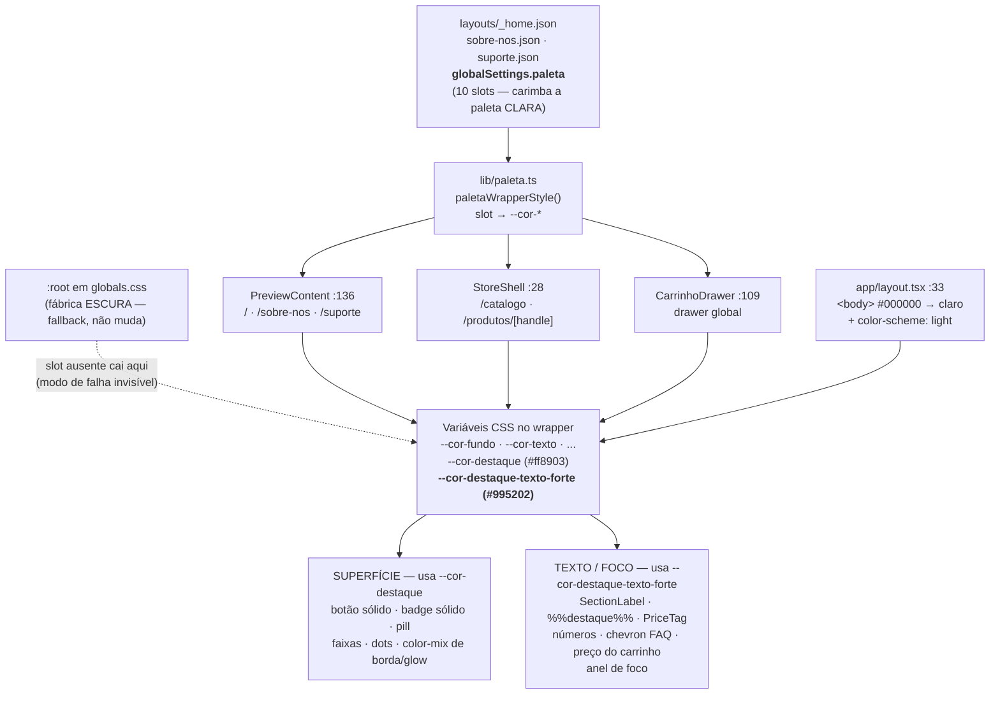

# Design Document

## Overview

Este design implementa a migração do tema escuro para o tema claro **pelo sistema
de paleta que já existe**, sem introduzir mecanismo novo. A mudança tem quatro
movimentos, em ordem de dependência:

1. **Estender o contrato de paleta** com um décimo slot opcional
   (`destaqueTextoForte` → `--cor-destaque-texto-forte`), porque o accent
   `#ff8903` é ilegível como texto sobre fundo claro (2.28:1).
2. **Carimbar a paleta clara** nos três JSONs de layout — as rotas da loja e o
   drawer do carrinho herdam de graça, porque todos leem `_home.json`.
3. **Reapontar os pontos de uso de accent-como-texto e accent-como-foco**
   para o slot novo, com fallback CSS. Os pontos de accent-como-superfície ficam
   intactos.
4. **Aplicar os consertos nomeados** (body, `color-scheme`, `CanaisSuporte`,
   `sectionBg` das faixas, beam do Hero) e auditar tela a tela.

O inventário exaustivo do movimento 3 está na seção **"Inventário de accent"** —
**101 linhas** classificadas com arquivo e linha, substituindo a estimativa
"~25" dos requisitos (Req 2.11). A contagem subiu porque a estimativa original
não contava `globals.css`, os `color-mix` de superfície, nem os pontos de
identificação de controle. **46 pontos migram.**

> **Princípio que governa todo o design:** a paleta é a única fonte de verdade de
> cor. Se um valor precisa ser ajustado na revisão visual (`#995202`, o creme das
> faixas, o alpha do beam), o ajuste acontece em **um** lugar.

## Steering Document Alignment

### Technical Standards (tech.md)

- **Regime de build intocado.** Nenhuma rota muda de `○ Static` / ISR 300s.
  O conserto do `<body>` em `app/layout.tsx` é um literal de estilo — não
  introduz `cookies()`, `headers()` nem Server Action, que são o modo de falha
  silencioso descrito em `tech.md`.
- **`rm -rf .next` antes do build de verificação.** O prerender ISR morno
  reaproveita HTML antigo; sem limpar, a auditoria de cor mede a página anterior.
- **Sem dependência nova.** Nada de biblioteca de tema, `next-themes` ou
  `data-theme`. O projeto já tem o mecanismo (wrapper de `--cor-*`) e ele é
  suficiente para um tema único.

### Project Structure (structure.md)

- **Idioma pt-BR nos nomes de domínio.** O slot novo se chama
  `destaqueTextoForte` / `--cor-destaque-texto-forte`, seguindo `destaqueTexto`.
- **Conteúdo vive em JSON, cor de tema vive em `globalSettings.paleta`.** As
  únicas chaves de JSON tocadas são `globalSettings.paleta` (3 arquivos) e
  `content.sectionBg` (2 seções de `_home.json`).
- **A paleta sobrescreve as `--cor-*` no WRAPPER, nunca no `:root`.** O `:root`
  de `globals.css` continua **escuro** (fábrica do builder). A única adição ali
  é o slot novo com o valor de fábrica e a declaração de `color-scheme`.

> **Correção de fato para os steering docs:** `structure.md` e `tech.md` afirmam
> "só existem **dois** wrappers de paleta". São **três** —
> `PreviewContent.tsx:136`, `StoreShell.tsx:28`, `CarrinhoDrawer.tsx:109`. Este
> design trata os três. Atualizar os steering docs fica como follow-up fora
> desta spec.

## Code Reuse Analysis

Esta spec é quase inteiramente reúso. Não há componente novo, hook novo, nem
arquivo novo de código.

### Existing Components to Leverage

- **`lib/paleta.ts` → `Paleta` / `PALETA_VARS` / `paletaToVars` /
  `paletaWrapperStyle`**: o mecanismo inteiro de injeção. Ganha **um** slot
  opcional. `paletaToVars` já itera `Object.keys(PALETA_VARS)` e já pula chaves
  ausentes (`if (valor)`), então o slot novo funciona sem tocar na função.
- **`components/preview/PreviewContent.tsx:136`**: wrapper das rotas de conteúdo
  (`/`, `/sobre-nos`, `/suporte`). Consome `paletaWrapperStyle` — herda o slot
  novo sem alteração.
- **`components/loja/StoreShell.tsx:28`**: wrapper das rotas de loja. Idem.
- **`components/loja/CarrinhoDrawer.tsx:109`**: wrapper do drawer, alimentado por
  prop resolvida em `app/layout.tsx:24`. Idem.
- **`components/ui/Heading.tsx` → prop `highlightColor`** e
  **`components/ui/Text.tsx` → prop `highlightColor`**: hooks já existentes para
  colorir os spans `%%destaque%%` sem tocar no `accentColor` estrutural. É onde
  o slot novo entra nesses dois componentes — **uma linha cada**.
- **`components/ui/SectionLabel.tsx` → prop `color`** e
  **`components/ui/StatNumber.tsx` → prop `color`**: mesmo padrão
  (`color ?? accentColor`), mesmo tipo de mudança de uma linha.
- **`--cor-destaque-texto` (`#000000` na paleta nova)**: já é o token "texto
  sobre superfície accent". Resolve o `CanaisSuporte` sem inventar token.

### Integration Points

- **`layouts/*.json` → `globalSettings.paleta`**: fonte da verdade da cor do
  site. Três arquivos, valores idênticos.
- **`app/globals.css` `:root`**: paleta de fábrica (permanece escura) + o slot
  novo + `color-scheme`.
- **`app/layout.tsx:33`**: fundo do `<body>`, fora de qualquer wrapper.
- **Shopify**: nenhum ponto de contato. Esta spec não toca `lib/shopify/`.

## Architecture

O fluxo de cor é uma cascata de três camadas. A mudança acontece nas camadas 1 e
2; a camada 3 só ganha um alvo novo a mais.



### A decisão central, em uma frase

`accentColor` continua sendo **uma** prop com **um** valor (`#ff8903`). O que se
bifurca não é a prop — é o **ponto de uso**: onde o accent vira pixel de letra ou
anel de foco, o código passa a ler `var(--cor-destaque-texto-forte, ${accentColor})`;
onde vira pixel de fundo, fica como está.

O fallback dentro do `var()` é o que preserva a compatibilidade retroativa
(Req 2.5, 2.9): sem o slot definido, o valor volta a ser exatamente o
`accentColor` de hoje.

## Components and Interfaces

### 1. `lib/paleta.ts` — contrato de paleta

- **Purpose:** expor o décimo slot.
- **Interfaces:**
  - `interface Paleta` ganha `destaqueTextoForte?: string` (opcional — Req 2.7).
  - `PALETA_VARS` ganha `destaqueTextoForte: "--cor-destaque-texto-forte"`.
- **Dependencies:** nenhuma nova.
- **Reuses:** `paletaToVars` e `paletaWrapperStyle` **não mudam** — o laço já
  percorre `PALETA_VARS` e já pula slots ausentes (`if (valor)`), satisfazendo
  Req 2.8 sem uma linha de código.

### 2. `app/globals.css` — fábrica e base do documento

- **Purpose:** declarar o slot novo na fábrica e o esquema de cor do documento.
- **Interfaces:**
  - `:root` ganha `--cor-destaque-texto-forte: #D4A017` (o accent dourado da
    fábrica escura é legível sobre `#0D0A08` — a fábrica não precisa de tom
    fechado; o slot existe para o **fallback não ficar vazio**).
  - `:root` (ou `html`) ganha `color-scheme: light` (Req 3.2).
  - Os pontos de accent-como-texto e os dois anéis de foco (`:529`, `:627`)
    passam a `var(--cor-destaque-texto-forte, var(--cor-destaque))`.
- **Dependencies:** o slot da camada 1.
- **Reuses:** o `:root` permanece **escuro** (Req 6.8).

> **Nota sobre `color-scheme: light`:** vai no `:root`, não no wrapper. O
> esquema de cor é propriedade do **documento** (barra de rolagem, autofill,
> controles nativos), e esses elementos vivem fora dos wrappers de paleta.
>
> **A inconsistência declarada:** isto deixa o `:root` com `--cor-*` ESCURAS e
> `color-scheme: light` ao mesmo tempo. Não é descuido, e é seguro **porque o
> `:root` nunca pinta uma página deste site** — as cinco rotas estão dentro de um
> dos três wrappers, que sempre carimbam a paleta clara. O `:root` existe como
> fallback do builder e como detector do modo de falha "slot ausente" (Req 1.6).
> O `color-scheme`, ao contrário, descreve o que o **usuário final** vê, e o que
> ele vê é sempre claro. Se algum dia o site voltar a ser escuro, os dois voltam
> juntos: o `color-scheme` acompanha a paleta carimbada, não o `:root`.

### 3. `layouts/*.json` — a paleta carimbada

- **Purpose:** ser a fonte da verdade do tema do site.
- **Interfaces:** `globalSettings.paleta` com os 10 slots, idêntico nos três
  arquivos.
- **Dependencies:** o contrato da camada 1.
- **Reuses:** a estrutura já existe; só os **valores** mudam.

### 4. Pontos de uso de accent (63 sites) — ver "Inventário de accent"

- **Purpose:** aplicar a bifurcação texto/foco vs superfície.
- **Interfaces:** nenhuma prop nova em nenhum componente. A mudança é sempre
  local: `accentColor` → `var(--cor-destaque-texto-forte, ${accentColor})` nos
  sites classificados como TEXTO/FOCO.
- **Reuses:** onde o componente já tem prop de cor de texto separada
  (`Heading.highlightColor`, `Text.highlightColor`, `SectionLabel.color`,
  `StatNumber.color`), a mudança é no **default resolvido**, não no site de uso.

### 5. `components/sections/CanaisSuporte/CanaisSuporte.tsx` — conserto nomeado

- **Purpose:** corrigir o texto sobre o accent sólido no bloco WhatsApp.
- **Interfaces:** `corSobreAccent` deixa de ter o ramo `var(--cor-fundo)`:

  ```
  ANTES: accentColor.startsWith("#") ? contrastColor(accentColor) : "var(--cor-fundo)"
  DEPOIS: accentColor.startsWith("#") ? contrastColor(accentColor) : "var(--cor-destaque-texto)"
  ```

  Com a paleta nova, `--cor-destaque-texto` é `#000000` → **8.83:1** sobre
  `#ff8903` (Req 3.3). O ramo do hex fica intacto: `contrastColor` já resolve
  sozinho quando o JSON fixa um accent.
- **Dependencies:** Req 1.1 (`destaqueTexto: #000000`).
- **Reuses:** o par accent/accent-texto que já existe. Nenhum token novo.
- **Nota obrigatória (Req 3.4):** o comentário de 6 linhas acima dessa expressão
  documenta a premissa antiga ("ASSUME uma paleta de fundo escuro… numa paleta
  de fundo claro este bloco precisa ser reavaliado"). Ele **precisa** ser
  reescrito — deixá-lo é deixar o arquivo mentindo sobre o próprio código.

### 6. `components/efeitos/AnimatedBackground.tsx` — beam do Hero

- **Purpose:** tornar o beam perceptível sobre `#FAFAF8`.
- **Interfaces:** duas escalas **independentes**, que não podem ser ajustadas
  como se fossem uma:

  **(a) Ramo animado — `:372-374`, multiplicadores.** São multiplicados por
  `BEAM_ALPHAS = [1.0, 0.6, 0.4]` (`:338`), então o alpha efetivo do beam mais
  fraco é 0.4× o do mais forte:
  - `:372` `alpha * 0.06` → `alpha * 0.16`
  - `:373` `alpha * 0.11` → `alpha * 0.28`
  - `:374` `alpha * 0.06` → `alpha * 0.16`

  **(b) Ramo `prefers-reduced-motion` — `:391`, literal puro.** Este desenha
  **um** beam estático e o `0.09` **não** é multiplicado por nada. Elevá-lo para
  `0.20` o deixa a ~71% do pico do ramo animado (0.28), não igual — o beam
  estático fica visível sem virar mancha, já que não há movimento para diluí-lo.
  Este ramo precisa ser **avaliado à parte** na revisão visual (simular
  `prefers-reduced-motion: reduce` no DevTools); ajustar só o ramo (a) deixaria
  os usuários de movimento reduzido sem beam nenhum.
- **Dependencies:** nenhuma. São valores numéricos.
- **Reuses:** `resolveCor` (`:37-41`) já resolve `var(--cor-destaque)` para
  `[r,g,b]` — o beam já pega o laranja do tema sozinho, sem hardcode.
- **Trava (Req 4.3):** se o headline do Hero medir < 4.5:1 no ponto mais intenso
  do beam, os valores caem. O critério de legibilidade **vence** o de
  visibilidade.

## Data Models

### `Paleta` — a interface estendida (`lib/paleta.ts`)

```ts
export interface Paleta {
  fundo?:              string
  superficie?:         string
  card?:               string
  borda?:              string
  texto?:              string
  textoSecundario?:    string
  textoFraco?:         string
  destaque?:           string   // accent de SUPERFÍCIE (fundo/preenchimento/borda)
  destaqueTexto?:      string   // texto SOBRE superfície accent
  destaqueTextoForte?: string   // NOVO — accent legível como TEXTO/FOCO sobre o fundo
}
```

Todos os slots são opcionais; ausência cai no `:root`. O slot novo segue a
mesma regra (Req 2.7–2.9).

### A paleta clara carimbada (idêntica nos 3 JSONs)

```json
{
  "fundo":              "#FAFAF8",
  "superficie":         "#F0EFEB",
  "card":               "#FFFFFF",
  "borda":              "#E2E0DA",
  "texto":              "#1A1A1A",
  "textoSecundario":    "#5A5A57",
  "textoFraco":         "#8E8B85",
  "destaque":           "#ff8903",
  "destaqueTexto":      "#000000",
  "destaqueTextoForte": "#995202"
}
```

O campo `estilo: "elegante"` permanece — ele é só o fallback caso `paleta` suma,
e `lib/estilos.ts` fica intacto (Req 6.9).

> **`card` é COR BASE, não gradiente.** `cardGradient()` deriva
> `linear-gradient(160deg, #FFFFFF → color-mix(#FFFFFF 92%, black))` na
> renderização. Com `#FFFFFF` isso vira branco → `#EBEBEB`, um degradê sutil
> correto para o claro. **Não** carimbar gradiente pronto no JSON.

### As faixas Features e CTAFinal — creme alaranjado (decisão fixada)

O `sectionBg` de `layouts/_home.json:90` (Features) e `:212` (CTAFinal) é hoje
`linear-gradient(to top, #e59701, #834506)` — marrom escuro. No tema claro vira
um **creme alaranjado suave**: um fundo levemente quente que mantém a identidade
laranja da marca sem competir com o conteúdo.

```
sectionBg: "linear-gradient(to top, #FFF8EF, #FBE8D2)"
```

| Papel | Valor | Nota |
|---|---|---|
| Fundo da faixa (topo) | `#FFF8EF` | quase-branco quente |
| Fundo da faixa (base) | `#FBE8D2` | creme alaranjado |
| Cor de referência plana | `#FDF1E3` | o "meio" do gradiente |
| Borda / divisória da faixa | `#F5D9BC` | decorativa (Req 6.2) |
| Texto de corpo e título | `#1A1A1A` | — |
| Rótulos / accent-texto | `#995202` | — |
| Botão dentro da faixa | fundo `#ff8903`, texto `#000000` | superfície: fica vibrante |

**Contraste verificado nos dois extremos do gradiente** (Req 3.5 exige medir no
ponto mais claro *e* no mais escuro):

| Par | Topo `#FFF8EF` | Base `#FBE8D2` | Veredito |
|---|---|---|---|
| `#1A1A1A` (texto) | 16.51:1 | 14.57:1 | passa AAA |
| `#995202` (accent-texto) | 5.59:1 | 4.93:1 | passa AA |
| `#5A5A57` (secundário) | ~6.5:1 | ~5.8:1 | passa AA |
| `#000000` sobre botão `#ff8903` | 8.83:1 | 8.83:1 | passa AAA |

A faixa contra o fundo da página (`#FDF1E3` sobre `#FAFAF8` = **1.07:1**) é uma
divisória de superfície, coberta pela exceção pré-registrada da Req 6.2 — a
faixa se distingue por **temperatura**, não por luminância. Se na revisão visual
ela sumir, a correção é acentuar o creme (ex.: base para `#F8DFC2`) ou aplicar a
borda `#F5D9BC`, **não** mudar estrutura.

**Todos os valores desta tabela são ajustáveis na revisão visual** — desde que
`#1A1A1A` e `#995202` continuem passando nos dois extremos.

## Inventário de accent (Req 2.11)

**101 linhas** de tabela que leem o accent, classificadas (§1–§5 numeradas 1–94,
mais 7 linhas em §6). Algumas linhas cobrem duas declarações irmãs
(ex.: `CtaButton.tsx:47,48`) — por isso a unidade de contagem é a **linha de
tabela**, não a declaração CSS. Legenda:

- **T** — o accent vira **pixel de letra/glifo**. Migra para
  `var(--cor-destaque-texto-forte, ${accentColor})`.
- **TC** — o accent é a **única identificação de um controle** ou um
  **indicador de foco**. Migra também (WCAG 1.4.11 exige ≥ 3:1; `#ff8903` dá
  2.28:1). Separado de **T** porque a Req 2.4 classificaria "border" como
  superfície — e aqui a borda *é* o controle.
- **S** — o accent vira **pixel de fundo/preenchimento/borda decorativa**.
  Mantém `#ff8903` vibrante. **Não mexer.**
- **P** — usa o par `--cor-destaque-texto`, que a paleta nova já corrige para
  `#000000`. **Não mexer.**

### 1. Primitivos — `components/ui/` (18)

| # | Arquivo:linha | Uso | Classe |
|---|---|---|---|
| 1 | `Heading.tsx:66` | `resolvedHL` — spans `%%destaque%%` | **T** |
| 2 | `Text.tsx:67` | `resolvedHL` — spans `%%destaque%%` | **T** |
| 3 | `SectionLabel.tsx:34` | `resolvedColor` — o rótulo | **T** |
| 4 | `SectionLabel.tsx:59` | `background` do traço decorativo (`showLine`) — **mesma** variável do item 3 | **T (derivado)** |
| 5 | `StatNumber.tsx:50` | `resolvedColor` — número da estatística | **T** |
| 6 | `StarRating.tsx:18` | `color` das estrelas preenchidas | **T** |
| 7 | `NavArrow.tsx:76` | `color` do glifo da seta | **T** |
| 8 | `NavArrow.tsx:40` | `background` color-mix 14% | S |
| 9 | `NavArrow.tsx:41` | `border` color-mix 24% | S |
| 10 | `NavArrow.tsx:52` | `background` color-mix 9.41% | S |
| 11 | `NavArrow.tsx:53` | `border` color-mix 20.78% | S |
| 12 | `HighlightBadge.tsx:36` | `textColor` do variante **outline** | **T** |
| 13 | `HighlightBadge.tsx:36` | `textColor` do sólido (`--cor-destaque-texto`) | P |
| 14 | `HighlightBadge.tsx:39` | `bg` — accent sólido / color-mix 12.55% | S |
| 15 | `HighlightBadge.tsx:40` | `border` color-mix 31.37% | S |
| 16 | `CtaButton.tsx:37` | `borderBottom 2px` do shape "link" — sublinhado do rótulo | **T** |
| 17 | `CtaButton.tsx:47,48` | `bg` sólido / `border 2px` outline | S |
| 18 | `CtaButton.tsx:73` | `resolvedText` (`--cor-destaque-texto`) | P |

> **Item 4 — decisão declarada.** `SectionLabel` usa **uma** variável
> (`resolvedColor`) para o texto *e* para o tracinho decorativo. Migrar o item 3
> arrasta o item 4 junto: o traço fica no tom fechado. **É intencional** — traço
> e rótulo são a mesma unidade visual e devem combinar. Registrado aqui para
> não parecer efeito colateral não visto.
>
> **`PriceTag.tsx` não lê accent diretamente.** Repassa a `HighlightBadge`
> (`:108`) e aos `Text`/`Heading` internos — herda dos itens 1, 2, 12 e 14.
> **Nenhuma alteração no arquivo.**

### 2. Foco e identificação de controle (7) — WCAG 1.4.11, todos migram

| # | Arquivo:linha | Uso | Classe |
|---|---|---|---|
| 19 | `globals.css:529` | `outline: 2px solid` — foco da seta do carrossel | **TC (foco)** |
| 20 | `globals.css:626` | `outline: 2px solid` — foco do filtro do catálogo | **TC (foco)** |
| 21 | `Input.tsx:63` | `border` do campo **focado** | **TC (foco)** |
| 22 | `Navbar.tsx:216` | `border` color-mix 20.78% — **único** contorno do botão hambúrguer | **TC (controle)** |
| 23 | `AcessoriosSugeridos.tsx:117` | `border 1px solid` — único contorno do botão | **TC (controle)** |
| 24 | `CupomForm.tsx:50` | `border 1px solid` — único contorno do botão de cupom | **TC (controle)** |
| 25 | `globals.css:760` | `.catalogo-bloco__botao` `border 1px solid` — único contorno | **TC (controle)** |

> **Correção de linha:** a Req 2.3 e a primeira versão deste inventário citavam
> `globals.css:627`. `:627` é `outline-offset: 2px`; o `outline` está em
> **`:626`**. Requirements corrigido.
>
> **Item 21, ressalva para a auditoria.** `Input.tsx:63` só usa accent quando
> **focado**. A borda em repouso é `color-mix(var(--cor-texto) 10%, transparent)`
> — no tema claro isso é um contorno quase invisível. Não é ponto de accent, mas
> **é** ponto 1.4.11 (identificação de campo de formulário) e entra na auditoria
> da Req 5.4 como item explícito.

### 3. Seções — `components/sections/` (33)

| # | Arquivo:linha | Uso | Classe |
|---|---|---|---|
| 26 | `CTAFinal.tsx:108` | **dígitos do contador** — `color` | **T** |
| 27 | `CTAFinal.tsx:130` | separador `:` do contador — `color` | **T** |
| 28 | `HowItWorks.tsx:97` | número "plain" — `color` | **T** |
| 29 | `HowItWorks.tsx:90` | número "outline" — `color` do dígito | **T** |
| 30 | `HowItWorks.tsx:90` | número "outline" — `border 2px solid` | S |
| 31 | `HowItWorks.tsx:104` | número "filled" — `background` | S |
| 32 | `HowItWorks.tsx:74,104` | texto do "filled" (`--cor-destaque-texto`) | P |
| 33 | `HowItWorks.tsx:195,348` | `border` color-mix 12.55% | S |
| 34 | `HowItWorks.tsx:331` | **`background`** color-mix 14.51% — a linha vertical do passo | S |
| 35 | `HowItWorks.tsx:227` | `background` color-mix 20.78% | S |
| 36 | `FAQ.tsx:118` | chevron do acordeão — `color` | **T** |
| 37 | `FAQ.tsx:356` | rótulo de categoria — `color` | **T** |
| 38 | `FAQ.tsx:91` | `borderBottom` color-mix 9.41% | S |
| 39 | `FAQ.tsx:266,349` | `border` / `borderBottom` color-mix | S |
| 40 | `Navbar.tsx:48` | span `%%destaque%%` do logo | **T** |
| 41 | `Navbar.tsx:219` | glifo do **hambúrguer** — `color` | **T** |
| 42 | `Navbar.tsx:113` | `border` color-mix 13.33% | S |
| 43 | `Navbar.tsx:120` | `borderBottom` color-mix 9.41% | S |
| 44 | `Navbar.tsx:130` | `borderTop` color-mix 9.41% | S |
| 45 | `Footer.tsx:171` | `color` do link no hover ("hover=cor") | **T** |
| 46 | `CanaisSuporte.tsx:249` | ícone do card de canal — `color` | **T** |
| 47 | `CanaisSuporte.tsx:258` | **rótulo do card de canal** — `color` | **T** |
| 48 | `CanaisSuporte.tsx:199` | rótulo do CTA WhatsApp — `color` sobre `corSobreAccent` | **caso especial** |
| 49 | `CanaisSuporte.tsx:336` | ícone de relógio da faixa de horário — `color` | **T** |
| 50 | `CanaisSuporte.tsx:159` | `background: accentColor` do bloco WhatsApp | S |
| 51 | `CanaisSuporte.tsx:240` | `border` color-mix 12.55% do card | S |
| 52 | `BenefitsCard.tsx:60` | glifo `✓` do benefício — `color` | **T** |
| 53 | `BenefitsCard.tsx:100` | ícone "outline" — `color` | **T** |
| 54 | `BenefitsCard.tsx:100` | ícone "outline" — `borderColor` | S |
| 55 | `BenefitsCard.tsx:110` | ícone "ghost" — `color` | **T** |
| 56 | `BenefitsCard.tsx:121` | ícone "filled" (`--cor-destaque-texto`) | P |
| 57 | `Features.tsx:140` | `renderIcon` → `color={accentColor}` — **a declaração** | **T** |
| 58 | `Features.tsx:142` | `bgColor` / `borderColor` color-mix 10.2% / 25.1% | S |

> **Item 26/27 é o achado mais grave desta revisão.** O contador do `CTAFinal`
> renderiza os dígitos em `accentColor` — e o `CTAFinal` é justamente uma das
> seções que ganha a **faixa creme**. `#ff8903` sobre `#FFF8EF` = **2.26:1**.
> A primeira versão deste design escreveu uma tabela de contraste inteira para
> essa faixa e não listou o texto mais proeminente dentro dela.
>
> **Item 48 — caso especial, não é falha de contraste.** O `<a>` do CTA WhatsApp
> tem `background: corSobreAccent` e `color: accentColor` — é o *negativo* do
> bloco. Com o conserto da §5, `corSobreAccent` vira `#000000`, então o pill fica
> **laranja sobre preto** (8.83:1, passa). Legível, mas é uma mudança visual real
> (hoje é laranja sobre creme claro). **Verificar a olho na auditoria do
> `/suporte`**; se ficar pesado, a correção é trocar o par do pill, não o token.
>
> `Features.tsx:184,334,339` (bordas e divisórias color-mix) e
> `Testimonials.tsx:111` (`--cor-destaque-texto`) → contados na §6.

### 4. Loja — `components/loja/` (12)

| # | Arquivo:linha | Uso | Classe |
|---|---|---|---|
| 59 | `CarrinhoDrawer.tsx:230` | preço da linha — `color` | **T** |
| 60 | `CarrinhoDrawer.tsx:254` | mensagem `role="alert"` — `color` | **T** |
| 61 | `CarrinhoDrawer.tsx:150,151` | `background`/`border` color-mix do bloco | S |
| 62 | `CarrinhoLinha.tsx:78` | badge de preço — `color` | **T** |
| 63 | `CarrinhoLinha.tsx:90` | marcador de atributo — `color` | **T** |
| 64 | `AcessoriosSugeridos.tsx:119` | rótulo do botão — `color` | **T** |
| 65 | `CupomForm.tsx:52` | **rótulo do botão de cupom** — `color` | **T** |
| 66 | `BotaoAdicionar.tsx:39` | `background` accent | S |
| 67 | `BotaoAdicionar.tsx:40` | texto (`--cor-destaque-texto`) | P |
| 68 | `ProductGallery.tsx:46` | dot ativo da galeria — `background` | S |
| 69 | `ProductCardLink.tsx:31` | `border` color-mix 14% | S |
| 70 | `IconeCarrinho.tsx:58` | contador (`--cor-destaque-texto`) | P |

> **`CupomForm.tsx` estava inteiramente ausente da primeira versão** — e é o
> arquivo do fluxo "aplicar cupom" que a Req 7.5 testa. Itens 24 e 65.
>
> **Repasse puro, sem alteração:** `app/catalogo/page.tsx:41,47`,
> `app/produtos/[handle]/page.tsx:110`, `FichaTecnica.tsx:39`,
> `RecomendadosRelacionados.tsx:27`, `StoreShell.tsx:24,32,42`,
> `Navbar.tsx:167,198,204`, `HowItWorks.tsx:148,149,…` — apenas passam
> `var(--cor-destaque)` adiante e herdam a classificação do primitivo receptor.

### 5. CSS da loja — `app/globals.css` (24)

| # | Linha | Seletor | Uso | Classe |
|---|---|---|---|---|
| 71 | 491 | `.vitrine-home__ver-detalhes` | `color` | **T** |
| 72 | 518 | `.carrossel__setas button` | `color` do glifo | **T** |
| 73 | 516 | `.carrossel__setas button` | `border` color-mix 22% | S |
| 74 | 525 | `.carrossel__setas button:hover` | `border-color` color-mix 45% | S |
| 75 | 526 | `.carrossel__setas button:hover` | `background` color-mix 8% | S |
| 76 | 607 | `.catalogo-filtro` | `border` color-mix 22% | S |
| 77 | 616 | `.catalogo-filtro:hover` | `border-color` color-mix 45% | S |
| 78 | 621 | `.catalogo-filtro[data-ativo]` | `background` accent | S |
| 79 | 622 | `.catalogo-filtro[data-ativo]` | `border-color` accent | S |
| 80 | 623 | `.catalogo-filtro[data-ativo]` | `color` (`--cor-destaque-texto`) | P |
| 81 | 643 | `.catalogo-bloco` | `border` color-mix 14% | S |
| 82 | 694 | `.catalogo-bloco__tarja` | `background` accent | S |
| 83 | 695 | `.catalogo-bloco__tarja` | `color` (`--cor-destaque-texto`) | P |
| 84 | 722 | `.catalogo-destaque__icone` | `color` | **T** |
| 85 | 733 | `.catalogo-bloco__selo` | `color` | **T** |
| 86 | 732 | `.catalogo-bloco__selo` | `background` color-mix 16% | S |
| 87 | 734 | `.catalogo-bloco__selo` | `border` color-mix 32% | S |
| 88 | 747 | `.catalogo-bloco__titulo-link:hover` | `color` | **T** |
| 89 | 762 | `.catalogo-bloco__botao` | `color` | **T** |
| 90 | 769 | `.catalogo-bloco__botao:hover` | `background` accent | S |
| 91 | 770 | `.catalogo-bloco__botao:hover` | `color` (`--cor-destaque-texto`) | P |
| 92 | 828 | `.ficha-card__icone` | `color` | **T** |
| 93 | 823 | `.ficha-card` | `border` color-mix 14% | S |
| 94 | 294 | `.footer-links-cor a:hover` | `var(--footer-accent, var(--cor-destaque))` | **T** |

> `globals.css:760` (borda do `.catalogo-bloco__botao`) está no grupo §2 como
> item 25 — é identificação de controle, não borda decorativa.

### 6. Superfícies restantes, confirmadas S — não mexer (9)

| Arquivo:linha | Uso |
|---|---|
| `Features.tsx:184` | `border` color-mix 18.82% do card |
| `Features.tsx:334,339` | `background` color-mix 14.51% das divisórias |
| `Testimonials.tsx:111` | `--cor-destaque-texto` sobre círculo accent → **P** |
| `globals.css:60` | `::selection` `background` color-mix 19% |
| `globals.css:78` | scrollbar thumb — `background` color-mix com `--cor-borda` |
| `globals.css:244,255` | `.btn-effect-*::before` — overlay de hover derivado de `--cor-destaque-texto` |
| `globals.css:268` | `.btn-effect-glow:hover` `box-shadow` |

### Tally

| Classe | §1–§5 (1–94) | §6 | Total | Ação |
|---|---|---|---|---|
| **T** — accent como texto/glifo | 39 | — | **39** | migra para `var(--cor-destaque-texto-forte, …)` |
| **TC** — foco / identificação de controle | 7 | — | **7** | migra (WCAG 1.4.11) |
| **S** — accent como superfície | 38 | 6 | **44** | intacto |
| **P** — par `--cor-destaque-texto` | 9 | 1 | **10** | intacto (já correto com `#000000`) |
| **caso especial** — item 48 | 1 | — | **1** | verificar a olho na auditoria |
| **Total de linhas** | **94** | **7** | **101** | |

**46 pontos migram** (39 T + 7 TC). 54 ficam intactos. Um exige olho.

> **Um dos 39 T não é uma edição separada:** o item 4 (`SectionLabel.tsx:59`) usa
> a *mesma* variável do item 3 e migra junto, automaticamente. Logo são **46
> pontos** em **45 locais de edição**.

**Distribuição por bloco de execução** (o `tasks.md` depende desta divisão):

| Bloco | Escopo | Migram | Intactos no escopo |
|---|---|---|---|
| 3 | §1 (rows 1–18) + item 21 | **10** (9 T + 1 TC) | 7 S · 2 P |
| 4 | §3 (rows 26–58) + item 22 | **17** (16 T + 1 TC) | 14 S · 2 P · 1 adiado (item 48) |
| 5 | §4 (59–70) + §5 (71–94) + itens 19, 20, 23, 24, 25 | **19** (14 T + 5 TC) | 17 S · 5 P |
| — | §6 | 0 | 6 S · 1 P |
| | | **46** | |

### Fora do inventário — confirmado que NÃO muda

| Ponto | Motivo |
|---|---|
| ~30 literais `#D4A017` | defaults de prop, sempre sobrescritos (Req 6.5) |
| `lib/tokens.ts` → bloco `colors` | sem consumidor (Req 6.6) |
| `lib/tokens.ts` → `radius`, `label`, `accent.default` | **VIVOS** — `radius` é usado em toda a `components/loja/`, e `accent.default` é o default de prop do `CtaButton.tsx:66`. Não são código morto; também não mudam (o default é sempre sobrescrito). |
| overlays `rgba(0,0,0,…)` de modal | backdrop deve escurecer (Req 6.7) |
| `lib/estilos.ts` (8 paletas nomeadas) | intocado (Req 6.9) |
| `public/uploads/tik-tok-…-fundo-preto.png` | não referenciado (Req 6.10) |

> **Ressalva ao texto da Req 6.6.** Ela diz "`lib/tokens.ts` … é código morto,
> sem consumidor", escopado ao bloco `colors` — o escopo está certo, mas a frase
> lida rápido sugere o arquivo inteiro. Só `colors` é morto.

## Error Handling

Esta spec não introduz caminhos de erro em runtime. Os "erros" relevantes são
**modos de falha silenciosos** — todos visuais, nenhum quebra o build.

1. **Slot de paleta ausente em um JSON**
   - **Handling:** os três JSONs carimbam os 10 slots; a verificação de aceite
     compara os três blocos `globalSettings.paleta` e exige igualdade.
   - **User Impact:** se escapar, aquele slot cai no `:root` escuro — ex.: texto
     creme `#E8DCC8` sobre fundo `#FAFAF8` (1.4:1), ilegível. Invisível no build.

2. **`--cor-destaque-texto-forte` não definido (layout antigo / builder)**
   - **Handling:** todo ponto de uso escreve
     `var(--cor-destaque-texto-forte, <accentColor>)`. O fallback devolve o
     comportamento de hoje.
   - **User Impact:** nenhum. É exatamente o render atual.

3. **Beam do Hero derruba o contraste do headline**
   - **Handling:** Req 4.3 é a trava — mede-se o headline no ponto mais intenso
     do beam; abaixo de 4.5:1, o alpha cai dentro da faixa 0.16–0.28, ou o efeito
     é desligado por valor.
   - **User Impact:** headline difícil de ler na primeira dobra — o pior lugar
     possível para essa falha.

4. **Faixa creme indistinguível do fundo da página**
   - **Handling:** exceção pré-registrada (Req 6.2). Se sumir na revisão, acentua
     o creme ou aplica a borda `#F5D9BC`.
   - **User Impact:** a seção perde a leitura de "faixa"; o conteúdo continua
     legível. Cosmético.

5. **Asset com fundo preto embutido sobre superfície clara**
   - **Handling:** os dois logos vivos (`sobre-nos.json:109,111`) são verificados
     visualmente e o resultado **registrado**; trocar arquivo é follow-up fora
     do escopo "SÓ COR" (Req 5.5).
   - **User Impact:** logo com moldura escura ou glifo branco invisível na seção
     de prova social.

6. **`.next` morno mascarando a mudança**
   - **Handling:** `rm -rf .next` obrigatório antes do build de verificação
     (Req 7.2).
   - **User Impact:** nenhum em produção — mas faz a auditoria aprovar a página
     antiga, que é pior.

## Testing Strategy

O projeto não tem suíte automatizada de testes; a verificação é por
**compilação, build e auditoria visual medida**. A estratégia reflete isso — e
reflete que o risco desta spec é ilegibilidade, não exceção em runtime.

### Unit Testing

Não há runner de teste no projeto; nenhum teste unitário novo é criado. O
equivalente de unidade aqui é a **verificação estática**:

- `npx tsc --noEmit` limpo (Req 7.1) — cobre o slot novo na interface `Paleta`
  e nos três JSONs.
- Verificação de que os três blocos `globalSettings.paleta` são **idênticos** e
  têm os 10 slots (o modo de falha nº 1).
- `grep` de regressão: nenhuma ocorrência remanescente de `#000000` como fundo
  em `app/layout.tsx`, e cada um dos **42 pontos T + TC** do inventário
  efetivamente reapontado (35 T + 7 TC) — conferido linha a linha contra as
  tabelas §1–§5.

### Integration Testing

- `rm -rf .next && npm run build` limpo (Req 7.2).
- **Comparação de regime de rota** com a saída anterior: `/` ISR 300s,
  `/catalogo` ISR 300s, `/produtos/[handle]` ISR 300s + `dynamicParams`,
  `/sobre-nos` `○`, `/suporte` `○` (Req 7.3).
- **Diff dos JSONs**: apenas `globalSettings.paleta` e `content.sectionBg`
  (Req 7.4).
- Verificação de que os três wrappers emitem a variável nova (inspecionar o
  estilo inline de `PreviewContent`, `StoreShell` e do drawer).

### End-to-End Testing

A auditoria da Req 5, feita no navegador, com medição — não impressão. Resultado
gravado em **`.claude/specs/tema-claro/auditoria.md`** (Req 5.7).

**Telas felizes (Req 5.1):** Home · Catálogo · Produto · Carrinho (drawer) ·
Sobre Nós · Suporte.

**Telas não-felizes (Req 5.2):** Shopify fora (estado de erro amigável) ·
catálogo vazio / filtro sem resultado · carrinho vazio · esqueletos de
carregamento · `not-found`.

**Por tela, medir e registrar:**
- texto de corpo e título ≥ 4.5:1; texto grande ≥ 3:1 (Req 5.3);
- identificação de controle e **indicador de foco** ≥ 3:1 — percorrer a página
  só com `Tab` e confirmar que o anel é visível (Req 5.4). Alvos nomeados: seta
  do carrossel, filtro do catálogo, botão hambúrguer, botão de cupom, botão de
  acessório, `.catalogo-bloco__botao`, e o campo `Input` **em repouso** (borda
  `color-mix(--cor-texto 10%)`, quase invisível no claro — item 21 do
  inventário);
- assets raster sobre superfície clara (Req 5.5);
- exceções pré-aceitas confirmadas, não re-abertas: `--cor-texto-fraco`
  (3.25:1 / 2.95:1) e os separadores de superfície (1.32:1 / 1.05:1) (Req 6.1,
  6.2).

**Fluxos funcionais (Req 7.5), para provar que só a cor mudou:** adicionar ao
carrinho · alterar quantidade · aplicar cupom · ir ao checkout · navegar pelo
menu · carrossel da Home · abrir/fechar FAQ · filtrar catálogo.

**Pontos de olho obrigatório (não medíveis por régua de contraste):**
- **Contador do `CTAFinal`** sobre a faixa creme — itens 26/27, o achado mais
  grave da revisão do inventário.
- **Pill do CTA WhatsApp** em `/suporte` — item 48: vira laranja sobre preto
  (8.83:1, legível, mas visualmente diferente de hoje).
- **Beam com `prefers-reduced-motion: reduce`** — ramo (b), escala independente.
- **Traço decorativo do `SectionLabel`** — item 4, vai para o tom fechado junto
  com o rótulo.

**Ajustes esperados nesta fase (todos de valor único):** `#995202` se o laranja
de texto ficar apagado ou escuro demais; o creme das faixas se sumir contra o
fundo; o alpha do beam pelos critérios da Req 4.
